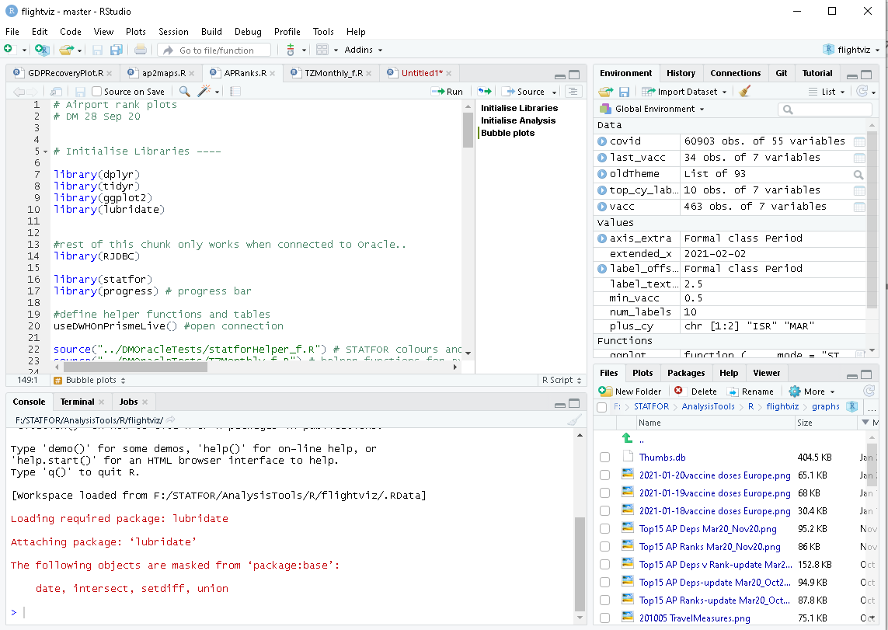
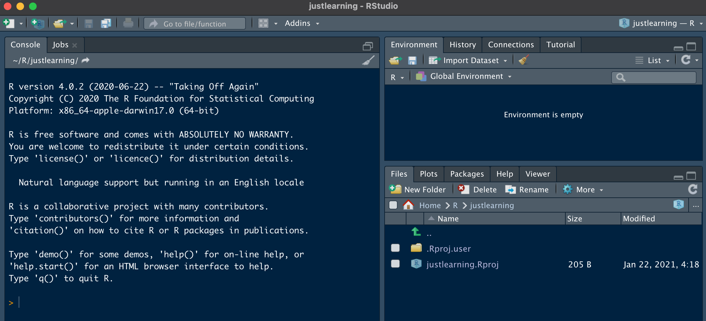
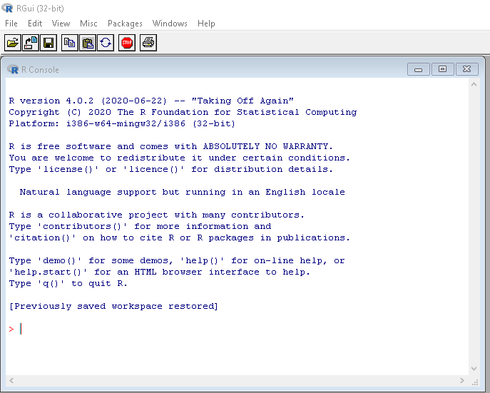

# Getting started {#start}

We said in chapter \@ref(howto) that you need first to install R and RStudio. These are separate pieces of software: R does all the statistical and graphics stuff, while RStudio provides the graphical user interface. 

## Orientation in RStudio {#rstudio}

Here we take a brief look around the RStudio interface. Use 'RStudio/Help' to get more detailed help.

The RStudio interface can be customised almost beyond recognition. We'll use a mix of styles in the book so that you don't get too fixed, but it's probably helpful to your colleagues not to re-order the main four panes, otherwise they'll find looking over your shoulder or screen-sharing a disorienting experience.

A basic MS Windows RStudio looks something like this.

{width=75%}

The main panes of the screen are:

* Top left: source code, shown as a number of tabs one for each file;
* Bottom left: the 'console', which is a scratchpad for entering code, and where log output is usually shown (and some other tabs which we don't need here);
* Top right: the 'environment' and 'history' tabs are of main interest. Environment is where you can explore all the data you've created. History is useful for re-doing something, particularly as you can search for code.
* Bottom right: This has several important tabs
  + Files: for exploring files within a project, can be quicker than using the windows explorer
  + Plots: is where plots will appear (usually)
  + Packages: is for checking which packages are installed, or active (see TBD)
  + Help: all the details of the functions that you will need - this is usually quicker to use than googling a function (though the help files come up when you google, from various providers).
  
The buttons that appear around the panes are context-sensitive: they will change according to the type of file that you have open.

There are some hot-keys for moving rapidly around the panes: I most use ctrl-1 to go to the source code, ctrl-2 for the console. You can then guess the others.

Recent versions of `RStudio` have a tutorial (tab in top right pane) if you need more detail.

## First project

While you can work with 'bare' files of R code, we think it's tidier to use 'projects', for two main reasons: you can keep several shorter files of code together, which makes it easier to navigate; and a project automatically remembers which directory it's working in, so you can manage data input and output and graphic output more neatly.

Create yourself a new project 'File/New Project', selecting the options new project (not new package), give it the name 'justlearning' and browse to put it in your personal R directory. (TBD templates). 

It will open without a code panel, because you have no code yet. It looks like this.
{width=75%}

You can already execute R code in the console (bottom left, ctrl-2), but we want to save and organise code. So we do a bit more organising, and then in the next section, create a file for the code.

In this book we'll assume that projects always keep data in the `data` directory, and save graphs to the `graphs` directory. You can create these quickly in your new project by copying the code (quick-copy icon appears top right in the code block) and pasting it into the console (and press return).

```{r new_project, eval=FALSE}
# good to have these in every project
dir.create("data")
dir.create("graphs")

```
If for some reason the directories already exist, don't worry, you'll just get a warning. You can also do this manually using 'New Folder' in the files tab (ctrl-5), but then look out for lower case! You could even use your operating system file explorer - these are just ordinary directories ('folders').

When you quit RStudio it will save any data and open files in your project. So you can re-open and continue from where you left off. If you've opened very large files, just beware that saving a copy as you close can take some time. (see TBD) 

## First code

Now you've got a blank project, add a new blank R script using `File/New File/R Script`, or the 'file plus' icon top left. It appears in the source code pane, top left. 

Immediately save it; 'chapter2' for example. The name isn't critical here, but avoid spaces and punctuation. By default, it will be saved to the top level in the project. This is fine for many projects, though in some cases we might choose to organise code differently.

Type this code into your script, either manually or copy paste. 

```{r first_code, eval=FALSE}
3 + 4
# I know pi
pi
1:50
cos(pi/3) # angle is in radians


```

Unlike in the console, it doesn't get executed as you type. You have to run it. Usually you're either:

* stepping through code, running a bit at a time, in which case ctrl-enter (cmd-enter on the Mac) is easy to use: it runs where the cursor currently sits, and then moves to the next line of code, jumping over comments that are preceded by `#`;
* running all the code, which you can do by pressing the 'source' button (or select all and ctrl-enter).

Output appears in the console as a running log.

## File types {#filetypes}

You will see lots of different file types (ie file extensions). The main ones to remember are:

* `.R`, `.Rmd`: both contain R code, though `.Rmd` is actually 'r markdown' which is a mix of code and text;
* `.RProj`: contains an R 'project' - if you see one of these in the directory, this is the one to open - everything else works from there (see TBD);
* `.rda`, `.RDS`: are different types of data file. R works easily also with `.csv` and `.xls(x)` see TBD.

## What's gone wrong?

If you see a window like this, then you have started R rather than RStudio. That is a GUI and you can use it to execute R code, but you'll find RStudio easier for all but the quickest snippets of code. {width=50%}

If it keeps on happening you will find it helpful to associate R files (`.R, .RMD` and others) with RStudio rather than R.

If you get errors saying a certain package is only compatible with version xx and higher (of R), and you think you've recently updated, are you sure you updated R rather than RStudio? The RStudio version is found from the top menu 'RStudio/About R Studio', the R version is seen when you first start up (see the image just above), or is printed if you type `version` in the console (see TBD).

If you're searching in 'help' and a function isn't appearing, for example in the drop-down as you type, it is probably because it comes from a package that isn't loaded. You can finish typing, and the system will search and may find it, but also some other less good matches. Or if you know the package name, you can type `?ggplot2::geom_line` for example, in the console to go straight there.

## Test yourself

### Questions

1. In which pane will you (usually) find the help on functions?
2. Which of these provides a graphical user interface (GUI): R, RStudio?
3. Which ctrl-key combination takes you to the environment pane?
4. What does an `.rda` file contain?
5. What's the difference between typing into a source file and into the console?
6. (teaser) What does `3 + 1:3` give?

### Answers

1. Bottom right.
2. Both, though you'll nearly always want to use RStudio.
3. CTRL-8
4. R data
5. With the console, code is executed as each line is completed.
6. `4 5 6`


