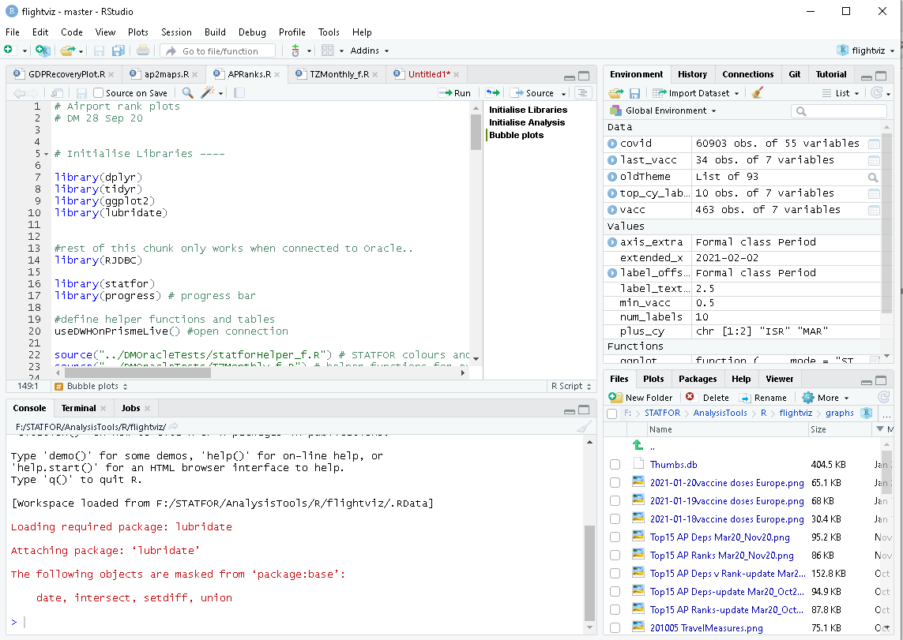
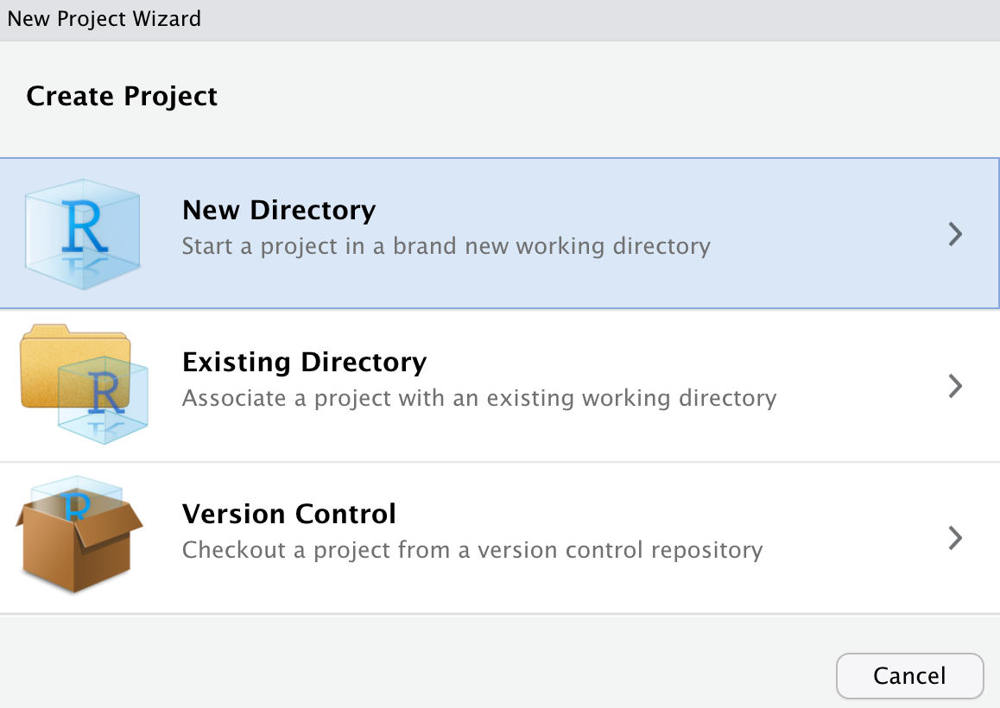
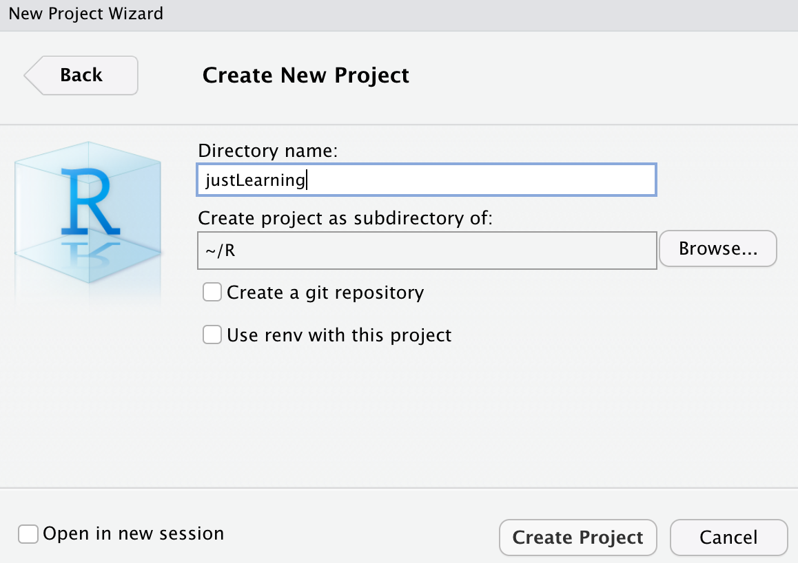
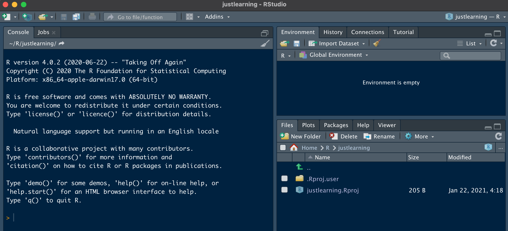
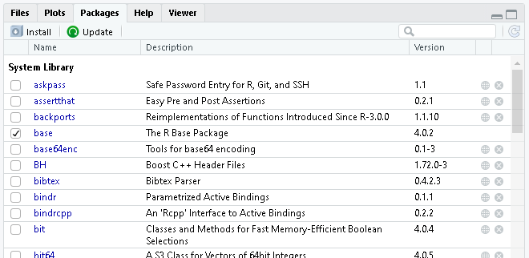
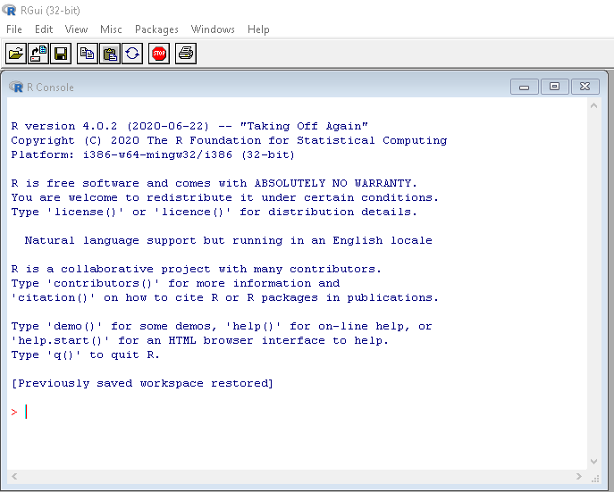

# Getting started {#start}

We said in chapter \@ref(howto) that you need first to install R and RStudio. These are separate pieces of software: R does all the statistical and graphics stuff, while RStudio provides the graphical user interface. In this chapter we get up and running in RStudio, and see some very basic R code.

## Orientation in RStudio {#rstudio}

Here we take a brief look around the RStudio interface. Use 'RStudio/Help' to get more detailed help.

The RStudio interface can be customised almost beyond recognition. We'll use a mix of styles in the book so that you don't get too fixed on seeing only one, but it's probably helpful to your colleagues not to re-order the main four panes, otherwise they'll find looking over your shoulder or screen-sharing a disorienting experience.

A basic MS Windows RStudio, with work on the go, looks something like this.



The main panes of the screen are:

* Top left: source code, shown as a number of tabs, one for each file;
* Bottom left: the 'console', which is a scratchpad for entering code, and where log output is usually shown (and some other tabs which we don't need here);
* Top right: the 'environment' and 'history' tabs are of main interest. Environment is where you can explore all the data you've created. History is useful for re-doing something, particularly as you can search for code.
* Bottom right: This has several important tabs
  + Files: for exploring files within a project, can be quicker than using the windows explorer;
  + Plots: is where plots will appear (usually);
  + Packages: is for checking which packages are installed, or active (see section \@ref(packages));
  + Help: all the details of the functions that you will need - this is usually quicker to use than googling a function (though the same help files also come up when you google, from various providers around the web).
  
The buttons that appear around the panes are context-sensitive: they will change according to the type of file that you have open.

There are some hot-keys for moving rapidly around the panes: most often, I use ctrl-1 to go to the source code, ctrl-2 for the console. You can then guess the others, or find them by trial and error.

Recent versions of `RStudio` have a tutorial (tab in top right pane) if you need more detail.

Try out the console (bottom left, ctrl-2). Try typing `3 + 4 * 2` there (and press 'enter'). You should see "[1] 11", meaning that the first "[1]" (and in this case only) element of your answer is 11. The spaces in that calculation are optional, but recommended for ease of reading. [Try it without the spaces.]

If you'd like to see an answer with more than one element, type `letters` into the console. This is a built-in constant. Check the 'help' for 'letters' to see some others.

## First project

The console is good for quick, throw-away calculations. But it's a bit like treating R as a pocket calculator. Instead, we want to save R code in files. 

While you can work with 'bare' files of R source code, 'script files' in the jargon or 'scripts', we think it's tidier to use 'projects', for two main reasons: 

* you can work with several shorter script files (and other types of source file that we won't be looking at) together, which makes it easier to organise and navigate;
* and a project automatically remembers which directory it's working in, so you can manage data input and output and graphic output more neatly.

Create yourself a new project using 'File/New Project', selecting the options new project, give it the name 'justlearning' and browse to put it in your personal R directory. (TBD templates). The sequence should look a little like this, with variation coming from where you create the new project subdirectory. That final part depends on your system and filing habits.
{width=75%}

{width=75%}

{width=75%}

In that final step, if you are working on a Windows machine you will see a slightly different path to your 'user directory' under 'Create project as a subdirectory of:'. It's rare that you need to change this, anyway.

The project will open without a code panel (which would have been top left), because you have no code yet. It looks like this.


In this book we'll assume that projects always keep data in the `data` directory, and save graphs to the `graphs` directory. You can create these quickly in your new project by copying the code from here (quick-copy icon appears top right in the code block when you move the mouse over it) and pasting it into the console (and press 'enter').


```r
# good to have these in every project
dir.create("data")
dir.create("graphs")
```
If for some reason the directories already exist, don't worry, you'll just get a warning. The line beginning with '#' is a comment which is ignored.

You can also create these directories manually using 'New Folder' in the files tab (ctrl-5), but then make sure both folder names are in lower case! You could even use your operating system file explorer - these are just ordinary directories ('folders'), there's nothing R-special about them.

When you quit RStudio it will save any data and open files in your project. So you can re-open and continue from where you left off. If you've opened very large files, just beware that saving a copy as you close can take some time. (see TBD) 

## First code

Now that you've got a blank project, add a new blank R script file using `File/New File/R Script`, or the 'file plus' icon top left. It appears in the source code pane, top left. 

Immediately save it; call it 'chapter2' for example. The name isn't critical here, but avoid spaces and punctuation. By default, it will be saved to the top level in the project. This is fine for many projects, though in some cases we might choose to organise code differently.

It's good practice to comment as you go along, using `#`. At the top of your new script put some comments saying who you are, the date, and what it is for. Then add a comment for each chunk of code, or for any lines you think might be difficult for you to understand when you come back. I forget where I read this idea, but think of comments as 'notes for a future you'.

Type this code into your new 'chapter2' script, either manually or copy paste. 


```r
3 + 4
# I know pi
pi
1:50
cos(pi/3) # angle is in radians
```

Unlike in the console, in a script file code doesn't get executed as you type. You have to run it. Usually you're either:

* stepping through code, running a bit at a time, in which case ctrl-enter (cmd-enter on the Mac) is easy to use: it runs the code where the cursor currently sits most of the time intelligently selecting other lines that need to run at the same time, and then moves to the next line of code, jumping over comments that are preceded by `#`;
* running all of the code, which you can do by pressing the 'source' button (or select all and ctrl-enter).

The output appears in the console as a running log. It should look like this:


## First packages {#packages}

The R language is expanding continually as people publish new packages for it. A 'package' provides a collection of functions, often some data and sometimes some new data types. If you're starting in R, and just aiming to find your way around in and use code, then mostly what you need to know is how to load packages (and what that means), and a little about the more common ones. That's what we cover in this section.

### Package basics {#twocolons}

Some packages are already bundled in the basic installation of 'R', such as `base` which provides, as the name suggests, many of the most basic functions. But there are thousands of other packages, coming from:

* [CRAN](https://cran.r-project.org), the "Comprehensive R Archive Network" is the authoritative collection of packages. There are also various 'mirror' (official copy) sites hosted elsewhere, such as at Ghent University. Packages in CRAN have been through a degree of quality control, and are preferred to the less official sources.
* [Github](https://github.com) and other public repositories. Even Eurocontrol shares some there, such as [CODA taxi times](https://github.com/david6marsh/codaTaxi) and the [PRC dashboard](https://github.com/euctrl-pru/portal).
* Home-made. Making packages is out of the scope of the book, but if you're inside Eurocontrol, you may want to load the `statfor` package (see section TBD) created by Sebastien Thonnard that builds some access to Eurocontrol datawarehouses as well as nice formatting.

There are two^[actually, there's a third, but that's too much detail for here] steps to using a package, and sometimes these get confused:

1) Installation. You type `install.packages("package_name")` and R finds the files for that package and saves them on your machine or on a network drive. So the files are available. You've done the shopping and the food is in the kitchen cupboards.
2) Attaching or Loading. You have to make a package _available_ for use for your session, usually with `library( )`. You've pulled the ingredients for your recipe out of the cupboard and they're on the kitchen table. If there's a difference between 'attaching' and 'loading' then it doesn't matter here. 

A few packages are automatically loaded at the start of the session. In the packages pane, a package is listed if it is installed and ticked if it's loaded. In the screenshot, just the `base` package is loaded of the ones listed in this screenshot.



Clicking on the package name takes you to the documentation. There's a manual for all functions together, as a pdf, but it's usually easier to use the help pane to get the same material, and perhaps copy examples from the end of each help entry. More importantly here there are links to **vignettes**, and often now to websites with more info. Vignettes are not little stickers, but essential how-to guides mixing text and code. Often this can provide a skeleton end-to-end structure showing how to use functions, and that you can copy and adapt to your own need. 

You can load a package by ticking the box in the packages pane, but normally it's done in code, as in this example.


```r
library(lubridate) # lots of date-related functions.
```

Two packages can define a function with the same name. The CRAN repository of packages performs quality checks, but overlap between packages is not something CRAN controls. Think of CRAN as an excellent library rather than an 'Académie française' for R  that controls which words are allowed into the language^[Actually, CRAN does enforce some quality control but that's more about how packages work than what packages there might be, with which functions.]. When there is overlap in packages, both defining a function with the same name, say, then on loading the second one 'masks' the first (you should see this above). Sometimes, as an alternative to loading the full package, you might see in code a 'two colon' usage, such as `base::union`. This is very common inside packages (it's recommended), and it's a way to insist that the first package version of the function should be used. 

As well as function with the same name and different results, there are often many different functions that you could use to achieve the same result, eg `base::paste0()` and `stringr::str_c()` both concatenate strings.


```r
# both concatenate two strings, inserting no separator between them
base::paste0("On Ilkley Moo", "r.")
```

```
## [1] "On Ilkley Moor."
```

```r
stringr::str_c("On Ilkley Moo", "r.")
```

```
## [1] "On Ilkley Moor."
```

In this example, notice that the strings to be concatenated are written in quotes. It's recommended to use double ", rather than single '. And while we're on such conventions, the space after the comma in the parameter list is optional, but recommended for ease of reading. In fact you'll see that when there are lots of parameters or long ones, we tend to move to a new line, also for ease of reading. Meanwhile, there should be no space between the function name and the '('.

There's an art in R to doing the most with the minimum number of packages, since it takes time to find your way around the functions in a package. That's like the satisfaction of making the recipe from things you already have in the cupboard.
 
But sometimes, you just don't want to make the flaky pastry yourself. There are times when you're looking at a complex task and should be thinking 'surely someone has already tackled this in R?'. A little googling will often find you most of the pieces already in place in a new package, or one you have but had forgotten about. 

You develop a personal 'dialect' of R, from the packages that you choose to use most often. We'll discuss one of the most common dialects, the `tidyverse`, in more detail in the next section. Since it helps if you and colleagues share a dialect, everyone adopting the tidyverse is a good start.

### Tidyverse

The [tidyverse](https://www.tidyverse.org) is our chosen dialect, in the sense that in most cases we'll use the functions and data structures, and way of organising, that go with this collection of packages. There's a lot of excellent documentation already available, so we will explain some basics here, and introduce other elements as we need them for flight data examples.

The *tidy* in 'tidyverse' refers to a [tidy data structure](https://r4ds.had.co.nz/tidy-data.html): a table with each variable in its own column and each observation on one row. While we often find flight data with years displayed across the table, and countries down the side, this is not 'tidy'. 


Table: (\#tab:unnamed-chunk-1)An untidy table.

|Country | Flights2019| Flights2020|
|:-------|-----------:|-----------:|
|France  |         1.3|         1.5|
|Germany |         5.2|         6.0|


Table: (\#tab:unnamed-chunk-1)A tidy table.

|Country | Year| Flights|
|:-------|----:|-------:|
|France  | 2019|     1.3|
|Germany | 2020|     5.2|
|France  | 2019|     1.5|
|Germany | 2020|     6.0|

The main data structure used by the tidyverse is the dataframe, although increasingly the tidyverse prefers the 'tibble' `tbl`, which is a specific sort of dataframe. We won't worry about the differences here.

For most 'quick pieces of code', the easiest is to start your R script with a `library(tidyverse)` to load all the parts of the tidyverse. If you were writing a package, that wouldn't be very efficient, because there's quite a lot of it. Sometimes you'll see individual parts of the tidyverse loaded including:

* `ggplot2`: lots of plotting functions (see next chapters)
* `dplyr`: for manipulating and processing data
* `tidyr`: for tidying data, such as pivot-table like actions, or splitting columns.

And there are packages which are on the outskirts of the 'tidyverse' which get announced when you first load. The full list (at the time of writing) is as follows. 


```
##  [1] "broom"         "cli"           "crayon"        "dbplyr"       
##  [5] "dplyr"         "dtplyr"        "forcats"       "googledrive"  
##  [9] "googlesheets4" "ggplot2"       "haven"         "hms"          
## [13] "httr"          "jsonlite"      "lubridate"     "magrittr"     
## [17] "modelr"        "pillar"        "purrr"         "readr"        
## [21] "readxl"        "reprex"        "rlang"         "rstudioapi"   
## [25] "rvest"         "stringr"       "tibble"        "tidyr"        
## [29] "xml2"          "tidyverse"
```

These include `lubridate` and `stringr` which we've already mentioned.

We'll see a lot more `tidyverse` usage in chapters TBD, when we get to grips with data wrangling. Just to whet your appetite, here we show two quick examples. Try the code out, but don't worry if it's a little cryptic at this stage, we will explain the parts in more detail later.

Start with the untidy dataframe shown above. Use `pivot_longer` to make it tidy, all in one go selecting a number of columns (those that start with 'Flights') and extracting the 'year' from this, then pivoting to the tidy form. 

Then we show a pairing of `group_by` and `summarise` to produce some annual totals. This example doesn't save its result but prints it immediately to the log.


```r
untidy <- data.frame(Country = c("France", "Germany"), 
                     Flights2019 = c(1.3, 5.2), 
                     Flights2020= c(1.5, 6.0))
# tidy the data
tidier <- pivot_longer(untidy, 
                       # pivot the two columns starting with 'Flights'
                       cols = starts_with("Flights"),
                       # put the column names in a column called 'year'
                       names_to= "year",
                       # ignore the 'Flights' bit of the name, and treat as integer
                       names_pattern = "Flights(.*)",
                       names_transform = list(year = as.integer),
                       # put the column values in a column called 'flights'
                       values_to = "flights")
print(tidier)
```

```
## # A tibble: 4 x 3
##   Country  year flights
##   <chr>   <int>   <dbl>
## 1 France   2019     1.3
## 2 France   2020     1.5
## 3 Germany  2019     5.2
## 4 Germany  2020     6
```

```r
# using groups - just print the result
tidier %>% group_by(year) %>% 
  summarise(total_flights = sum(flights))
```

```
## # A tibble: 2 x 2
##    year total_flights
##   <int>         <dbl>
## 1  2019           6.5
## 2  2020           7.5
```

Don't worry if this demo seems complicated, or to come out of nowhere - we'll take it more slowly in Chapter TBD. But it illustrates the principle we mentioned earlier: for many operations (like tidying a table), you're not the first to need to do this, so there's probably a neat way to do it in R.

You'll see another short bit of tidyverse at the beginning of the next chapter.

## File types {#filetypes}

You will see lots of different file types (ie file extensions), in the files pane. The main ones to remember are:

* `.R`, `.Rmd`: both contain R code, though `.Rmd` is actually 'r markdown' which is a mix of code and text;
* `.RProj`: contains an R 'project' - if you see one of these in the directory, this is the one to open - everything else works from there (see TBD);
* `.rda`, `.RDS`: are different types of data file. R works easily also with `.csv` and `.xls(x)` see TBD.

## What's gone wrong?

If you see a window like this, then you have started R rather than RStudio. That is a GUI and you can use it to execute R code, but you'll find RStudio easier for all but the quickest snippets of code. {width=60%}

If it keeps on happening you will find it helpful to associate R files (`.R, .RMD` and others) with RStudio rather than R.

If you get errors saying a certain package is only compatible with version xx and higher (of R), and you think you've recently updated, are you sure you updated R rather than RStudio? (Even if this is a task for IT, perhaps they misunderstood and updated the wrong one?) The RStudio version is found from the top menu 'RStudio/About R Studio', the R version is seen when you first start up (see the image just above), or is printed if you type `version` in the console.

If you're searching in 'help' and a function isn't appearing, for example in the drop-down as you type, it is probably because it comes from a package that isn't loaded. You can finish typing, and the system will search and may find it, but also some other less good matches. Or if you know the package name, you can type `?ggplot2::geom_line` for example, in the console to go straight there.

## Test yourself

### Questions

1. Where will you (usually) find the help on functions?
2. Which of these provides a graphical user interface (GUI): R, RStudio?
3. Which ctrl-key combination takes you to the environment pane?
4. What does an `.rda` file contain?
5. What's the difference between typing into a script file and into the console?
6. What is a 'vignette'?
7. (teaser) What does `3 + 1:3` give?

### Answers

1. Bottom right.
2. Both, though you'll nearly always want to use RStudio.
3. CTRL-8
4. One or more R datasets
5. With the console, code is executed as each line is completed.
6. An extended entry in the documentation showing how to put the functions of the packages together.
7. `4 5 6`


