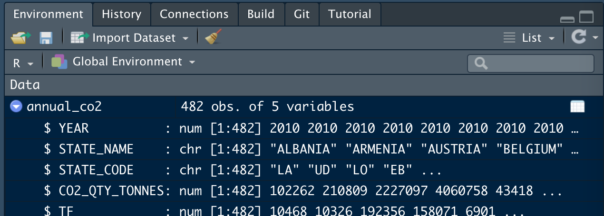
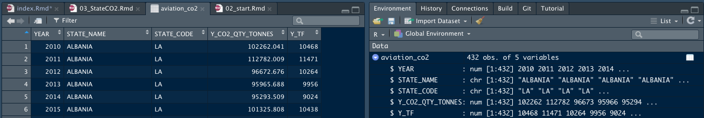

# First look at data and CO~2~ Emissions

It's hard to get far in an analysis without first looking at the data to ask questions such as:

* What variables are there? Do I know what they all mean? 
* What time period does it cover?
* Which countries, or airports etc, are included?

In this chapter, we introduce some of the ways to take a quick look at your data. We introduce some data on CO~2~ emissions per European State from aviation. 

```{r, echo=FALSE}
knitr::kable(data.frame(syl=c("`read_xlsx()`, `<-`, `summary`, `str`, environment pane, `View()`, `unique`, `head`, `c()`, `[]`, `ggplot()`")),
             col.names = c("In this chapter"))
```


Re-open your `justlearning` project and start a new source file, to copy and paste the examples into. This starts a new R session, which means you have to re-load the package(s) that you need.

```{r initialiseChapter, results='hide'}
suppressPackageStartupMessages(library(tidyverse)) # without lots of messages filling up the book

```


## Looking at data: CO~2~ Data {#loadco2}

We use public data on national CO~2~ emissions from aviation available on the [EUROCONTROL/AIU website](https://ansperformance.eu/data/). We choose this, apart from the interest in the data themselves, because it's a small set so quick to download, and it's already tidy (each variable in one column).

```{r getCO2}
# download the file to the data folder
# download.file("https://ansperformance.eu/download/xls/CO2_emissions_by_state.xlsx", 
#               "data/CO2_emissions_by_state.xlsx")

# load from the DATA worksheet - case sensitive!
aviation_co2 <- readxl::read_xlsx("data/CO2_emissions_by_state.xlsx", 
                                  sheet = "DATA")

```

We've already seen the `function(parameter)` way to call a function in the `cos(pi/3) ` example. Now we have `something <- function(parameter, parameter)`. This is a peculiarity of R that you just need to get used to. Think of it as saying: create `something` in the environment (without saying what it is just yet); then fill it (`<-`) with; the results of the `function`.

Now that the Excel is downloaded, comment out the 2 lines, because we don't need to keep downloading if you happen to re-run the code. If there were frequent updates, maybe you would keep downloading. See (TBD) for an example. See the Excel, now in your project `data` folder, for disclaimer and details. 

International conventions mean that CO~2~ emissions are measured from flights departing airports in a State. `read_xlsx` automatically selects the first row as variable names.

```{r co2summary}
summary(aviation_co2)
```

The `summary` function is fairly basic, but it gives a quick feel for what's in the data. Often more helpful with numeric than character, but also useful for spotting if there are missing values `NA`, of which there are none here.

In this dataset we have:

* YEAR: An integer, not a date, but read_xlsx reads this as a real number.
* STATE_NAME, STATE_CODE: A long name and the 2-letter 'country code' derived from the ICAO 4-letter communication address, of which the less said, the better.
* Y_CO2_QTY_TONNES: Total annual CO2 emissions, in (metric) tonnes.
* Y_TF: Total flights. Presumably this is departing flights (TBD)

There are three other important ways to explore the data. Firstly in the environment pane (top right, CTRL-8), where you can click the blue arrow-disk to see a summary. You get much the same thing in the console by typing `str(aviation_co2)` where `str` is for 'structure'. You should see something like this.



We can see that there are 3 numeric variables (`num`) and 3 character variables (`chr`). All 5 variables have the same number of observations (`r nrow(aviation_co2)` - but maybe this is more by the time you download it). In a tibble or data.frame the columns are always the same length.

The second way, because this is a tibble, is just to type its name in the console. [Try it] This is useful but just bear in mind that for some data structures, this might fill up your console with a lot of output. Save it for when you're sure you've a tibble. You can check by typing `class(my_thing)` into the console to see if `my_thing` is a tibble (shown as `tbl`).

The third way gives a way to explore every observation. Click on the dataset name next to the blue arrow or type `View(aviation_co2)` in the console (sorry about the upper case 'V') and you get a tabular data explorer, which allows you to sort and filter. You should see something like this. Try out the sorting and filtering in the view window.



## Extracting variables

To answer more questions about the data there are some more tools to summarise the values that it takes. We saw `summary()` works for numeric values, but what about discrete ones?

There are several ways to pull one variable out of your data. We'll use the `$` notation, partly because there's a reminder of this in the environment tab.

```{r whichStates}
# pull out all values in the column
state_vbl <- aviation_co2$STATE_NAME

states <- unique(state_vbl)
```

Look in the environment pane, `state_vbl` is listed under 'Values'. It's a (column) vector, one of the simple data types in R which is why it's listed under 'Values' and not under 'Data'. You've just pulled a column out of `aviation_co2` so not surprising that it has the same number of rows as `aviation_co2`. And the first values are all `r states[1]`, or were when this book was compiled.

Really we want to know how many different States there are, and which ones. `unique` does what it says, and we've saved these as `states`; a variable name which to me implies 'unique States'. You can tell how many there are from the environment pane, or you could use `length(states)`. [How many are there?]

To inspect all of these values you can just type `states` into the console, a good way to check the spelling of some, perhaps. [Try this.]

The order in which the elements are shown is as in the original data, there's no careless re-ordering. If you've worked with SAS PROC SQL or other languages, it might come as a relief to hear that, in R, the order of rows stays where it's put until you say otherwise; none of this sorting before every operation. We'll see some ways to handle 'top' values later (TBD - top_n)

So in this case, even if the `states` are in alphabetical order, that's just because the original Excel file was.

## Extracting a few values

We've just seen how to pull a variable out of a tibble. How do we extract one or more values out of the vector that we created?

The `states` are quite a lot to show in the console. If you had even more you might just want to see a few. The code chunk above shows that `head()` is useful for showing you the first ones (6 by default).

```{r}
head(states)

```

If you want to pull out a single value, or a few of them, again there are multiple ways to do this, but the simplest is this. We show here two ways to select with a vector of numbers: creating a consecutive sequence of numbers (`1:3`); and creating a vector with an arbitrary selection (`c(1, 5, 10)`).

```{r}
states[1]
states[3]
states[1:3]
states[c(1, 5, 10)]

```

We'll deal with subsetting the whole dataset, rather than just a vector, in the next chapter.

## CO~2~ Scatter plot

It's hard to beat a graph as a way to explore data. So we end the chapter exploring a simple graph.

The tidyverse way of doing this is to use `ggplot`.

### First draft

In the most basic scatter plot we have the following components, joined with a `+`. This `+` is peculiar to `ggplot`; another lovable quirk of R. Learn it, but get used to the idea that you'll forget and use other conjunctions by mistake at times.

In the simplest code we have:

* `ggplot`: with parameters the data to use, and an 'aesthetic' `aes`;
* `aes`: gives the x and y first, and here also says choose colour based on year;
* `geom_point`: says to plot points with these data, ie a scatter plot.

```{r}
ggplot(aviation_co2, 
       aes(Y_TF, Y_CO2_QTY_TONNES, colour = YEAR)) +
  geom_point() 

```

Even this simple example illustrates that:

* a parameter can be another function call `aes()`;
* we can specify parameters by order of appearance (`x` and `y` are first and second for `aes`) or by name (`colour`), or both;
* `geom_point` takes its aesthetics by default from the `ggplot` statement.

There's a (very) rough correlation along a diagonal line, but it would be interesting to know which States are above the line (more CO~2~ per flight) and which below. And is the change gradual, or is there much variability?

### Improve the titles

Let's at least label the axes so that someone else can see quickly what has been plotted. We can transform variables on the fly (using the rule that a parameter can be a function call, here to the function `/`), so let's convert both axes to millions.

The label on the legend is meaningful, but to avoid the block capitals we can change that too within the `labs` statement.

```{r}

ggplot(aviation_co2, aes(Y_TF/1e6, Y_CO2_QTY_TONNES/1e6, colour = YEAR)) +
  geom_point() + 
  labs(x = "Departing Flights (millions)", 
       y = "CO2 (million tonnes)",
       colour = "Year",
       title = "Emissions per State")

```

### and with clustering by State {#statecluster}

It's tempting to read the graph as having a number of small clusters, each with flights and CO~2~ increasing with time, and assume that each of these corresponds to a single State. It would be nice to use the graph to see if that's true.

There are too many countries to give each its own shape (we'll see shapes used more effectively in TBD), but we can easily add a line to join the points for each State. [How do you think you would add a line?]

We need both to add a line, which follows the pattern of `geom_point`, and group by State. That's done in the same way that we coloured by year, in the aesthetics. But there are several ways to plot a line `geom_line` joins the points in x-axis order, we want data order, so that's `geom_path`.

Out of a sense of neatness, we also add a subscript to CO~2~. The code `bquote(~CO[2]~" (million tonnes)")` took some googling and is cryptic, but it works!

```{r}
ggplot(aviation_co2, aes(Y_TF/1e6, Y_CO2_QTY_TONNES/1e6, 
                         colour = YEAR, group = STATE_NAME)) +
  geom_point() + 
  geom_path() +
  labs(x = "Departing Flights (millions)", 
       y = bquote(~CO[2]~" (million tonnes)"),
       colour = "Year",
       title = "Emissions per State")

```

The graph isn't ready for a presentation yet, but a story is already emerging. The lines do the job of grouping the years for each State together. We see a graph with 6 busy States, 3 of which are fairly linear, so a relatively fixed CO~2~/flight. Three others are more variable from year to year. 

Then there are two States, with flights in the 0.25-0.5 million flights range and that diverge from the main trend line. The remaining States rather overlap in this graph. 

We'll find out how to pick out and label States in the next chapter.

## What's gone wrong?


## Test yourself

### Questions


1) Use `head` to view the first 10 states.
2) Using the help file for `head`, how would you display the last 6 states?
3) Which State names are followed by '*'?
4) Print the distinct state ISO codes to the console.
5) Print the 3rd, 23rd and 33rd state names to the console.
6) What does `<-` do?
7) In `ggplot` what does `+` do?

### Answers

1) `head(states, 10)`
2) `head` is documented alongside `tail`: use `tail(states)`
3) (In my version of the data), typing `states` into the console, and by eye I see 4 States with a '*'. We'll see other ways to do this, later.
4) `unique(aviation_co2$STATE_CODE)`
5) `states[c(3, 23, 33)]`
6) It puts the results of whatever is on the right-hand side into the object on the left.
7) It connects parts of the definition of a graph together.

