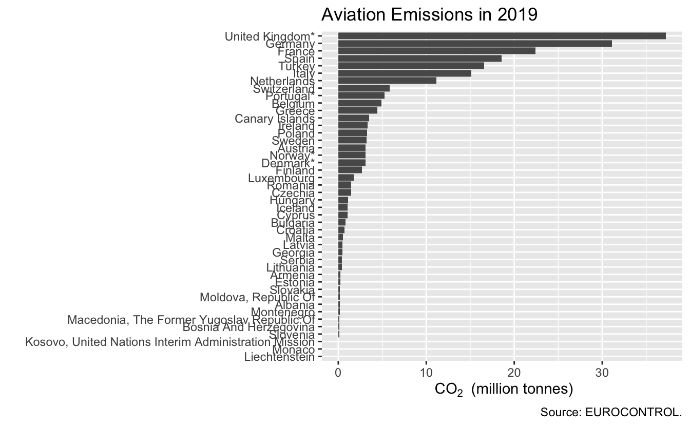
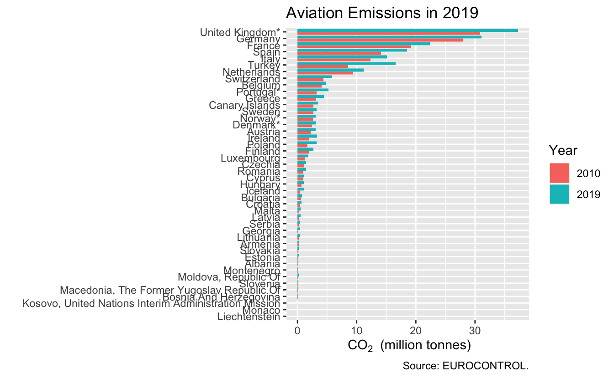
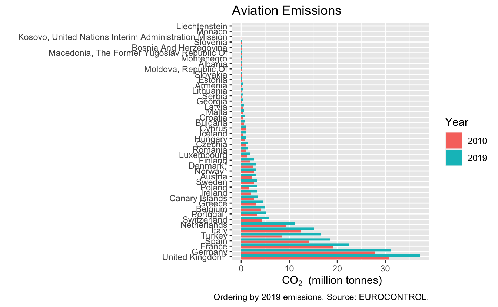
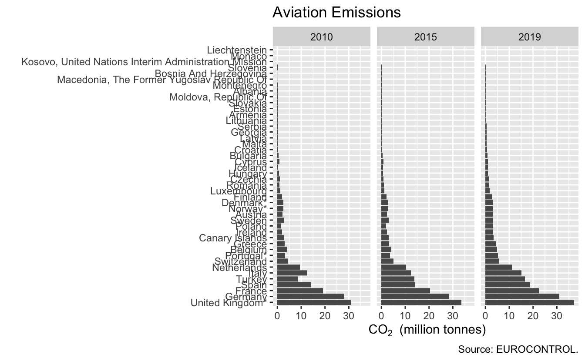
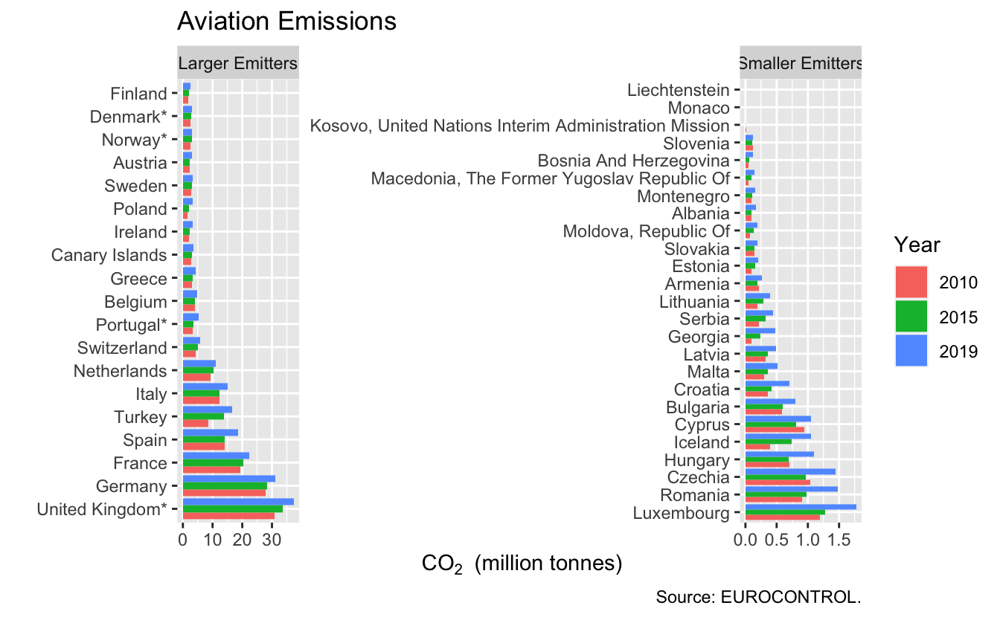
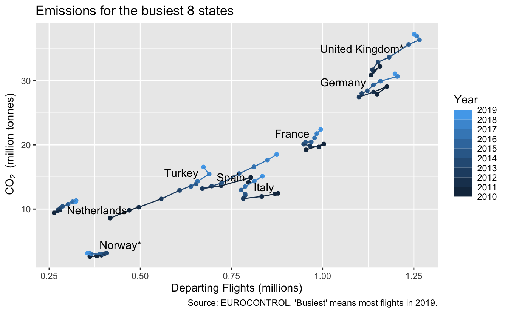
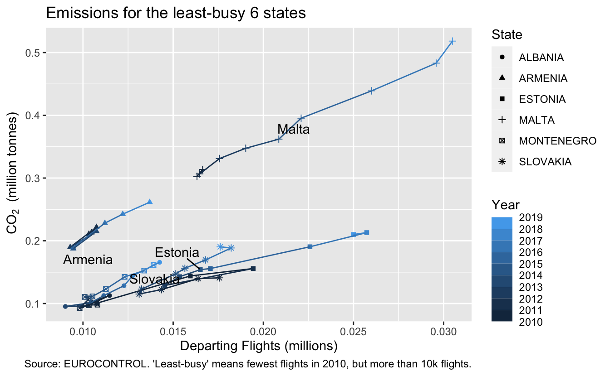
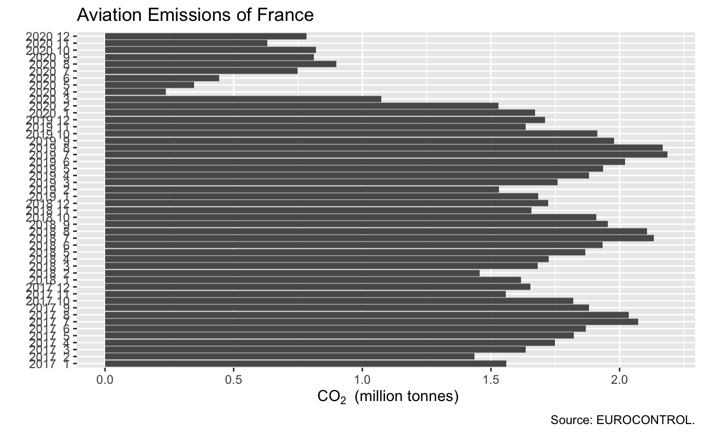

# Sorting Bars, Saving Graphs, Facets {#sortbars}

While nothing beats a well hand-crafted chart, there are times when you want to just run the code and get a quick update, as a .png say. In this chapter we see how to do a classic sorted-bar chart and to save it to a file for use elsewhere. We need slightly different methods for simple bar charts and more complex ones.


|In this chapter, you'll be introduced to:                                                                                    |
|:----------------------------------------------------------------------------------------------------------------------------|
|`geom_col()`, `dodge`, `reorder()`, `ggsave()`, `as.factor()`, `factor()`, `arrange()`, `facet_wrap()`, `select`, plots pane |

## The simple sorted bar chart - more on CO~2~ {#firstsortedbar}

A classic visualisation is the bar chart, sorted from longest to shortest. With `ggplot` there are a couple of ways to get a bar chart. If you want `ggplot` to count the rows for you, use `geom_bar`. Here we already have values for the length of the bar, so we use `geom_col` instead (for 'column' chart). 

For the simplest bar charts, there is a quick way to get the order you want. In place of `state_label` for the x-axis, you give `reorder(state_label, CO2_QTY_TONNES)`, the second being the variable to sort by. If you find the bars a bit top-heavy, put a `-` in front of `CO2_QTY_...` to reverse the order.

The final novelty in this graph is `coord_flip()`. Forty-something State names is a lot of text to cram onto the horizontal axis. So we flip the axes. You'll need to decide if this trick works where you want to use the graph. We'll see other ways to separate the labels on the axes in (TBD).


```r
ggplot(annual_co2 %>% 
         filter(YEAR == 2019), 
       aes(reorder(state_label, CO2_QTY_TONNES),
           CO2_QTY_TONNES/1e6)) +
  geom_col() +
  labs(x = "", 
       y = bquote(~CO[2]~" (million tonnes)"),
       title = "Aviation Emissions in 2019",
       caption = "Source: EUROCONTROL.") +
  coord_flip()
```



If you were to google 'ggplot ordered bar chart', you might find references to 'factors'. That becomes necessary, in place of `reorder`, when the charts are more complicated. We'll look at that in section \@ref(factors).

## Saving a plot

You might be looking at the bar chart and thinking that it's the wrong proportions for your need (portrait rather than landscape, or vice versa) or you might be thinking the axis labels are still a bit squashed together.

The proportions on your screen will depend on a number of things including the space you have allowed for the 'Plots' window. Now, the plots window has an export button which you could use. It allows for re-sizing, but that means you have to do the same manual intervention each time.

We prefer to use `ggsave()` to save the most-recent plot, and at the same time set the aspect ratio. Usually it's worth doing this before working too much on the font sizes, since you don't really know if there's a problem until you've seen the png. 

Finally, we use the `graphs` folder we created for the project. Square seems about right for this graph (the width includes the axis text); and having one of the dimensions around 15cm also seems to produce png that are good enough for reports and slides without being too big a file.


```r
ggsave("graphs/FirstSortedBars.png", width = 15, height = 15, units = "cm")
```

## Plotting more than one year

I can think of four ways to plot more than one year, and there are no doubt more than that: 

1) as staggered bars, though we probably will have to work hard to make enough space;
2) as 'facets', creating one sub-plot per year;
3) as a few graphs, merged and aligned using an dedicated package like `cowplot`;
4) as multiple graphs using a loop

Number (3) is particularly useful for combining graphs of different variables, but it's a bit heavy to deal with here. We'll deal with (4) in section (TBD) when we look at loops. The first two we will demonstrate in the next sections.

### Staggered bars, and factors {#factors}

We took some shortcuts in section \@ref(firstsortedbar), which will need sorting out for the staggered bars. First we need to choose a couple of years, since there certainly isn't room for more than two. That's a filter that we've seen before. Secondly, we used `state_label` before because it was prettier, but this only exists for 2019, so we have to go back to using `STATE_NAME`. It's probably time to turn this name into title case once and for all.

The separation by year is done in the aesthetic `aes()` as you might expect. We want the bars to be different colours by year. In this case it's the `fill` that we specify; `colour` would add an outline to the bars. To get the bars side by side we set the `position = "dodge"` parameter in `geom_col()`.

The least obvious, final step is that 'year' needs to be a discrete variable, whereas currently it's `num` which is a continuous number. Slightly oddly, `as.integer()` doesn't work: it's still treated as continuous by `ggplot`, presumably because there are potentially still quite a lot of integers.

We could convert to a string with `as.character`, but we need to start using factors, so let's do that here. 

Factors in R were originally a way to save space with character variables in a dataset. In `annual_co2` for example, rather than store 'ALBANIA' 10 times, for each row, a factor would give `ALBANIA` a numeric code and store that. The character strings become the levels. [Try `z <- as.factor(annual_co2$STATE_NAME)` and see what is said for z in the environment pane. `rm(z)` to tidy up, if you wish.] 

For this example, we'll convert `YEAR` on the fly, with an `as.factor` in the `aes()` call.


```r
annual_co2 <- annual_co2 %>% 
  mutate(STATE_NAME = str_to_title(STATE_NAME))

ggplot(annual_co2 %>% 
         filter(YEAR %in% c(2010, 2019)), 
       aes(reorder(STATE_NAME, CO2_QTY_TONNES),
           CO2_QTY_TONNES/1e6,
           fill = as.factor(YEAR))) +  # make discrete
  geom_col(position = "dodge") +
  labs(x = "", 
       y = bquote(~CO[2]~" (million tonnes)"),
       title = "Aviation Emissions in 2019",
       caption = "Source: EUROCONTROL.",
       fill = "Year") + # nicer label for legend
  coord_flip()
```



Look closely at the graph. What is the sort order? Neither the 2010 nor the 2019 bars are actually in order. We've asked `reorder` to do too much. It seems to have sorted by the total of the 2 years, which is a reasonable thing to do in the circumstances. But I think that's hard for the user of the graph to interpret, and I'd like the ordering to be by 2019. 

We can do this ordering with factors. First define a vector that is in the order we want, using `arrange()` to sort it. The `desc()` reverses the order. Then define a factor version of the state names, and insist that it's in this fixed order. `factor()` is like `as.factor()` which we used in the previous chunk of code, but allows these extra parameters.


```r
# get the state names in the specific order that we want
state_order <- annual_co2 %>% 
  filter(YEAR == 2019) %>%     # in year 2019
  arrange(desc(CO2_QTY_TONNES)) %>%  # descending order
  pull(STATE_NAME) 

# create an ordered factor with this
annual_co2 <- annual_co2 %>% 
  mutate(ordered_states = factor(STATE_NAME, 
                                 levels = state_order, ordered = TRUE))

ggplot(annual_co2 %>% 
         filter(YEAR %in% c(2010, 2019)), 
       aes(ordered_states,
           CO2_QTY_TONNES/1e6,
           fill = as.factor(YEAR))) +  # make discrete
  geom_col(position = "dodge") +
  labs(x = "", 
       y = bquote(~CO[2]~" (million tonnes)"),
       title = "Aviation Emissions",
       caption = "Ordering by 2019 emissions. Source: EUROCONTROL.",
       fill = "Year") + # nicer label for legend
  coord_flip()
```



### Chart facets, more years in the bar chart

If you want the reader to compare things, a good rule of thumb is to make sure these things are all in the same graph. We've achieved this for comparisons between years and between countries. However, this is a bit of a squeeze, vertically, while there's lots of empty space. Plus, it doesn't look like this method would easily cope with a third year, say.

`ggplot` provides a simple way to split charts into 'facets', which can sometimes be a way to show variation across a dimension with just a few values (2 or 3 years, say), while aligning the axes in a sensible way. There's a bit of a twist in the notation: you can't just mention a variable name (as you can in `aes()`), you need either to say `vars(YEAR)` or use a 'formula' notation starting with a tilde `~`, which involves less typing so that's what I've done here. The `_wrap` would allow wrapping onto multiple rows, but I just want one row here.


```r
ggplot(annual_co2 %>% 
         filter(YEAR %in% c(2010, 2015, 2019)), 
       aes(ordered_states,
           CO2_QTY_TONNES/1e6)) +  
  geom_col() +
  facet_wrap(~YEAR, nrow = 1) + 
  labs(x = "", 
       y = bquote(~CO[2]~" (million tonnes)"),
       title = "Aviation Emissions",
       caption = "Source: EUROCONTROL.") + 
  coord_flip()
```



`facet_wrap` has given all the x- and y-axes the same matching scale, and not bothered to repeat the y-axis labels. So it's compact. The graph is not bad for comparing relative sizes of the larger States in a given year, and for seeing how the ranking changes. But it's not that easy to compare amounts between years.

However, we can use facets to split in a different way, if we arbitrarily put the States into two groups. Remember that `[ ]` is a way to select elements of the vector, in this case the first 19. We could equally have used `head(state_order, 19)`, but the `[1:19]` is a model that is used more often. 

We turn off the scale-matching (`scales = "free"`), so really it's two separate graphs, but with one piece of code. 


```r
annual_co2 <- annual_co2 %>% 
  mutate(size = if_else(ordered_states %in% state_order[1:19], 
                        "Larger Emitters", "Smaller Emitters"))

ggplot(annual_co2 %>% 
         filter(YEAR %in% c(2010, 2015, 2019)), 
       aes(ordered_states,
           CO2_QTY_TONNES/1e6,
           fill = as.factor(YEAR))) +  
  geom_col(position = "dodge") +
  facet_wrap(~size, nrow = 1, scales = "free") + 
  labs(x = "", 
       y = bquote(~CO[2]~" (million tonnes)"),
       title = "Aviation Emissions",
       caption = "Source: EUROCONTROL.",
       fill = "Year") + # nicer label for legend
  coord_flip()
```



This certainly allows better comparisons of some of the mid-range emitters, and between years. Assuming you're not after comparison of of Luxembourg and Finland, perhaps this is fit for purpose.

There are many different distributions in flight data that have this long tail challenge: with most of the flights in a few airports, or a few countries, or by a few aircraft types. It's easy enough to switch to a logarithmic scale, but that's then often hard to read. Facets like this are a reasonable alternative, and adaptable. The results are a little distorted by the length of some of the names, for which a crude solution is in question (2) below.

## What's gone wrong?

If your saved .png file seems very large, check that you specified the units. `ggsave` defaults to inches.

If your axis labels are switched, remember that `coord_flip` will affect these.

## Exercises

### Questions

1) Plot the bar chart of section \@ref(firstsortedbar) with the longest bars at the bottom.
2) Plot the bar chart of section \@ref(firstsortedbar) without the 3 near-zero entries. (Hints: View the data. Filter on 2019 and choose a threshold.)
3) Test the statement in the text that `aes(..., colour=as.factor(YEAR))` gives an outline to the bars.
4) Use `select` and `!` to remove the `size` variable again. (Hint: Until you're sure it works, don't overwrite your dataset but make a temporary one, eg. start with `z <-`.)
5) Read the description of `geom_bar` in the help file. In the first bar chart, switch to using `geom_bar` instead - to get the same results. (Hint: A minor addition to the `aes()`.)
6) Save the final faceted bar chart to a png file.

### Answers

1) Use reorder(state_label, -CO2_QTY_TONNES).
2) Use `filter(YEAR == 2019 & CO2_QTY_TONNES > 100000)`.
3) Did it?
4) `z <- annual_co2 %>% select(!size)`, then if it works, replace `z`.
5) Replace `geom_col` with `geom_bar` and add `weight = ` in front of `CO2_QTY_TONNES/1e6`, thus switching it from the `y` parameter to the `weight`.
6) `ggsave("graphs/2facet co2.png", width = 15, height = 10, units = "cm")` or some other appropriate proportions. Did you save the correct graph? Remember that by default it saves the last one plotted.

## Extended Exercises

In chapters \@ref(firstLook) to \@ref(sortbars) we've covered some basics of the R language, seen through the process of building graphs of some emissions data. Before moving on to new concepts, you might like to try some extended exercises. 

These do not introduce any new functions, but they might use new parameters for functions that you've already seen. So a good place to start if you're stuck is the help file for the functions that you know about. If that doesn't work, then there are some hints in section \@ref(co2hints), deliberately placed slightly separate from the questions!

This book also has a search function, for finding your way back to relevant sections - see the magnifying glass top left. Up and down arrows move from one find to the next.

It's good practice to periodically 'clean' your environment, that is, to remove all the data saved in it. This is essential before testing, because you often find that you're relying on something that has been changed as you tweak and improve the code. Click the broom icon in the environment pane before you start the exercises. 

### Questions

1) Starting from the final graph in chapter \@ref(labelco2), move the label to 2015 and set the colour of the label to black.
2) Building on (1) plot the 6 states with fewest flights in 2010, but which had more than 10,000 flights . There's a bit of overlap, so use a different shape for each one.
3) (Harder) Plot the monthly emissions for France from 2015 onwards as a bar chart. We haven't done dates yet, so use a character string.

### Hints {#co2hints}

1) If you're starting from a 'clean' environment, you will need to load the data and re-create `top_states`. Search in this book for `load(` and `top_states`. 
2) Mostly a question of filtering. Don't forget to check the text of your graph when it's done. The help for `geom_point` lists which aesthetics are understood, so will help you find the parameter name for changing shape (in this case, it's the obvious answer).
3) You need to go back to the code that loads the original excel file. You'll need to `mutate` to create a new variable combining two strings `str_c` (or `paste`), but you need to put this inside an `if else` to treat 10-12 different to the other months, or the text won't sort correctly. Remember what we did to the bar charts when there was long text on the x-axis? 
In the end, it's an ugly chart but let's not worry too much about that. 

### Answers

1) This exercise is really a lesson in assembling the code into one sequence - it gets a bit broken up in the book. You should probably include your `library(tidyverse)` statement at the top, for really complete code.

Notice that we have two `colour` aesthetics: the default one which is by `YEAR` and one specifically for the `geom_text_repel`.

The other catch is that, because the colour of the text is constant, it appears outside the `aes()`, not inside.


```r
# load the dataset
load("data/annual_co2.rda")

top_states <- annual_co2 %>%
  filter(YEAR == 2019) %>%     # top in year 2019
  slice_max(TF, n = 8) %>%  # top 8 
  pull(STATE_NAME) 

annual_co2 <- annual_co2 %>% 
  mutate(state_label = if_else(YEAR == 2015, str_to_title(STATE_NAME), ""))

ggplot(annual_co2 %>% 
         filter(STATE_NAME %in% top_states), 
       aes(TF/1e6, CO2_QTY_TONNES/1e6, 
           colour = YEAR, group = STATE_NAME)) +
  geom_point() + 
  geom_path() +
  ggrepel::geom_text_repel(aes(label = state_label), colour = "black") +
  scale_colour_steps(n.breaks = 8, show.limits = TRUE) +
  labs(x = "Departing Flights (millions)", 
       y = bquote(~CO[2]~" (million tonnes)"),
       colour = "Year",
       title = "Emissions for the busiest 8 states",
       caption = "Source: EUROCONTROL. 'Busiest' means most flights in 2019.")
```




2) This is an exercise in logic in the `filter`. Did you remember to update the title, footnotes and the legend title?


```r
# load the dataset
load("data/annual_co2.rda")

selected_states <- annual_co2 %>%
  filter(YEAR == 2010 & TF > 10000) %>%     # more than 10k flights
  slice_min(TF, n = 6) %>%  # bottom 6 
  pull(STATE_NAME) 

annual_co2 <- annual_co2 %>% 
  mutate(state_label = if_else(YEAR == 2015, str_to_title(STATE_NAME), ""))

ggplot(annual_co2 %>% 
         filter(STATE_NAME %in% selected_states), 
       aes(TF/1e6, CO2_QTY_TONNES/1e6, 
           colour = YEAR, group = STATE_NAME)) +
  geom_point(aes(shape = STATE_NAME)) + 
  geom_path() +
  ggrepel::geom_text_repel(aes(label = state_label), colour = "black") +
  scale_colour_steps(n.breaks = 8, show.limits = TRUE) +
  labs(x = "Departing Flights (millions)", 
       y = bquote(~CO[2]~" (million tonnes)"),
       colour = "Year",
       shape = "State",
       title = "Emissions for the least-busy 6 states",
       caption = "Source: EUROCONTROL. 'Least-busy' means fewest flights in 2010, but more than 10k flights.")
```




3) 
You could load from Excel and immediately filter. I do it in two steps, because then I can check the correct field names for the `filter` and `mutate` using the environment pane.

This is an exercise in building up quite complex statements from simple functions. Formatting with line breaks should help a lot.


```r
# go back to the excel file
aviation_co2 <- readxl::read_excel("data/CO2_emissions.xlsx", 
                                  sheet = "DATA")
# just the data that we need
monthly_co2 <- aviation_co2 %>% 
  filter(YEAR >= 2017 & STATE_NAME == "FRANCE") %>% 
  mutate(date = if_else(MONTH < 10,
                        str_c(YEAR, "  ", MONTH), 
                        str_c(YEAR, " ", MONTH))) #a pseudo-date

# then the basic ggplot(data, aes(x,y)) + geometry...
ggplot(monthly_co2, aes(date, CO2_QTY_TONNES/1e6)) +
  geom_col() +
  labs(x = "", 
       y = bquote(~CO[2]~" (million tonnes)"),
       title = "Aviation Emissions of France",
       caption = "Source: EUROCONTROL.") +
  coord_flip()
```



