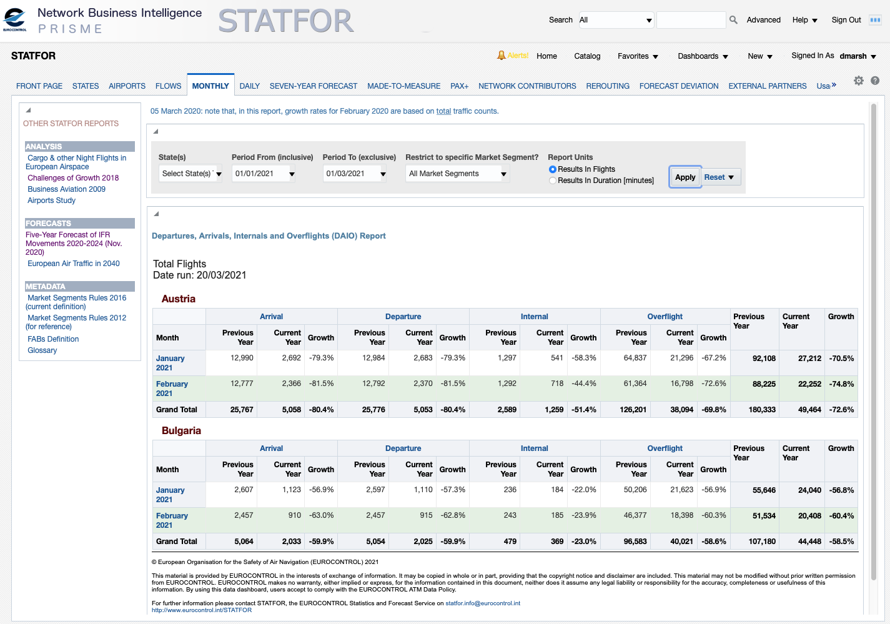
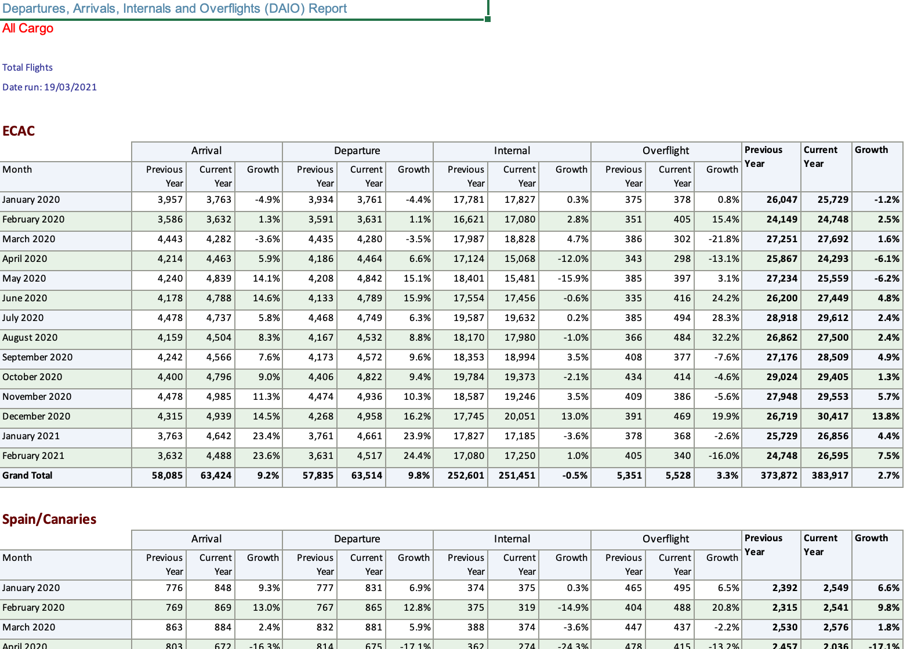

# Loops, functions and SID data {#loopsfunctions}

In the next few chapters we move away from tweaking code for graphs and get more hands-on with manipulating data. With another software language, this might be the time to discuss loops. In a manner of speaking we will be looping, but in a very R way. R does have a 'for..next' syntax, but it's a little like the chips on the menu of an Indian restaurant: most of the time you're better off with something else.

We'll cover loops in 4 ways: 2 explicit loops, the classic R `lapply` and the tidyverse `map`-`reduce` pairing; and 2 implicit loops, because half the time in R you hardly notice you're looping, vectors and `group_by` for looping within rows of a dataframe. `group_by` and its associated functions are a major toolset, so we will cover them in the next chapter, the other three in this one.

Loops go hand-in-hand with functions, so this chapter also takes some first steps in defining our own.

There's a wealth of flight data to download in the [STATFOR Interactive Dashboard](https://www.eurocontrol.int/dashboard/statfor-interactive-dashboard) or 'SID' to its friends. The Excel downloads look fiddly to process into something you might handle in R, but we'll see how to do this quite quickly with a few short loops.

```{r, echo=FALSE}
knitr::kable(data.frame(syl=c("`lapply`, `rep`, `function`, `pmin`, `pmax`, `is.list`, `unlist`, `read_xlsx`, `map`, `pmap`, `crossing`")),
             col.names = c("In this chapter, you'll be introduced to:"))
suppressPackageStartupMessages(library(tidyverse)) # without lots of messages 
```

By the end of this chapter you will know how to write functions to extract structured, but complex data from a directory full of spreadsheets.

## Vectors and Lists

We met vectors in passing in Chapter \@ref(start): `1:50`. We saw other ways to construct them in section \@ref(someValues): `c(1, 5, 10)`. But we can do more than just use them for filtering. Many functions in R are 'vector friendly', in the sense that they will operate on an entire vector, and return a vector result. This can then be used in another function. 

The use of vectors is a sort of looping through a set of values. Or if you prefer the Excel analogy, it's like filling a column of cells with a sequence of values and then creating another with a set of formulas using those vales, but without all the repetitious clicking, dragging and filling.

```{r}
c(1, 3, 7) + 2
1:4 + 1:2 # values of the second vector are recycled
1:3^2 # ^ happens before :
(1:3)^2
sin(pi/1:4) %>% round(3)  # = round(sin(pi/1:4), 3)
round(pi, 0:4) # vectors can work in surprising places
str_c("Year_", unique(aviation_co2$YEAR))
```

The examples illustrate that there are still some rules of precedence: `:` is evaluated after `^`, but before `+`. They also show 'recycling': `1:4` needs a length 4 vector to be added to it, so the values in `1:2` are recycled. Strictly speaking, this is happening with the first example (the `2` is being recycled into a vector of length 3), and also in the last example with "Year_".

If the recycling can't be done neatly, you get an error or a warning. [Evaluate `1:4 + 1:3`.]

There are plenty of other ways to create simple vectors when you need them. 

```{r}
seq(10, 50, by = 5) # when 10:50 won't do
rep(4, 3) # repeat 3 times
seq.Date(as.Date("2020/1/15"), as.Date("2020/12/15"), by = "month") # ides of 2020
letters # 'letters' and 'LETTERS' are built in to base R

# and by combining others
a <- c(1, 1, 2)
b <- c(3, 5, 8, 13)
c(a, b)
```

While vectors and vector-savvy functions are, in a sense, loops with an R flavour, it's probably better to think of them as working 'in parallel' calculated all at the same time, rather than one by one as they would be in a 'for...next' loop. (TBD)

Every element in a vector must be the same type (character, numeric, and here we introduce `integer` with an `L` after it, standing for 'long'). If you need something more general than that, then `list` is for you. A 'list' can contain almost anything, including vectors and other lists.

```{r}
a <- c(787, "neo", 320)
str(a) # every element was silently converted to character
b <- list(72, "CO2", 380L, c("Embraer", "ATR"))
str(b) # list is less fussy
```

We already saw how to extract specific elements of a vector, in section \@ref(someValues). [How would you extract the first and third elements of vector `a`? Does the same work for the list `b`?]

R has some more tricks up its sleeve to help with referring to elements. They can all have names. Or some can have names, and some not, as in the following examples. To extract elements by their names you can use the square brackets: so within the brackets you can give names or numbers. Lists have an extra trick, the `$`. 

```{r}
# putting brackets around the code prints the result as well as executing it
(a <- c(a = 7, 3, b = 7, c = 800))
(b <- list(p = 0.05, pi = 3.14, pie = "apple", pier = "Bournemouth", piers = c("Weston", "Wigan")))
names(b)

a[c("a", "b")]
b["pie"]
b$pier
b$pier[2]
```
Does the `$` method work for vectors? [Try `a$c`] It's no coincidence that we use `$` to extract an element from a list, as well as (in section \@ref(extractfield)) extracting a field from a dataset, but I'll leave you to wonder why that is.

### Exercises

#### Questions

1) What code generates the vector `2 6 10 14`?
2) What code generates the vector `1 2 1 2 1 2 1 2`?
3) What code generates the vector `"A1" "B2" "C3" "D4" "E5"`?
4) What code generates the vector `1.000 0.500 0.333 0.250 0.200`?
5) What code generates the vector `"1/1" "1/2" "1/3" "1/4" "1/5"`?
6) Create a named vector containing the numbers 1 to 26 named with upper case letters of the alphabet (and not by typing them out!).

#### Answers

For the first 5 there are several answers that work. The ones here are relatively compact.

1) `seq(2, 14, by = 4)` (or `c(2, 6, 10, 14)` is hardly any longer)
2) `rep(1:2, 4)`
3) `str_c(LETTERS[1:5], 1:5)`
4) `1/1:5`
5) `str_c("1/", 1:5)`
6)  The `names` function can be used to set as well as to get the names.
```{r}
z <- 1:26
names(z) <- LETTERS 
```

## Functions and Loops

We have already seen plenty of example of using functions, passing parameters and returning their values. How do we define our own functions?

We said that almost everything you do with R is use functions. Well, you even define a function using `function()`, which is a special sort of function: `my_function <- function(parameters) { code to apply to the parameters }`. The parameters are all of the form `name` or `name=expression` if you want to give a default value. The value returned is the result of the last phrase of code, or what is explicitly in a `return()` statement.

### First function: bi-directional airport pairs

For our first function, think about converting uni-directional flight data to bi-directional: you want to merge `Heathrow>JFK` with `JFK>Heathrow`. Often we do this by just taking the alphabetically-first one first. Our first function is to help that.

In this first example we hit the ground running, introducing an optional but powerful parameter. You can use an ellipsis, `...`, in the parameter list of your function; then echo it in a function _within_ your function. Then a user can pass, in the function call, parameters directly to the inner function call. We use it here to allow us to pass the `sep=` parameter (or others) to the `str_c` function. 

```{r}
alpha_str_c <- function(n1, n2, ...) {
  # concatenate in parallel each element of these two vectors
  # but with the smaller of the two elements first.
  str_c(pmin(n1, n2), pmax(n1, n2), ...)
}
#some airports
ap_list1 <- c("EGLL", "KJFK", "LFPG")
ap_list2 <- c("KJFK", "EGLL", "LEMD")
alpha_str_c(ap_list1, ap_list2, sep = "<>")
# it recycles values if the vectors are different lengths
# this is inherited directly from the two functions that it calls
alpha_str_c("EHAM", ap_list2, sep = "<>")
```

This is a pretty simple function. It doesn't even define any of its own data, just calls another function. We could have assigned the result to a variable `pairs <- ` or something like that. The result would be no different, and the variable is forgotten once you leave the function anyway. [Try this.]

Using `...` in this way saves you the bother of deciding how and which parameters to pass on to the `str_c`, and can open your function to being used in ways you had not first intended.

Even a short function like this is worth writing. Once you've checked it, you can use it several times and be confident there are no typos (it would be easy to type `pmin` twice, for example). Note the way the lines are broken in the function definition. R really doesn't mind, but they're easier to read if they're all formatted in the same way.

The [tidyverse style guide](https://style.tidyverse.org/functions.html) says that function names should be verbs. In the spirit of this, our 'alphabetize and concatenate' function name becomes `alpha_str_c`, shortening "concatenate" for obvious reasons. We could have dropped the `str_` bit, but it's a reminder of which parameters can be passed with `...`.

The style guide means that, if you're trying to remember a tidyverse function, in theory the mental search space can be cut down to verbs. In practice, English doesn't help much since so many words are both nouns and verbs, as crossword-setters exploit with glee.

What if we sometimes want to combine in reverse alphabetical order? Rather than have a separate function, we extend `alpha_str_c` using a logical `TRUE` or `FALSE` parameter, and an `if`-`else` statement. The relevant help section here is `if` for the language construct, rather than for the function `dplyr::if_else` (which you saw in section \@ref(labelco2)). 

```{r}
alpha_str_c <- function(n1, n2, asc = TRUE, ...) {
  # concatenate in parallel each element of these two vectors
  # but with the smaller of the two elements first.
  if (asc) {
    str_c(pmin(n1, n2), pmax(n1, n2), ...)
  } else {
    str_c(pmax(n1, n2), pmin(n1, n2), ...)
  }
}

#some airports
ap_list1 <- c("EGLL", "KJFK", "LFPG")
alpha_str_c("EFHK", ap_list1, sep = "<>")
alpha_str_c("EFHK", ap_list1, sep = "<>", asc = FALSE)
```

That's quite a lot of curly brackets for one if-else. In fact, when all you have within them is a single statement, you can omit the "{}". [Exercise: Remove the excess brackets and show the result is unchanged.]

The example also illustrates that, once you're passing a parameter "by name", the order doesn't matter: `asc` appears before `...` and hence before `sep` in the parameter list, but we pass them in any order we like.

When _using_ a function, passing parameters by position is more compact. Your variable names should make clear what is in them, anyway. So it should be clear what you're passing to the function, here two airport lists. What the function calls them internally is irrelevant.

However, when passing a logical parameter as in the last example, it isn't at all clear what the parameter means from your call to the function, without opening the function. `alpha_str_c("EFHK", ap_list1, FALSE, sep = "<>")` uses the implicit position of the `asc` parameter and gives the same result. [Try this.] But when you come back to the code in a week or two, will you remember what the `FALSE` means? Better then, to be explicit with the parameter name, as we were in the code chunk above.

### Looping with functions

Now that we can define functions, we can try out a basic R loop. There are many variants to the 'apply a function over a list of values' function `lapply` [read the help file]. Each gives different sorts of result, and they can be difficult to remember. As a result, I use `lapply` probably more often than I should, and just deal with the fact that it returns a list each time.

One variety of function doesn't get a name (`function_name <- `) at all. These anonymous, temporary functions are defined just to be passed as parameters to another function, and are forgotten afterwards. Here, we pass anonymous functions to `lapply`, which takes a list and applies a function to the list one at a time, returning a list of results.

```{r}
listed_loop <- lapply(1:10, function(x) {x^2 + x})
is.list(listed_loop)

unlisted_loop <- lapply(1:10, function(x) {x^2 + x}) %>% 
  unlist()
# which could also have been listed_loop %>% unlist()
is.list(unlisted_loop)
unlisted_loop
```

Check in the Environment pane, or by printing to the console, how these are different. [Why is `unlisted_loop` in a different part of the Environment pane?] Which of the two you need will depend on what you're developing, but I think the second is more frequent.

For a second example, we wrap this `lapply`-`unlist` pairing up inside a function. Before you run this code chunk, or read on to the end, describe in words what it will do, given two vectors of text. The answer is a couple of paragraphs earlier.

```{r}
combos_str_c <- function(s1, s2, ...){
  lapply(s1, function(x) str_c(x, s2, ...)) %>% 
    unlist()
}

combos_str_c(c("A319", "A320", "A321"), c("ceo", "neo"), sep="")
```

'Combos' is short for 'combinations'. Rather than just pasting elements of the vectors in pairs, as in `alpha_str_c`, it creates all combinations of the two. In the example this creates a list of 'current engine' and 'new engine' options of Airbus aircraft. You'll have to check elsewhere if all 6 exist!

### Exercises

#### Questions

1) What would happen if you used `min` and `max` instead, in `alpha_str_c`? Read the help file first to decide. Then check this by adapting the code.
2) What happens if you pass lists with respectively 3 and 4 airport codes in them? Why does it happen twice?
3) What other parameters can you pass to `alpha_str_c`?
4) Inside `alpha_str_c` assign the result to a variable. Does anything change?
5) How would you adapt `alpha_str_c` to use `<>` as a default separator?
6) With this new version, do the two examples of its use, in the code chunks above, still work? How can you make the examples even more compact?
7) Building on `combos_str_c` write a function to create all bidirectional combinations of two lists of airport names or codes, eg `c("EGLL", "LEMD", "LFPG", "LTFM")` and `c("LIRF", "EHAM", "LFPO", "EDDF")`?
8) Extend the function from (7) to find all possible routes between the airports in a single list. (Hint: It means adding just 5 characters to the code, including spaces.)
9) Add a parameter to allow this function to return, either the full list or with duplicates removed. (Hint: You'll need a function you saw in section \@ref(extractfield))

#### Answers

1) `min` combines whatever it is passed, and takes the minimum of them all. So you get the first airport of all, and the last. I have used `min` instead of `pmin` more times than I'd like to say. Think "parallel min need pmin".
2) R will 'recycle' elements to match the lengths of the vectors, but in this case, warn you that that is happening. It's the `pmin` and `pmax` that are doing the recycling, not the `str_c`, so the error is found twice. 
3) From the help file, `str_c` and therefore `alpha_str_c` also accepts `collapse`. [Experiment with using the `collapse` parameter.]
4) `alpha_str_c <- function(n1, n2, ...) {pairs <- str_c(pmin(n1, n2), pmax(n1, n2), ...)}` and no, no difference. The function returns the last thing calculated.
5) `alpha_str_c <- function(n1, n2, sep="<>", ...) {str_c(pmin(n1, n2), pmax(n1, n2), sep = sep, ...)}` You need to define the default in your own function, and now pass it explicitly to the new one. I don't really like `sep = sep` which feels an odd thing to write, but it would be stranger still to have a separator parameter than was called something else.
6) Yes they do, but now `alpha_str_c("EHAM", ap_list2)` is enough.
7) This merges the two functions we saw earlier. The `asc` and `sep` parameters both work through the ellipsis `...` even though they're from different functions: this demonstrates the power of 'nested' ellipsis.
```{r}
alpha_combos_str_c <- function(s1, s2, ...){
  lapply(s1, function(x) alpha_str_c(x, s2, ...)) %>% 
    unlist()
}
ap_list1 <- c("EGLL", "LEMD", "LFPG", "LTFM")
ap_list2 <- c("LIRF", "EHAM", "LFPO", "EDDF")
alpha_combos_str_c(ap_list1, ap_list2, sep = "<>")
alpha_combos_str_c(ap_list1, ap_list2, sep = "<>", asc = FALSE)
```
8) We just want the second list to be the same as the first one, by default, so like this.
```{r}
alpha_combos_str_c <- function(s1, s2 = s1, ...){
  lapply(s1, function(x) alpha_str_c(x, s2, ...)) %>% 
    unlist()
}
ap_list1 <- c("EGLL", "LEMD", "LFPG", "LTFM")
alpha_combos_str_c(ap_list1, sep = "<>")
alpha_combos_str_c(ap_list1, sep = "<>", asc = FALSE)
```
9) This calls for a logical parameter, and finally a good use for defining a variable within the function. The final `else pairs` is really saying `else return(pairs)`. If you omit the `else pairs` completely then, when `uniq=FALSE` the `if` evaluates to nothing, so the function returns nothing. [Try this.]
```{r}
alpha_combos_str_c <- function(s1, s2=s1, uniq = FALSE, ...){
  pairs <- lapply(s1, function(x) alpha_str_c(x, s2, ...)) %>% 
    unlist()
  if (uniq) unique(pairs)
  else pairs
}
ap_list1 <- c("EGLL", "LEMD", "LFPG", "LTFM")
alpha_combos_str_c(ap_list1, sep = "<>")
alpha_combos_str_c(ap_list1, sep = "<>", uniq = TRUE)
```

#### Extended question

Some theory you didn't want to know.

A default value provided in a function definition is often called a 'promise'. It is only evaluated at the moment that it is needed, not at, say, some hypothetical moment of compilation. Knowing that, predict  the result of calling `promises()`, without specifying any parameters. Then try it in the console.

```{r}
a <- 5
promises <- function(a = 1, b = a^2) {
  a <- 2
  b #short for return(b)
}
```


## Country data

The first data that we look at from [SID](https://www.eurocontrol.int/dashboard/statfor-interactive-dashboard) is the 'monthlies'. This tab in the dashboard shows monthly total flights in a choice of airspaces, for any period from Jan 2005. You can ask for one or more market segments, too, so low-cost, or business aviation etc. And the units can be switched to flight minutes rather than flights. Data can be exported to Excel format.



### Load one country's monthly data  {#loadonemonthly}

An 'airspace' here is usually a country's airspace: think of extending the border on the ground upwards. In some cases, such as Belgium and Luxembourg, they share an airspace. In others an airspace is split: Spain has (continental) Spain and Canary Islands. There are also aggregates, such as ECAC, for which you'll find details on line, for example [region definitions](https://www.eurocontrol.int/publication/eurocontrol-five-year-forecast-2020-2024). Being airspaces, they have overflights: flights which neither depart, nor land in the country but just pass through the airspace.
 
There are two little catches to the SID data. Firstly, the Excel export comes in a number of tables one after the other on a single worksheet. Secondly, the field names of each table are horrible, and use merged cells.

We've extracted some data for the all-cargo market segment. As a first example, we extract a single table from within the Excel file. [Download some yourself and inspect the Excel file.] For this book, as with the emissions data, we provide a snapshot on-line which you can download like this. You only need to do this once.

```{r}
url <- "https://github.com/david6marsh/flights_in_R/raw/main/data/SID_Monthly_AllCargo.xlsx"
download.file(url, "data/SID_Monthly_AllCargo.xlsx", mode = "wb") 
```


The column names are month, and three values for each of arrival, departure, (one airport in the airspace and one not), internal (both airports in), overflight (neither) and total. We use `combos_str_c` to generate some more useful column names.

Loading one table is then just a matter of saying how many rows to ignore at the top (`skip=`) and how many rows to load (`n_max`). 
```{r}
# this adds the output of combos_str_c to a vector that already has 'month' in it
# the indentation should help highlight that
monthly_cols <- c("month", 
                  combos_str_c(c("A", "D", "I", "O", "T"), 
                               c("_last", "", "_growth"),
                               sep=""))

monthlies <- readxl::read_xlsx("data/SID_Monthly_AllCargo.xlsx", skip = 9, n_max = 14, 
                               col_names = monthly_cols) 
```
The `month` column has been correctly interpreted as a date. We'll look at dates and date-time variables in more detail in section TBD. For the moment, if you see `POSIXct` then this is a format for date-time variables. In this chapter, the dates look after themselves.

### Load monthly data for multiple countries {#loadmultiplemonthlies}

That didn't take much code. If we want to load multiple countries, then we need to wrap up the extraction into a function. At the same time, we can pick up some metadata: market segment and units from the top of the file, and the airspace name from just before the data. These are obtained by selecting a specific range (here just one cell at a time).

```{r}
extract_monthlies <- function(file, skip, n_rows){
  monthly_cols <- c("month", 
                    combos_str_c(c("A", "D", "I", "O", "T"), 
                                 c("_last", "", "_growth"),
                                 sep=""))
  meta_segment <- readxl::read_xlsx(file, range = "A2", 
                                    col_names = "segment") 
  meta_units <- readxl::read_xlsx(file, range = "A4", 
                                  col_names = "units")
  # need to create an Excel reference "An" where n is just before skip
  meta_airspace <- readxl::read_xlsx(file, range = str_c("A", skip - 2), 
                                     col_names = "airspace")
  monthlies <- readxl::read_xlsx(file, skip = skip, n_max = n_rows, 
                                 col_names = monthly_cols) 
  # this is a quick way to return a dataframe reasonable column order
  # the first 3 get recycled as usual, to the same length as monthlies
  bind_cols(meta_airspace, meta_segment, meta_units, monthlies)
}

# check this works, as before but with added metadata
monthlies <- extract_monthlies("data/SID_Monthly_AllCargo.xlsx", skip = 9, n_rows = 14)
```

By inspecting the Excel file, we need skips `c(9, 28, 47, ..., 199)`. [How do you generate that with `seq`?]

For the looping we are spoiled for choice.

* We could use `lapply`, as we saw earlier. That is simple to remember. The anonymous function isn't pretty, but that's hardly grounds for dismissal.
* We can use `purrr::map` which is very similar, and has a nicer format for anonymous functions. It also reminds us that there's a wide variety of `map` functions around. Something for most purposes.
* `pmap` is one of the `purrr::map` family. It has the nice property of enabling us to specify a set of locations for the data, then very compactly extract from those locations: implicitly taking a field `file` from the `extract_locs` dataframe and passing it to the `file` parameter of a function. And similarly for the other parameters. Remember it as "parameter or parallel map? pmap".
```{r}
# V1. Use lapply
all_monthlies_v1 <- lapply(seq(9, 199, by = 19),
                     function(x) extract_monthlies("data/SID_Monthly_AllCargo.xlsx",
                                                   x, 14)) %>% 
  bind_rows()

# V2. With 'map' the anonymous function is more compact
all_monthlies_v2 <- map(seq(9, 199, by = 19),
                     ~extract_monthlies("data/SID_Monthly_AllCargo.xlsx", ., 14)) %>% 
  bind_rows()
identical(all_monthlies_v1, all_monthlies_v2)

# V3.
# Build a set of parameters for the extract
extract_locs <- data.frame(file = "data/SID_Monthly_AllCargo.xlsx",
                       skip = seq(9, 199, by = 19),
                       n_rows = 14)
# Then pmap passes them by name to your function
all_monthlies_v3 <- extract_locs %>% 
  pmap(extract_monthlies) %>% 
  bind_rows()
identical(all_monthlies_v1, all_monthlies_v3)
```
Code that keeps data (or metadata, like filenames) in datasets rather than in parameter lists, is an advantage: it will be easier to extend to other files (as we will see TBD); and it means that you can also save it and hence keep a record. None of the solutions is 'wrong', but the third one is the one I prefer.

### Load multiple files {#loadMultipleFiles}

The third version is most interesting because we actually want to load data from multiple files.  For this book, there's an admin step first, which is to get them from the web onto your machine. We do this with a list and a function that does the looping for us.

```{r}
file_segments <- c("LowCost", "TradSched", "BusAvn", "AllCargo")
urls <- str_c("https://github.com/david6marsh/flights_in_R/raw/main/data/SID_Monthly_",
                file_segments, 
                ".xlsx")
local_names <- str_c("data/SID_Monthly_", file_segments, ".xlsx")
download.file(urls, local_names, mode = "wb") 
```
In this particular case, we already know the file names. More often, we have downloaded a number of files, and know the file name format, but want to avoid typing in the names ourselves. The `dir` function does the job for us, and matches to a pattern. Best to check the number of files, or check the list by eye just to see that the pattern didn't find files that you don't want to process.

We need something like the code for `extract_locs`, but automatic "recycling" does not work here. What we need is sometimes called a 'Cartesian' or a 'cross' join, where all combinations are generated. The latter is the clue to the function name. We will use `tidyr::crossing` to make all combinations of file name and skip (with n_rows along for the ride).

```{r}
SID_files <- dir("data", pattern = "SID_Monthly", full.names = TRUE)
# force all combinations of file and skip
extract_locs <- data.frame(file = SID_files) %>% 
  crossing(data.frame(skip = seq(9, 199, by = 19),
                       n_rows = 14))
# and load
many_segment_monthlies <- extract_locs %>% 
  pmap(extract_monthlies) %>% 
  bind_rows()
```

It might take a minute to load the files, but it didn't take much code.

There's a lot more that we can do with such data: tidying, summarising, adapting, plotting. But for that we need `group_by`, which is the main theme of the next chapter. In the meantime, save the file to `data/` rather than rely on your project to keep a track of it. (We covered `save` at the end of section \@ref(loadco2).)

### Exercises

#### Questions

1) Use `lapply` and an anonymous (temporary) function to loop over the `skips`. What happens if you `unlist` the result?
2) Use `read_xlsx` to load the A-column from the file. Use seq to generate the row position of the airspace names (rather than the starts of the data). Hence extract the airspace names.
3) Is the `monthlies` dataset tidy?
4) Plot total flights with one line per airspace.
5) How would you improve this graph? 
6) Where is the drop in flights resulting from the COVID-19 lockdowns?
7) Try a single `data.frame` without the `crossing`. Why does R complain?
8) As for question 4, but facet by market segment.
10) From the SID, download a longer set of data, for multiple market segments. Adapt the code you have used to import this. Plot the data, for a quick visual check.
11) Adapt `extract_monthlies` to allow the user to modify the column names. Advanced version: Use the `...` when doing this, but why might this be risky?
12) What sanity checking of column names would be useful?
13) Advanced: Make an alternative version of `combo_str_c` which uses `crossing` instead of `lapply`.

#### Answers

1) It seems to work, but you get a list of answers. `Unlist` just puts everything into a single vector, all structure is lost. There are ways to save this (eg `bind_rows(monthlies)` is how to bind this list of results together row-wise), but even then, we lose track of which file the data have come from. this leads towards an approach that becomes increasingly like a construction from Heath-Robinson (or Panamarenko, if you prefer).
```{r}
skips <- seq(9, 199, by = 19)
monthlies <- lapply(skips,
                    function(x) readxl::read_xlsx("data/SID_Monthly_AllCargo.xlsx", 
                                      skip = x, n_max = 14, 
                                      col_names = monthly_cols))
temp <- unlist(monthlies)
```
2) Code like this. I followed through the links in the help file to find the `cell_cols` syntax, but you could also just use something like `"A1:A200"`, knowing that you only need the first 197 anyway, and `read_xlsx` drops blank rows from the end.
```{r}
name_rows <- seq(7, 197, by = 19)
airspace_names <- readxl::read_xlsx("data/SID_Monthly_AllCargo.xlsx", 
                            range = cellranger::cell_cols("A"), 
                                      col_names = "airspace") %>% 
  slice(name_rows)
```
You could also use `[]` syntax instead of `slice`. Can you give two alternative approaches to this? Even if it has only 1 column, `airspace_names` is a dataframe, so you need to refer to both the column and the rows.
```{r}
# two approaches
airspace_names <- readxl::read_xlsx("data/SID_Monthly_AllCargo.xlsx", 
                            range = cellranger::cell_cols("A"), 
                                      col_names = "airspace") 
v1 <- airspace_names$airspace[name_rows]
v2 <- airspace_names[name_rows, 1]
# and a third - pull out the vector - in effect does the same as the '$' in 1.
v3 <- airspace_names %>% pull(airspace)
v3 <- v3[name_rows]
```
3) No, not tidy, because we have multiple columns of flight data.
4) A minimum graph is something like this. 
```{r}
ggplot(all_monthlies_v3,
       aes(month, T, colour = airspace)) + 
  geom_line() +
  labs(y = "Total flights in month")
```

5) There are rather too many colours. Perhaps split into large and smaller groups and facet. Or one facet per airspace. `ggplot` formats the month axis nicely: probably labelling this as "month" is unnecessary, so remove it. 
6) Without the context of 2019, the drop in traffic is not evident. But in fact, this is the all-cargo market segment which was relatively unaffected by COVID-19, or at least did not see the deep declines in flights of other market segments.
7) Because it's not obvious how to recycle vectors of length 4, 19 and 1 to get the same lengths.
8) A minimum graph is something like this. Three further experiments: free up the y-axis, between the four facets; transform `T` into thousands (as we did for millions in previous examples); remove ECAC, as it is quite dominant.
```{r}
ggplot(many_segment_monthlies,
       aes(month, T, colour = airspace)) + 
  geom_line() +
  facet_wrap(~ segment) +
  labs(y = "Total flights in month")
```

10) If you save the downloaded Excel files into the `data` directory then you'll need to name them so that you can tell them apart from the first batch. Easier might be to use a subdirectory of `data`. Otherwise, just adapt `skip` and `n_max`.
11) We do the full monty and make all three parts adaptable. It's polite, to yourself and others, when adding parameters to an existing function, to make the default behaviour exactly as it was before. That way, any existing uses of the function will continue to work. List new parameters after the old ones, and supply default values to give the original behaviour.

```{r}
extract_monthlies <- function(file, skip, n_rows,
                              col1 = c("A", "D", "I", "O", "T"),
                              col2 = c("_last", "", "_growth"),
                              sep = ""){
  stopifnot(length(col1) == 5)
  stopifnot(length(col2) == 3)
  monthly_cols <- c("month", 
                    combos_str_c(col1, col2, sep = sep))
  meta_segment <- readxl::read_xlsx(file, range = "A2", 
                                    col_names = "segment") 
  meta_units <- readxl::read_xlsx(file, range = "A4", 
                                  col_names = "units")
  # need to create an Excel reference "An" where n is just before skip
  meta_airspace <- readxl::read_xlsx(file, range = str_c("A", skip - 2), 
                                     col_names = "airspace")
  monthlies <- readxl::read_xlsx(file, skip = skip, n_max = n_rows, 
                                 col_names = monthly_cols) 
  # this is a quick way to return a dataframe reasonable column order
  # the first 3 get recycled as usual, to the same length as monthlies
  bind_cols(meta_airspace, meta_segment, meta_units, monthlies)
}

monthlies <- extract_monthlies("data/SID_Monthly_AllCargo.xlsx", skip = 9, n_rows = 14,
                               col1 = c("Arr", "Dep", "Int", "Over", "Total"))
```

For the 'advanced' version, the clue is if you find yourself writing `sep = sep` to pass parameters on to another function. Here we replace both `sep = ""` and `sep = sep` with `...`. There is a risk with this that a user could then also pass the `collapse` parameter, which would have unfortunate consequences. So safer is not to use the `...` here.

12) It's important that `col1` has 5 values, and `col2` has 3 values, otherwise the column naming will be scrambled. How do you get the number of values in a vector? With that, we also need the function `stopifnot` for checking parameters. Here we would add two lines, eg `stopifnot(length(col1) == 5)`, `stopifnot(length(col2) == 3)` at the start of the function. Try this. We use two lines because then the error reporting is more precise: it tells the user exactly which parameter is the wrong length.
13) `crossing` replaces `lapply` for us, but it returns a dataframe, and `str_c` is not be happy with a tibble or dataframe, it wants a vector. In section \@ref(topStates) we saw `pull` for getting a vector out of a dataframe. With this, we can make it work. It's not clearly simpler than using `lapply`, but it's more self explanatory, because, rather than seeing `lapply` which could be any sort of loop and you need to read it to work out why the loop is there, you've got `crossing` written clearly.

```{r}
alt_combos_str_c <- function(s1, s2, ...){
  # get all combinations, as a dataframe
  cross <- crossing(s1, s2)
  # paste the vectors from this 
  str_c(cross %>% pull(1),
        cross %>% pull(2),
        ...)
}

alt_combos_str_c(c("A319", "A320", "A321"), c("ceo", "neo"), sep="")
```

Even if you didn't get this answer correct, there is a useful 'error pattern' here: where your code does not work first time because either (a) a function returns a type of data that you were not expecting or (b) a function is fussy about the type of data that you pass it as a parameter. 

The functions of R are really powerful, and you do a lot by stringing them together. Sometimes, however, it feels like all the effort is in getting the data types aligned from one function to the next.

