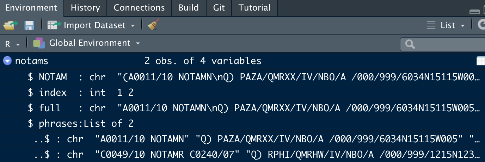

# NOTAMS: Splitting and parsing strings {#splitparse}

NOTE: This chapter has been written out of sequence, so jumps some steps and may feel a bit of a leap from the (current) previous chapter. Need to add in between chapters on: dates, mutate-across, lapply, named list (extracting from) TBD.

This chapter uses the example of NOTAMs (notices to airmen) to explore R functions for turning text into more useable data, by splitting and parsing.

The parsing of NOTAMs here is _NOT_ for operational use. It's for statistical analysis, post operations. NOTAMs are very varied, and we will not handle all the possible ways in which the parsing might fail. We assume that failures can be picked up in later statistical analysis, or will just be outliers that can be ignored as 1 in millions of cases. This code is NOT A SUBSTITUTE FOR READING THE NOTAM BEFORE THE FLIGHT.


|In this chapter, you'll be introduced to:                                                                                                                                                       |
|:-----------------------------------------------------------------------------------------------------------------------------------------------------------------------------------------------|
|`separate()`, regular expressions, list fields, `system.time()`, `identical()`, `str_match`, `str_split()`, `str_replace(_all)()`, `str_sub()`, `unnest_(wider/longer)()`, `map2()`, `relocate` |

The sections are ordered _not_ in the order you'd have to work, starting with a full NOTAM text, but in a rough order of simple to more complex. We assume throughout that you have not just a single string, but a dataframe of strings for processing. This is because we want to illustrate this way of working: 'vectorised' in the R jargon. 

You could write a function that takes a single string and parses it. Then call it many times and stack the results together with `rbind` or `bind_rows`. But we're planning to run this millions of times, so that's millions of function calls. So instead we write in a way that works on the whole dataset at once, and leaves the tidyverse to do that in the most efficient way. (There's an illustration of the time penalty later in the chapter.)

## Splitting a column into many

Within the tidyverse `tidyr` provides some useful tools for parsing text. In this chapter we see a simpler and a more complex use of `tidyr::separate`.

### Splitting a column at a character {#splitatcharacter}

In the simplest case, a string is to be separated at a single separator character. In field Q of the NOTAM this is "/". We just need to tell `separate` what the new columns are called, as in the following code.


|FIR  |qgroup |IV |NBO |AEW |FL_lo |FL_hi |geo            |
|:----|:------|:--|:---|:---|:-----|:-----|:--------------|
|GLRB |QPLXX  |IV |NBO |E   |000   |999   |0620N01206W483 |
|LYBA |QKKKK  |K  |K   |K   |000   |999   |4234N02102E999 |

There are some fields here which could be parsed further (`qgroup` and `geo`), but we leave that. I suspect that the 'K' is a missing value, which we could translate into an R `NA` value, but we don't go that far here.

We will assume that all the q-fields are properly formed, of these 8 fields. A more robust piece of code would check this is true. This is for analysis, not operations - you're getting the message I think.

Inspecting the raw strings (always essential!) shows that there are some blank spaces. So in our result we have some fields with trailing spaces. We could use `stringr::str_trim` on the results to get rid of trailing spaces, and indeed, that would probably be a good idea anyway. But we can use this to illustrate the next level in use of `separate`, which we do in the next section. 

### Splitting a column at a regular expression

The `sep=` is a 'regular expression'. Entire books have been written about regular expressions, so my advice would be to find a page you like, or download a cheatsheet of which there are many. [This is the one I use, being R-focused.](https://rstudio.com/wp-content/uploads/2016/09/RegExCheatsheet.pdf)

A regular expression is a search or matching pattern. We want to split the q-field at not just `\` but any number of spaces followed by a `\`. That will remove the trailing spaces, because they'll be treated as part of the separator. 

Our string has some 'newlines' in it `\n` as well as spaces, and in other applications perhaps tabs are used. So we use a `\\s` code, rather than just a space character " ". `\\s` stands for all of these types of 'space', and some others [check in the cheatsheet].

In regular expression terms this is `\\s*/`, which you can read as zero-or-more spaces followed by a back slash.

We can show that this gives the same result as using trim. 


```
## [1] TRUE
```

They are identical. Which do you prefer? The second involves one less line of code, but you might feel the need to add a comment, as I've done here, because the code is more obscure. So it's the same number of lines to read.

That's a qualitative judgement. If you wanted to run this thousands of times, maybe you would run timing tests. Something like this.


```
##    user  system elapsed 
##    3.89    0.23    4.12
```

```
##    user  system elapsed 
##   3.639   0.181   3.827
```

```
##    user  system elapsed 
##   1.139   0.048   1.187
```

```
## [1] TRUE
```

On my machine, the first takes about 40% longer in elapsed time, and twice the system time. So having fewer lines of code _is_ more efficient in this case. In a light-heared way, we also show a timing test for calling the function each time. Yes, the code that isn't carefully designed for speed, but for a dataset 100 times smaller already takes longer than either of the other two. Letting R do its vectorised thing is indeed better!

### Splitting a column at an either-or

Taking this one step further, we can also work on the NOTAM header. This has NOTAM in it, which isn't that useful information, so we can ditch in, but it has this in the form 'NOTAMC', 'NOTAMR', 'NOTAMN' depending on whether this is cancelling, replacing or a new NOTAM, respectively. The structure of the field varies between these cases.

As always, there are several ways to approach this. We could first remove the 'NOTAM' then split at spaces. But that's two steps. So instead, we split at either ' NOTAM' or ' ' , in one go. In regular expressions, either or is given by `|`, just as in R syntax for 'or'. And to be on the safe side, we use the more general code for a 'space', though a new line is unlikely in this position.


|notam    |type |replaces |
|:--------|:----|:--------|
|A0001/13 |N    |         |
|A0001/13 |R    |A0032/12 |
|W0809/13 |C    |W0808/13 |

This works neatly, partly because there's a trailing space at the end of the first one. [In the code, delete the space and re-run. What happens? How does the `header-parsed` dataframe change?]

In bulk use, you could either live with the `Expected 3 pieces....` errors, or add an extra space. Probably this is a sign that we should look for a better way to split, but this will always be tricky when the number of parts varies from one to the next, as it does here.

### Exercises

#### Questions

1) If `\\s` matches a space, what matches everything that is not a space?
2) How did the `header_parsed` dataframe change when you removed the space?
3) Look up the format of q_parsed$geo on the internet. Split it into 3 parts of _fixed length_, not based on a separator, but appropriately to the meaning.

#### Answers

1) `\\S`, from the cheat sheet. There's also a more complex version of the same thing `[^[:space]]`.
2) One value changed from empty string, "", to `NA`.
3) The help file explains that sep can also be positions. Try `separate(geo, c("Lat","Long","Radius"), c(5, 11))`.

## List columns {#listcolumns}

In the last section we saw various ways to split one column into several. Here we use another approach. Conceptually, it's harder, but it keep the parts 'similar' for longer, so we can modify them further _en masse_ rather than one column at a time. As usual this is not the only way this could be done, but it's a good example of the use of list columns.

List columns? Up to now, you might have been thinking of tidy datasets like a table in a spreadsheet. Not a bad analogy, but R has more tricks up its sleeve. One particularly powerful one is that any column can contain, not just single values, but lists. There's a whole package in `tidyverse` called `purrr` (yes, 3 'r's) to help handle such things. 

List columns are great for modelling. You can have rows with just 3 cells, say, one a country name, the next the whole historic time series, the next the forecast. Extremely compact. The application here is simpler. 

The pattern we'll introduce here has 4 steps:

1) Split a complex text column into a list (one column)
2) Flip that list to generate extra rows in the dataset
3) Manipulate those rows, in groups
4) Pivot to generate 1 row per text, again, and multiple columns.

Why might this be easier than approaches using `separate`? Because we want to manipulate what would be the column names after `separate`, it's easier to do if these are instead text fields.

### Splitting a field into a list

We load a set of NOTAM texts from Github. These are based on real ones, but some have been manipulated to create parsing challenges that have been seen in larger sets. The problems are in the later ones, so we will use short samples to begin with: *start with a small `slice`* is a good principle to follow anyway. (see TBD handling large datasets) Sites like [Eurocontrol's EAD Basic](https://www.ead.eurocontrol.int/cms-eadbasic/opencms/en/login/ead-basic/) provide views onto ready-parsed NOTAM data. So this chapter is relevant either (a) to learn string manipulation with regular expressions or (b) if you happen to receive bulk data for analysis, or both.

When adding rows, as we will, we need an index that lets us identify all of the rows that go with one piece of text. We generate a simple integer `index` for this.

The initial processing is to remove the opening and closing bracket from the whole NOTAM. This is just for sake of tidiness, though once we split the field the "()" are no longer a matched pair, so best to do it now. [How does the regular expression `^\\(|\\)$` achieve this?]

NOTAMs are in sections, with headers "Q) ", "A) ", "B) " to "G) ". So, in a first attempt (which works in very simple cases only), we want to split where we find 'section' headers "Q) ", "A) " etc. But we don't want to throw these away, we want to split and keep the separator.

The regular expression is `\\s+[QABCDEFG]\\)\\s` to match any of the allowable headers in a NOTAM. You've seen most of these parts, the only new one is `[QABCDEFG]`, which says any one of these characters (case-sensitive). The extra bit is `(?=   )` which says: and leave behind the value corresponding to the part after the `=`, after splitting on its position. We choose to forget any leading spaces, so the `\\s+` is before this bracketed term.


```
## [[1]]
## [1] "A0011/10 NOTAMN"                               
## [2] "Q) PAZA/QMRXX/IV/NBO/A /000/999/6034N15115W005"
## [3] "A) PAEN"                                       
## [4] "B) 1001011230"                                 
## [5] "C) 1001031230 EST"                             
## [6] "E) RWY 01L/19R PATCHY THIN ICE SANDED"
```

That's what a single list element looks like when you print it to the log. Have a look in the Environment pane to see what a list column looks like.



The dataframe has 2 observations. So `phrases` is shown as a "List of 2". It has to be the same length as the number of rows in the dataframe. Each element in `phrases` is also a list, so it's a list of lists, but each element can be of any length. [Check by inspection, or run `lapply(notams$phrases, length)`.]

### More realistic splitting

In real NOTAMs, "A)" can be a header as we saw above, but it can also be a bullet for a bulleted list within field "E)". After trying a number of approaches to parsing this, I've opted here to split the NOTAM into 2 parts at the first "E)" and handle them separately. In fact it allows me to illustrate some more features of list fields. If there were only one "E)" we could just use `separate` to do this. _But_ "E)" can also appear as a bullet, so we take a multi-step approach: 

* split at "E)" using `str_split` because we can insist on only have 2 parts, ie splitting at the first occurrence;
* add names to the resulting list column, using `setNames`;
* then `unnest_wider`, ie into columns.

If this isn't an obvious approach, don't worry, because it wasn't obvious to me either. It took trial and error, and a bit of googling to find this combination. The error was finding the hard way that `unnest_wider` won't let you provide names for the new columns (as we saw above that `separate` does), it insists on finding them in the data. [You can see the 'errors' by commenting out the line with `map` in it.] The googling was how to provide names for `unnest_wider`. As usual, someone has already struggled with this, and an answer was out there.


We can now split out the fields from the first part as in our first attempt, splitting at `\\s+(?=[QABCD]\\)\\s)`. The second part is still tricky, because "F)" and "G)" can be fields or bullets in a bulleted list. The two fields are rare, and describe the vertical extent of the NOTAM. We find the 'real' fields by looking for something that resembles a vertical extent. Inspection of many cases shows we have values such as:

* 1200FT AMSL (above mean sea level), or that could be in metres 'M' or above ground level (AGL) or surface SFC. There might or might not be a space between. [What would the regular expression look like?]
* FL310 (flight level)
* or just SFC or GND (ground) for the bottom (field F) or UNL (unlimited) in either field.

Put all of these together and we get an expression like `ffg` in the next code chunk; we could have found slightly different expressions for F and G, but this single one works for both, so it's good enough for us here.  Use the cheatsheet for terms that may be new (eg `\\d`). It can be easier to read if you look for () pairs, starting with ones close together, and for the `|` symbol. [Which expression allows for a possible but not necessary space? Find each the listed items above, separated by `|`.]

Having split, and generated two list fields, we need to recombine them. Normally you'd join list with `c()`, eg `c(list(1), list(7,5))`. Here we do that too, but within the mutate function have to write it in a longer form, using `map2` (TBD - explain reasons?). Then, finally, we get to step (2) of our pattern (remember that?) and un-nest into rows. 


```
## [1] 7
```

```
## [1] 45
```

[Check visually that in NOTAM 4, the fields F and G have been pulled out but that in NOTAM 6 bullets F and G are left within field E.]

If we had used `separate` in place of `str_split` then we would generate missing fields `NA`, and potentially (if there were a D field but no C, say) map data into the wrong field. [Exercise - try with separate]

### Manipulate fields in rows

Step 3 is to generate what will become the column names. After all those regular expressions, we'll stick to some basic extraction of parts of strings for this. We want the first element to be called header. So we use groups as we saw earlier (TBD), and `row_number` to get the first item. 

Then converting to columns is done with `pivot_wider`. [Why not `unnest`? Because we not dealing with list columns now, but 'ordinary' ones.] The order in which this happens is not quite perfect, so we `relocate` it, even if it will make no difference to the analysis, it will help us when scrolling back and forth in the data viewer.


That's steps 3 and 4 done; we've finished extracting the fields from the raw text.

We can move on to parsing the fields, to pull out information from then. In fact, we already did this in section \@ref(splitatcharacter). You could also convert text to dates. Pulling forward the code from those earlier sections we get something like this.


That's as far as we need to go. The code generates some warnings of 'missing pieces', but otherwise works on these examples. The exercises explore a bit further, including how this 'basic' set of code might fail for some NOTAMs.

### Exercises

#### Questions

 1) How does the regular expression `^\\(|\\)$` achieve what we need?
 2) What would `str_replace` have done differently to `str_replace_all`?
 3) `stringr::str_replace_all` would also accept a vector of regular expressions. Predict what using `c("^\\(","\\)$")` would deliver. Then try it out. [Hint: there are 2 rows.]
 4) In `\\s+(?=[QABCDEFG]\\)\\s)`, which closing bracket goes with the opening bracket?
 5) Create a dataframe with a named list column, for which each entry is a named list. [Hint: I find this surprisingly fiddly. Create a 2-row, 1 field dataframe. Then add the named list column.]
 6) How can you pull out a single value from this?
 7) Use `str_match` to pull the A field directly from the NOTAM field in `notam_texts`. Try two approaches, one assuming that the string ends in "B)" and another based only on the likely content of the field. 
 8) Create a function that takes a dataframe like 'notam_texts' and returns the result of the whole process. What happens if you run it on the last NOTAM in the file and why? In words, how might you solve this?
 9) In words, how might you solve the 'missing pieces' warnings?
 10) Where would our code struggle if a NOTAM has repeated fields? (I've seen this occur: two different (!) versions of fields F and G)?
 
#### Answers

 1) The cheat sheet will tell you: `^` matches at the start of the string, `$` at the end. `(` and `)` are reserved tokens in regular expressions, so you need to 'escape' them to use them as literal characters. `|` we saw earlier, means 'or'.
 2) It just changes the first occurrence. Compare `str_replace(q_fields$q, "/", "-$-")` and `str_replace_all(q_fields$q, "/", "-$-")`.
 3) The usual R behaviour is to cycle through the values. So it alternates, using the first for the odd rows (ie the first one) and the second for the even rows. So the first loses the starting ( and the second loses just the ending ).
 4) The first closing bracket is preceded by `\\` so it is treated as a literal character, not part of the code. By elimination, then, it has to be the second one.
 5) For example `z <- data.frame(id = 1:2)   z$named <- list(a=c(x=1, y=2), b=c(z=4))`
 6) With that example, you can use `z$named$a["y"]`, for example.
 7) Amongst many possible solutions, these work. How would you select A if it contains multiple 3 or 4 letter strings separated by spaces?
 

 
 8) (Essentially a cut-paste exercise, so result not provided here.) The final NOTAM has a missing "E)" header for the E field, so the splitting approach fails. Two possible solutions: filter to remove, if "E)" not found would perhaps be ok as one outlier amongst thousands; or detect and insert "E)" after C or D to allow the code to work properly.
 9) Perhaps there's a 'quiet' option for the function ;-). Otherwise, since the problem is whether or not there's text to say which NOTAM is being replaced, you could test for length and `separate` in two different ways: `if_else(header is long, separate with 3 column names, separate with 2 column names)`.
 10) A hard one, but this leads `pivot_wider()` to create a list column rather than an ordinary one. A nice robust response, but possibly not what you want. In practice, I used the additional parameters `values_from = both, values_fn = gdata::first` to handle this and arbitrarily pick the first of the duplicate entries. This might not suit your need.
 
 


 
 
