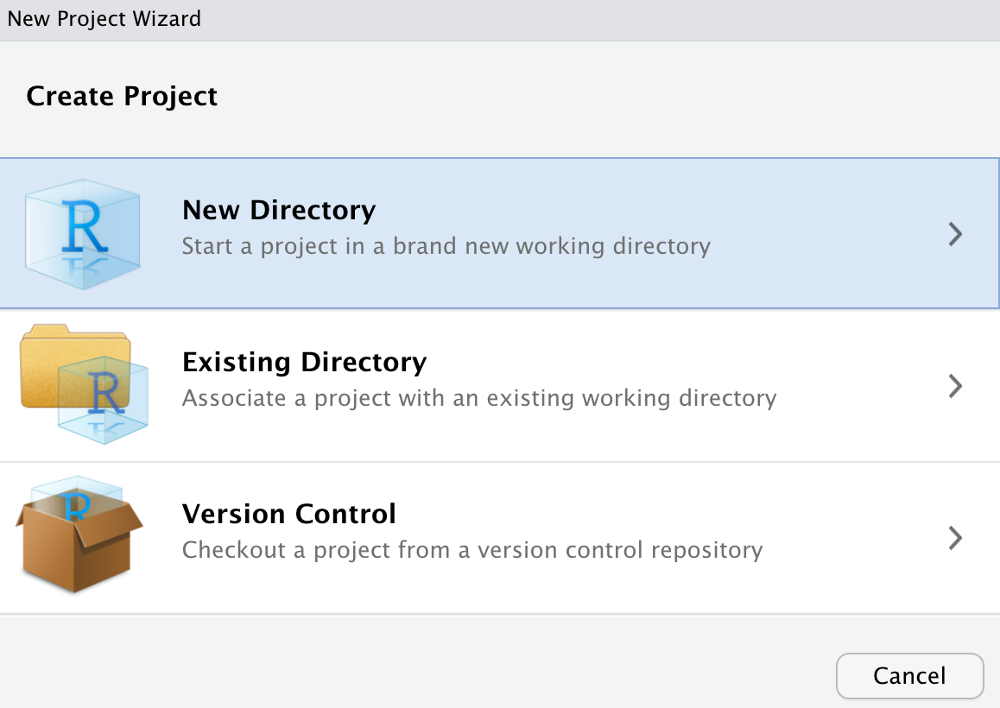
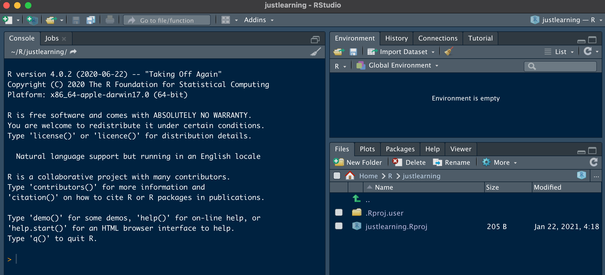
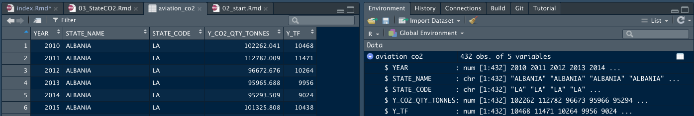

--- 
title: "Analysing Flights with R - UNDER CONSTRUCTION"
author: "David Marsh"
date: "`r Sys.Date()`"
site: bookdown::bookdown_site
documentclass: book
bibliography: [book.bib, packages.bib]
biblio-style: apalike
link-citations: yes
geometry: margin=3cm
description: "This is a training and reference manual for Eurocontrol staff, on how to use RStudio to analyse our traffic data. - UNDER CONSTRUCTION -"
---

# How to use this book {#howto}
-- UNDER CONSTRUCTION! ---

## Before you start

You need to have RStudio and R installed on your machine. These are available from IT Support as standard installations, or if you want to work on your own machine, both are open source: [R download here](https://cran.r-project.org) and [RStudio download here](https://rstudio.com/products/rstudio/download/).

We assume that you are familiar with air traffic data, so won't spend time explaining the concepts.

This book is available as [html here](https://david6marsh.github.io/flights_in_R/) and can be downloaded complete with data from here (TBD).

If you're working through the book as training, then it will help to install (TBD - training bundle)

If you want a more speedy introduction, then Enrico Spinielli has covered the [important steps here](https://github.com/euctrl-pru/portal/wiki/Intro-to-everything). Sebastien Thonnard and others have compiled an (internal) [wiki on the intranet](https://ost.eurocontrol.int/sites/STATFO/WikiPages/R_documentation.aspx).

There are also several useful 'cheat sheets', which we'll introduce as we go through.

Although this was written with Eurocontrol staff in mind, beyond this short section I think you'll find everything is open to anyone. The joys of open source! 

```{r include=FALSE}
# automatically create a bib database for R packages
knitr::write_bib(c(
  .packages(), 'bookdown', 'knitr', 'rmarkdown'
), 'packages.bib')
```


## Ways to Use the Material

The book aims to support you using it in a number of different ways:

* Training. Work through chapters in order, or pick out specific chapters if you need a refresher on a topic. Read the explanations, grab the code and run it, and test your understanding by answering questions [in square brackets in the text] and doing exercises.
* Reference. Use the book search (top left of this page) to find some how-to material directly.
* Snippets. The book builds up snippets of usable code (TBD - how complete?) for you to cut-and-paste.

But it is never going to replace the huge amount of excellent information, especially in [stackoverflow](https://stackoverflow.com/). A key principle is that _"Google is your friend"_: even if I prefer [DuckDuckGo](https://www.duckduckgo.com) for many purposes, a google search is often more productive for R. Whether it's for how to do something, or how to respond to an error, usually someone has already suffered, and some kind person has answered. Google it.

## Structure of the book

* Chapters \@ref(howto) and \@ref(start) should get you up and running in RStudio.
* Chapters \@ref(firstLook) to 5 start with how to look at data, using a data viewer and with some initial graphs. If you're mostly using existing code that creates simple charts, written by someone else, then these chapters should help you find your way around, and start to adapt the code for your own needs.
* Chapters \@ref(loopsfunctions) (and TBD) do more data loading and wrangling, covering the basics of loops and functions
* more...TBD
* Chapter \@ref(splitparse) covers pulling data out of strings (parsing) using 'regular expressions', with NOTAMs as the application.

## What's gone wrong?

Learning from mistakes is essential, so each chapter has a "what's gone wrong?" section near the end, discussing some typical potholes that we all fall into from time to time. Look there especially if you don't see the results from the code in the book that you were expecting.

We start the book with one classic pitfall: R is *case sensitive*, which can be quite a culture shock if you're brought up on other systems. This matters for filenames as well as code. When in doubt, check the case of what you've typed!


<!--chapter:end:index.Rmd-->

# Getting started {#start}

We said in chapter \@ref(howto) that you need first to install R and RStudio. These are separate pieces of software: R does all the statistical and graphics stuff, while RStudio provides the graphical user interface. In this chapter we get up and running in RStudio, and see some very basic R code.

## Orientation in RStudio {#rstudio}

Here we take a brief look around the RStudio interface. Use 'RStudio/Help' to get more detailed help.

The RStudio interface can be customised almost beyond recognition. We'll use a mix of styles in the book so that you don't get too fixed on seeing only one, but it's probably helpful to your colleagues not to re-order the main four panes, otherwise they'll find looking over your shoulder or screen-sharing a disorienting experience.

A basic MS Windows RStudio, with work on the go, looks something like this.


The main panes of the screen are:

* Top left: source code, shown as a number of tabs, one for each file;
* Bottom left: the 'console', which is a scratchpad for entering code, and where log output is usually shown (and some other tabs which we don't need here);
* Top right: the 'environment' and 'history' tabs are of main interest. Environment is where you can explore all the data you've created. History is useful for re-doing something, particularly as you can search for code.
* Bottom right: This has several important tabs
  + Files: for exploring files within a project, can be quicker than using the windows explorer;
  + Plots: is where plots will appear (usually);
  + Packages: is for checking which packages are installed, or active (see section \@ref(packages));
  + Help: all the details of the functions that you will need - this is usually quicker to use than googling a function (though the same help files also come up when you google, from various providers around the web).
  
The buttons that appear around the panes are context-sensitive: they will change according to the type of file that you have open.

There are some hot-keys for moving rapidly around the panes: most often, I use ctrl-1 to go to the source code, ctrl-2 for the console. You can then guess the others, or find them by trial and error.

Recent versions of `RStudio` have a tutorial (tab in top right pane) if you need more detail.

Try out the console (bottom left, ctrl-2). Try typing `3 + 4 * 2` there (and press 'enter'). You should see "[1] 11", meaning that the first "[1]" (and in this case only) element of your answer is 11. The spaces in that calculation are optional, but recommended for ease of reading. [Try it without the spaces.]

If you'd like to see an answer with more than one element, type `letters` into the console. This is a built-in constant. Check the 'help' for 'letters' to see some others.

## First project

The console is good for quick, throw-away calculations. But it's a bit like treating R as a pocket calculator. Instead, we want to save R code in files. 

While you can work with 'bare' files of R source code, 'script files' in the jargon or 'scripts', we think it's tidier to use 'projects', for two main reasons: 

* you can work with several shorter script files (and other types of source file that we won't be looking at) together, which makes it easier to organise and navigate;
* and a project automatically remembers which directory it's working in, so you can manage data input and output and graphic output more neatly.

Create yourself a new project using 'File/New Project', selecting the options new project, give it the name 'justlearning' and browse to put it in your personal R directory. (TBD templates). The sequence should look a little like this, with variation coming from where you create the new project subdirectory. That final part depends on your system and filing habits.
{width=75%}

{width=75%}

{width=75%}

In that final step, if you are working on a Windows machine you will see a slightly different path to your 'user directory' under 'Create project as a subdirectory of:'. It's rare that you need to change this, anyway.

The project will open without a code panel (which would have been top left), because you have no code yet. It looks like this.


In this book we'll assume that projects always keep data in the `data` directory, and save graphs to the `graphs` directory. You can create these quickly in your new project by copying the code from here (quick-copy icon appears top right in the code block when you move the mouse over it) and pasting it into the console (and press 'enter').

```{r new_project, eval=FALSE}
# good to have these in every project
dir.create("data")
dir.create("graphs")

```
If for some reason the directories already exist, don't worry, you'll just get a warning. The line beginning with '#' is a comment which is ignored.

You can also create these directories manually using 'New Folder' in the files tab (ctrl-5), but then make sure both folder names are in lower case! You could even use your operating system file explorer - these are just ordinary directories ('folders'), there's nothing R-special about them.

When you quit RStudio it will save any data and open files in your project. So you can re-open and continue from where you left off. If you've opened very large files, just beware that saving a copy as you close can take some time. (see TBD) 

## First code

Now that you've got a blank project, add a new blank R script file using `File/New File/R Script`, or the 'file plus' icon top left. It appears in the source code pane, top left. 

Immediately save it; call it 'chapter2' for example. The name isn't critical here, but avoid spaces and punctuation. By default, it will be saved to the top level in the project. This is fine for many projects, though in some cases we might choose to organise code differently.

It's good practice to comment as you go along, using `#`. At the top of your new script put some comments saying who you are, the date, and what it is for. Then add a comment for each chunk of code, or for any lines you think might be difficult for you to understand when you come back. I forget where I read this idea, but think of comments as 'notes for a future you'.

Type this code into your new 'chapter2' script, either manually or copy paste. 

```{r first_code, eval=FALSE}
3 + 4
# I know pi
pi
1:50
cos(pi/3) # angle is in radians
```

Unlike in the console, in a script file code doesn't get executed as you type. You have to run it. Usually you're either:

* stepping through code, running a bit at a time, in which case ctrl-enter (cmd-enter on the Mac) is easy to use: it runs the code where the cursor currently sits most of the time intelligently selecting other lines that need to run at the same time, and then moves to the next line of code, jumping over comments that are preceded by `#`;
* running all of the code, which you can do by pressing the 'source' button (or select all and ctrl-enter).

The output appears in the console as a running log. It should look like this:


## First packages {#packages}

The R language is expanding continually as people publish new packages for it. A 'package' provides a collection of functions, often some data and sometimes some new data types. If you're starting in R, and just aiming to find your way around in and use code, then mostly what you need to know is how to load packages (and what that means), and a little about the more common ones. That's what we cover in this section.

### Package basics {#twocolons}

Some packages are already bundled in the basic installation of 'R', such as `base` which provides, as the name suggests, many of the most basic functions. But there are thousands of other packages, coming from:

* [CRAN](https://cran.r-project.org), the "Comprehensive R Archive Network" is the authoritative collection of packages. There are also various 'mirror' (official copy) sites hosted elsewhere, such as at Ghent University. Packages in CRAN have been through a degree of quality control, and are preferred to the less official sources.
* [Github](https://github.com) and other public repositories. Even Eurocontrol shares some there, such as [CODA taxi times](https://github.com/david6marsh/codaTaxi) and the [PRC dashboard](https://github.com/euctrl-pru/portal).
* Home-made. Making packages is out of the scope of the book, but if you're inside Eurocontrol, you may want to load the `statfor` package (see section TBD) created by Sebastien Thonnard that builds some access to Eurocontrol datawarehouses as well as nice formatting.

There are two^[actually, there's a third, but that's too much detail for here] steps to using a package, and sometimes these get confused:

1) Installation. You type `install.packages("package_name")` and R finds the files for that package and saves them on your machine or on a network drive. So the files are available. You've done the shopping and the food is in the kitchen cupboards.
2) Attaching or Loading. You have to make a package _available_ for use for your session, usually with `library( )`. You've pulled the ingredients for your recipe out of the cupboard and they're on the kitchen table. If there's a difference between 'attaching' and 'loading' then it doesn't matter here. 

A few packages are automatically loaded at the start of the session. In the packages pane, a package is listed if it is installed and ticked if it's loaded. In the screenshot, just the `base` package is loaded of the ones listed in this screenshot.


Clicking on the package name takes you to the documentation. There's a manual for all functions together, as a pdf, but it's usually easier to use the help pane to get the same material, and perhaps copy examples from the end of each help entry. More importantly here there are links to **vignettes**, and often now to websites with more info. Vignettes are not little stickers, but essential how-to guides mixing text and code. Often this can provide a skeleton end-to-end structure showing how to use functions, and that you can copy and adapt to your own need. 

You can load a package by ticking the box in the packages pane, but normally it's done in code, as in this example.

```{r loadingPackages}
library(lubridate) # lots of date-related functions.

```

Two packages can define a function with the same name. The CRAN repository of packages performs quality checks, but overlap between packages is not something CRAN controls. Think of CRAN as an excellent library rather than an 'Académie française' for R  that controls which words are allowed into the language^[Actually, CRAN does enforce some quality control but that's more about how packages work than what packages there might be, with which functions.]. When there is overlap in packages, both defining a function with the same name, say, then on loading the second one 'masks' the first (you should see this above). Sometimes, as an alternative to loading the full package, you might see in code a 'two colon' usage, such as `base::union`. This is very common inside packages (it's recommended), and it's a way to insist that the first package version of the function should be used. 

As well as function with the same name and different results, there are often many different functions that you could use to achieve the same result, eg `base::paste0()` and `stringr::str_c()` both concatenate strings.

```{r concatenate}
# both concatenate two strings, inserting no separator between them
base::paste0("On Ilkley Moo", "r.")
stringr::str_c("On Ilkley Moo", "r.")
```

In this example, notice that the strings to be concatenated are written in quotes. It's recommended to use double ", rather than single '. And while we're on such conventions, the space after the comma in the parameter list is optional, but recommended for ease of reading. In fact you'll see that when there are lots of parameters or long ones, we tend to move to a new line, also for ease of reading. Meanwhile, there should be no space between the function name and the '('.

There's an art in R to doing the most with the minimum number of packages, since it takes time to find your way around the functions in a package. That's like the satisfaction of making the recipe from things you already have in the cupboard.
 
But sometimes, you just don't want to make the flaky pastry yourself. There are times when you're looking at a complex task and should be thinking 'surely someone has already tackled this in R?'. A little googling will often find you most of the pieces already in place in a new package, or one you have but had forgotten about. 

You develop a personal 'dialect' of R, from the packages that you choose to use most often. We'll discuss one of the most common dialects, the `tidyverse`, in more detail in the next section. Since it helps if you and colleagues share a dialect, everyone adopting the tidyverse is a good start.

### Tidyverse

The [tidyverse](https://www.tidyverse.org) is our chosen dialect, in the sense that in most cases we'll use the functions and data structures, and way of organising, that go with this collection of packages. There's a lot of excellent documentation already available, so we will explain some basics here, and introduce other elements as we need them for flight data examples.

The *tidy* in 'tidyverse' refers to a [tidy data structure](https://r4ds.had.co.nz/tidy-data.html): a table with each variable in its own column and each observation on one row. While we often find flight data with years displayed across the table, and countries down the side, this is not 'tidy'. 

```{r echo=FALSE}
knitr::kable(data.frame(Country = c("France", "Germany"), Flights2019 = c(1.3, 5.2), Flights2020= c(1.5, 6.0)),
             booktabs = TRUE, caption = "An untidy table.")

knitr::kable(data.frame(Country = c("France", "Germany"), Year = 2019:2020, Flights = c(1.3, 5.2, 1.5, 6.0)),
             booktabs = TRUE, caption = "A tidy table.")

```

The main data structure used by the tidyverse is the dataframe, although increasingly the tidyverse prefers the 'tibble' `tbl`, which is a specific sort of dataframe. We won't worry about the differences here.

For most 'quick pieces of code', the easiest is to start your R script with a `library(tidyverse)` to load all the parts of the tidyverse. If you were writing a package, that wouldn't be very efficient, because there's quite a lot of it. Sometimes you'll see individual parts of the tidyverse loaded including:

* `ggplot2`: lots of plotting functions (see next chapters)
* `dplyr`: for manipulating and processing data
* `tidyr`: for tidying data, such as pivot-table like actions, or splitting columns.

And there are packages which are on the outskirts of the 'tidyverse' which get announced when you first load. The full list (at the time of writing) is as follows. 

```{r echo = FALSE}
library(tidyverse)
tidyverse_packages()
```

These include `lubridate` and `stringr` which we've already mentioned.

We'll see a lot more `tidyverse` usage in chapters TBD, when we get to grips with data wrangling. Just to whet your appetite, here we show two quick examples. Try the code out, but don't worry if it's a little cryptic at this stage, we will explain the parts in more detail later.

Start with the untidy dataframe shown above. Use `pivot_longer` to make it tidy, all in one go selecting a number of columns (those that start with 'Flights') and extracting the 'year' from this, then pivoting to the tidy form. 

Then we show a pairing of `group_by` and `summarise` to produce some annual totals. This example doesn't save its result but prints it immediately to the log.

```{r}
untidy <- data.frame(Country = c("France", "Germany"), 
                     Flights2019 = c(1.3, 5.2), 
                     Flights2020= c(1.5, 6.0))
# tidy the data
tidier <- pivot_longer(untidy, 
                       # pivot the two columns starting with 'Flights'
                       cols = starts_with("Flights"),
                       # put the column names in a column called 'year'
                       names_to= "year",
                       # ignore the 'Flights' bit of the name, and treat as integer
                       names_pattern = "Flights(.*)",
                       names_transform = list(year = as.integer),
                       # put the column values in a column called 'flights'
                       values_to = "flights")
print(tidier)

# using groups - just print the result
tidier %>% group_by(year) %>% 
  summarise(total_flights = sum(flights))


```

Don't worry if this demo seems complicated, or to come out of nowhere - we'll take it more slowly in Chapter TBD. But it illustrates the principle we mentioned earlier: for many operations (like tidying a table), you're not the first to need to do this, so there's probably a neat way to do it in R.

You'll see another short bit of tidyverse at the beginning of the next chapter.

## File types {#filetypes}

You will see lots of different file types (ie file extensions), in the files pane. The main ones to remember are:

* `.R`, `.Rmd`: both contain R code, though `.Rmd` is actually 'r markdown' which is a mix of code and text;
* `.RProj`: contains an R 'project' - if you see one of these in the directory, this is the one to open - everything else works from there (see TBD);
* `.rda`, `.RDS`: are different types of data file. R works easily also with `.csv` and `.xls(x)` see TBD.

## What's gone wrong?

If you see a window like this, then you have started R rather than RStudio. That is a GUI and you can use it to execute R code, but you'll find RStudio easier for all but the quickest snippets of code. {width=60%}

If it keeps on happening you will find it helpful to associate R files (`.R, .RMD` and others) with RStudio rather than R.

If you get errors saying a certain package is only compatible with version xx and higher (of R), and you think you've recently updated, are you sure you updated R rather than RStudio? (Even if this is a task for IT, perhaps they misunderstood and updated the wrong one?) The RStudio version is found from the top menu 'RStudio/About R Studio', the R version is seen when you first start up (see the image just above), or is printed if you type `version` in the console.

If you're searching in 'help' and a function isn't appearing, for example in the drop-down as you type, it is probably because it comes from a package that isn't loaded. You can finish typing, and the system will search and may find it, but also some other less good matches. Or if you know the package name, you can type `?ggplot2::geom_line` for example, in the console to go straight there.

## Test yourself

### Questions

1. Where will you (usually) find the help on functions?
2. Which of these provides a graphical user interface (GUI): R, RStudio?
3. Which ctrl-key combination takes you to the environment pane?
4. What does an `.rda` file contain?
5. What's the difference between typing into a script file and into the console?
6. What is a 'vignette'?
7. (teaser) What does `3 + 1:3` give?

### Answers

1. Bottom right.
2. Both, though you'll nearly always want to use RStudio.
3. CTRL-8
4. One or more R datasets
5. With the console, code is executed as each line is completed.
6. An extended entry in the documentation showing how to put the functions of the packages together.
7. `4 5 6`


<!--chapter:end:02_start.Rmd-->

# First look at data and CO~2~ emissions {#firstLook}

It's hard to get far in an analysis without first looking at the data to ask questions such as:

* What variables are there? Do I know what they all mean? 
* What time period does it cover?
* Which countries, or airports etc, are included?

In this chapter, we introduce some of the ways to take a quick look at your data. We also introduce some data on CO~2~ emissions per European State from aviation. 

```{r, echo=FALSE}
knitr::kable(data.frame(syl=c("`read_xlsx()`, `<-`, `summary`, `str`, environment pane, `View()`, `unique`, `head`, `c()`, `[]`, `ggplot()`")),
             col.names = c("In this chapter, you'll be introduced to:"))
```

Re-open your `justlearning` project (File:Recent Projects, or 'justLearning.Rproj'). Create a new script file (File:New File:R script), to copy and paste the examples into, and save it as 'chapter3'.

Although the project re-opens your datasets and scripts, it starts in a new R session. That means that you have to re-load the package(s) that you need, as in this code. So you might find it easier to have this at the start of your 'chapter3' script.

```{r initialiseChapter, results='hide', message=FALSE}
library(tidyverse) 

```


## Looking at data: CO~2~ Data {#loadco2}

We use public data on national CO~2~ emissions from aviation available on the [EUROCONTROL/AIU website](https://ansperformance.eu/data/). We choose this, apart from the interest in the data themselves, because it's a small set so quick to download, and it's already tidy (each variable in one column). To isolate this book from changes in the original file, we use a version that we've saved to github.

```{r getCO2}
# download the file to the data folder, the 'mode' parameter is needed on Windows machines
co2_url <- "https://github.com/david6marsh/flights_in_R/raw/main/data/CO2_emissions_by_state.xlsx"
# if you want the original, which might have been updated, use this instead
# co2_url <- "https://ansperformance.eu/download/xls/CO2_emissions_by_state.xlsx"
download.file(co2_url, "data/CO2_emissions.xlsx", mode = "wb")

  
# load from the DATA worksheet - case sensitive!
aviation_co2 <- readxl::read_excel("data/CO2_emissions.xlsx", 
                                  sheet = "DATA") 

```

We've already seen the `function(parameter)` way to call a function in the `cos(pi/3)` example. Now we have `something <- function(parameter, parameter)`. This is a peculiarity of R that you just need to get used to. Think of it as saying: create `something` in the environment (without saying what it is just yet), then fill it (`<-`) with the results of the `function()`. While you might occasionally have used a function in Excel, for example, in R basically everything you do is call functions.

Now that the Excel data are downloaded, in your R script comment out the line `download.files(...`, because we don't need to keep downloading if you happen to re-run the code. Comment means putting a `#` in front of it. Pressing shift-ctrl-C (shift-cmd-C on a Mac) does the same, and also works over many lines at once.

Notice that R doesn't mind if a function is split over several lines. If there were frequent updates, maybe you would repeatedly download (so not comment out). See (TBD) for an example. [See the Excel, now in your project `data` folder, for disclaimer and details.] 

International conventions mean that CO~2~ emissions are measured from flights departing airports in a state. `read_xlsx` automatically selects the first row as variable names.

One tool in the 'explore your data' toolbox is `summary`.

```{r co2summary}
summary(aviation_co2)
```

The `summary` function is fairly basic, but it gives a quick feel for what's in the data. Often more helpful with numeric than character variables, but also useful for spotting if there are missing values `NA`. So we can see there are no missing values here.

In this dataset we have:

* YEAR: An integer, not a date, but `read_xlsx` reads this as a real number (ie potentially having decimals).
* MONTH: An integer, giving the month in the year. Again, this has been assumed to be real rather than integer.
* STATE_NAME, STATE_CODE: A long name and the 2-letter 'country code' derived from the ICAO 4-letter communication address, of which the less said, the better.
* CO2_QTY_TONNES: Total annual CO2 emissions, in (metric) tonnes.
* TF: Total flights. This is departing flights. Flights through a state's airspace that do not land are not counted, nor are arrivals from outside the state. A domestic flight is counted once, as a departure.

You'll notice a few names in there which aren't states, such as 'Canaries' which is counted separately from Spain. These measurements add up cleanly (this isn't always true in flights data), so you can get the full 'Spain' by adding the two. There are also some States with a '*' next to their names, which means there's a footnote elsewhere in the spreadsheet.

We want to keep things simple, so we will use a little data wrangling to aggregate to yearly totals for each country, then save the result as an R dataset, rather than an Excel file. These are some quite common step in data wrangling:

* Drop some variables. Here, just `select` everything _except_ than `STATE_CODE`. (Not is a very thin `!`, so easily overlooked.)^[In fact, this step is here just to illustrate the selection step. It's not needed, as we'll see in the data wrangling chapters, or you could test by removing it.]
* Summarise. `group_by` the relevant variables, then summarise within those groups. Here we use the `summarise_at` variant of summarise, which allows us quickly to apply a function `sum` to multiple variables.
* Drop some rows. There are few families and business unaffected by COVID-19. Aviation is of course no exception, and the data from 2020 are really an outlier for this reason. To keep things simple here, we omit 2020, using a `filter` that says 'keep only the values before 2020'. The `group_by` isn't _essential_ for the filter, but I think it's probably faster as written here, since the grouping process has already found all of the year 2020 values.

Often you want to keep your groups, but here we don't need to, so we `ungroup` at the end. Then we save the data into the `data` subdirectory of the project.

There will be more examples of this sort of data manipulation in Chapter \@ref(filter), with more explanation of what's happening. And a lot more when we turn to data wrangling in chapters \@ref(loopsfunctions) and \@ref(groups).

```{r}
annual_co2 <- aviation_co2 %>%
  select(!STATE_CODE) %>% 
  group_by(YEAR, STATE_NAME) %>%
  summarise_at(vars(CO2_QTY_TONNES, TF), sum) %>%
  filter(YEAR < 2020) %>% 
  ungroup()

save(annual_co2, file = "data/annual_co2.rda")

```

 
There are three other important ways to explore the data. Firstly in the environment pane (top right, CTRL-8), where you can click the first line, with name on, to see a summary. You get much the same thing in the console by typing `str(annual_co2)` where `str` is for 'structure'. You should see something like this.


We can see that there are three numeric variables (`num`) and two character variables (`chr`). All five variables have the same number of observations (`r nrow(annual_co2)`). In a tibble or dataframe the columns are always the same length.

The second way to explore the structure, because this is a tibble, is just to type its name in the console. [Try it] This is useful but just bear in mind that for some data structures, this might fill up your console with a lot of output. Save it for when you're sure you've a tibble. You can check by typing `class(my_thing)` into the console to see if `my_thing` is a tibble (shown as `tbl`).

The third way gives a window to explore every observation. Click on the dataset name next to the blue arrow or type `View(annual_co2)` in the console (sorry about the upper case 'V', R is like that) and you get a tabular data explorer, which allows you to sort and filter. You should see something like this. [Try out the sorting and filtering in the view window. Filter to show only the Netherlands, and sort by total flights.]



## Extracting variables {#extractfield}

To answer more questions about the data there are some more tools to summarise the values that it takes. We saw `summary()` works for numeric values, but what about discrete ones?

There are several ways to pull one variable out of your data. We'll use the `$` notation, partly because there's a reminder of this in the environment tab. [Where is this 'reminder'?]

```{r whichStates}
# pull out all values in the column
state_vbl <- annual_co2$STATE_NAME

states <- unique(state_vbl)
```

Look in the environment pane, `state_vbl` is listed under 'Values'. It's a (column) vector, one of the simple data types in R which is why it's listed under 'Values' and not under 'Data'. 'Data' is for more complex data structures, such as dataframes and tibbles. You've just pulled a column out of `annual_co2` so not surprising that it has the same number of rows as `annual_co2`. And the first values are all `r states[1]`, or were when this book was compiled.

Really we want to know how many different states there are, and which ones. `unique` does what it says, and we've saved these as `states`; a variable name which to me implies 'unique states'. You can tell how many there are from the environment pane, or you could use `length(states)`. [How many are there?]

To inspect all of these values you can just type `states` into the console, a good way to check the spelling of some, perhaps. [Try this. Is it 'Canaries' or 'Canarias'?]

The order in which the elements are shown is as in the original data, there's no re-ordering unless you ask for it. If you've worked with SAS PROC SQL or other languages, it might come as a relief to hear that, in R, the order of rows stays where it's put until you say otherwise; none of this need to sort before every operation. We'll see some ways to handle 'top' values later (section \@ref(topStates)).

So in this case, even if the `states` are in alphabetical order, that's just because the original Excel file was.

## Extracting a few values {#someValues}

We've just seen how to pull a variable out of a tibble, as a vector. How do we extract one or more values out of the vector that we created?

The `states` are quite a lot to show in the console. Sometimes you just need to see a quick sample, eg to check if they're in title case, or if they're codes or names. `head()` is useful for showing you the first few (6 by default).

```{r}
head(states)

```

If you want to pull out a single value, or a few of them, again there are multiple ways to do this, but the simplest is this. We show here two ways to select with a vector of numbers: creating a consecutive sequence of numbers (`1:3`); and creating a vector with an arbitrary selection (`c(1, 5, 10)`).

```{r}
states[1]
states[3]
states[1:3]
states[c(1, 5, 10)]

```

We'll deal with subsetting the whole dataset, rather than just a vector extracted from it, in the next chapter.

## CO~2~ Scatter plot

It's hard to beat a graph as a way to explore data. So we end the chapter exploring a simple graph. The tidyverse way of doing this is to use `ggplot`.

### First draft

In the most basic scatter plot we have the following components, joined with a `+`. This `+` is peculiar to `ggplot`; another lovable quirk of R. Learn it, but get used to the idea that you'll forget and use other conjunctions by mistake at times. 

In the simplest code we have:

* `ggplot`: with parameters the data to use, and an 'aesthetic' `aes`;
* `aes`: gives the x and y first, and here also says choose colour based on year;
* `geom_point`: says to plot points with these data, ie a scatter plot.

```{r}
ggplot(annual_co2, 
       aes(TF, CO2_QTY_TONNES, colour = YEAR)) +
  geom_point() 

```

Even this simple example illustrates that:

* a parameter to a function (here `ggplot`) can be another function call (here `aes()`);
* we can specify parameters by position of appearance in the list (`x` and `y` are first and second for `aes`) so we don't have to name them, or we can specify a parameter by name (`colour`), or a mix of both (as long as the position ones come first!);
* `geom_point` takes its aesthetics by default from the `ggplot` statement. We'll see later that you can add to or override this default (eg section \@ref(labelco2)).


There's a (very) rough correlation along a diagonal line, but it would be interesting to know which states are above the line (more CO~2~ per flight) and which below. And is the change gradual, or is there much variability?

### Improve the titles

Let's at least label the axes so that someone else can see quickly what has been plotted. We can transform variables on the fly (using the rule that a parameter can be a function call, here to the function `/`), so let's convert both axes to millions (`1e6` means 1*10^6, so millions with less risk of getting the number of 0s wrong).

The label on the legend is meaningful, but to avoid the block capitals we can change that too within the `labs()` statement. It's a 'colour' legend (that's what is in the `aes` call), so you need to refer to 'colour' in the `labs()`. 

```{r}

ggplot(annual_co2, aes(TF/1e6, CO2_QTY_TONNES/1e6, colour = YEAR)) +
  geom_point() + 
  labs(x = "Departing Flights (millions)", 
       y = "CO2 (million tonnes)",
       colour = "Year",
       title = "Emissions per state")

```

### and with clustering by state {#statecluster}

It's tempting to read the graph as having a number of small clusters, each with flights and CO~2~ increasing with time, and assume that each of these corresponds to a single state. It would be nice to use the graph to see if that's true.

There are too many countries to give each its own shape (we'll see shapes used more effectively in section TBD), but we can easily add a line to join the points for each state. [Working from `geom_point`, how do you think you would add a line?]

We need both to add a line, which follows the pattern of `geom_point`, and group by state. That's done in the same way that we coloured by year, in the aesthetics. There are several ways to plot a line. The most obvious one, having seen `geom_point` previously, is `geom_line`. However, this joins the points in x-axis order. We want data order, so that's `geom_path`.

Out of a sense of neatness, we also add a subscript to CO~2~. The code `bquote(~CO[2]~" (million tonnes)")` took some googling and is cryptic, but it works!

```{r}
ggplot(annual_co2, aes(TF/1e6, CO2_QTY_TONNES/1e6, 
                         colour = YEAR, group = STATE_NAME)) +
  geom_point() + 
  geom_path() +
  labs(x = "Departing Flights (millions)", 
       y = bquote(~CO[2]~" (million tonnes)"),
       colour = "Year",
       title = "Emissions per state")

```

The graph isn't ready for a presentation yet, but a story is already emerging. The lines do a pretty good job of grouping the years for each state together. We see a graph with 6 busy states, 3 of which are fairly linear, so a relatively fixed CO~2~/flight. Three others are more variable from year to year. 

Then there are two states, with flights in the 0.25-0.5 million flights range and that diverge from the main trend line, respectively higher and lower. The remaining, smaller states rather overlap in this graph. 

We'll find out how to pick out and label states in the next chapter.

## What's gone wrong?

Why do I get a message saying something like "could not find function ..."? When you re-open RStudio, remember that it goes some of the way to restarting where you left off (opening files and loading datasets for you), but it opens in a new R 'session'. That means that only the base packages are available. That's why your R scripts usually start with a bunch of `library()` statements - you have to start by running these to get the packages back for this session.

It pays to looks closely at the graph and try to explain what you see. In fact, it was only once I'd tidied the colours up that I noticed that they were not in order along the line. I had used `geom_line` (join in x-axis order) in place of `geom_path` (join in data order). So story-telling can help debugging too. Also, it pays to read the help file, even if you think you know how the function works.

We'll see more about grouping in later chapters. It's quite common that I get errors in some tidyverse data wrangling, because the dataset is grouped, and I had forgotten that. So grouping is powerful and quick, but R remembers your groups longer than you do! 

## Test yourself

### Questions


1) Use `head` to view the first 10 states.
2) Using the help file for `head`, how would you display the last 6 states?
3) Which state names are followed by '*'?
4) Print the distinct state codes to the console.
5) Print the 3rd, 23rd and 33rd state names to the console.
6) What does `<-` do?
7) In `ggplot` what does `+` do?

### Answers

1) `head(states, 10)`
2) `head` is documented alongside `tail`: use `tail(states)`
3) (In my version of the data), typing `states` into the console, and by eye I see 4 states with a '*'. We'll see other ways to do this, later.
4) `unique(aviation_co2$STATE_CODE)`
5) `states[c(3, 23, 33)]`
6) It puts the results of whatever is on the right-hand side into the object on the left.
7) It connects parts of the definition of a graph together.


<!--chapter:end:03_StateCO2.Rmd-->

# Filtering a dataset and refining the CO~2~ graph {#filter}

In this chapter we improve the CO~2~ emissions graph, _en route_ learning how to filter observations from a dataset, to add new variables, and to use the `pipe` operator `%>%`.

```{r, echo=FALSE}
knitr::kable(data.frame(syl=c("`filter()`, `==`, `%in%`, `mutate()`, `slice_max()`, `%>%`, `geom_text_repel()`, `scales_colour_...`")),
             col.names = c("In this chapter, you'll be introduced to:"))
suppressPackageStartupMessages(library(tidyverse)) # without lots of messages filling up the book

# open the data file again if necessary
load("data/annual_co2.rda")
```

On re-opening your `justlearning` project, you should still have the `annual_co2` dataset in your environment, since RStudio saves these data and reloads on restart. If not, you should find that `annual_co2.rda` is saved in the `data` folder, and you can load it using `load("data/annual_co2.rda")`. One R speciality here is that you don't need to assign the result with a `annual_co2 <- ...`; in fact the single file that we saved could have contained a number of datasets, and they're all reloaded _with their original dataset names_.^[If even that doesn't work, and for some reason the `rda` file is not in your data folder, go back to section \@ref(loadco2), load the Excel file again, and find the code to summarise over years.] 

If you have closed RStudio and re-opened it, then you have a new session and need to reload packages, in this case `library(tidyverse)`. Make yourself a new R script file for 'chapter4' starting with this.

## Sequences of functions

It's time for a bit more syntax. We saw already that you can combine functions by making one the parameter to another. Or to put it another way, wrapping one around the other. As you combine more functions, this soon becomes hard to read, and you have to rely on the editor to help you spot whether you've enough brackets closed at the right point.

For that reason we use a different syntax, the 'pipe' operator `%>%` introduced by the `magrittr` package and adopted by the tidyverse. If you learn only one control-key combination in RStudio, do learn shift-ctrl-M (also shift-command-M on Mac). This must be the fastest way to type '%>%'! [Try it in your console.]  

With a new line after each `%>%` and appropriate indenting (RStudio helps with that), you get code that looks like this. This says, fill `a` with what you get from dataset `b` after applying function `fun1`, then function `fun2`.

```{r syntax, eval=FALSE}
# which is clearer
# with a pipe?
a <- b %>% 
  fun1(p1) %>% 
  fun2(p2, p3)
# or without?
a <- fun2(fun1(b, p1), p2, p3)
```

The pipe syntax works because `fun1` actually has a parameter list that _starts_ with the dataset to which it should be applied `fun1(data, p1,...)`. So `b %>% fun1(p1)` is just another way of writing `fun1(b, p1)`. Or, the other way around, you can use `%>%` whenever you have a function whose first parameter is the dataset to be operated on. It turns out that this is true for very many of them, and the tidyverse is designed that way. [Does the code to summarise by year that you saw in section \@ref(loadco2) make more sense now that you know about `%>%`?]

## Filtering datasets and logical tests

As is so often the case, in R there are several of ways to select rows from a dataframe or tibble. We'll focus on the `filter(data, test)` function. For this we need to know how to construct a logical test.

There are three parts to this: the logic, the test functions and what's being tested. 

1) Logic is mostly given by `&`, `!` and `|`^[that's a vertical bar, not an 'l' or 'I'] for 'and', 'not' and 'or', grouped with round brackets in the normal way. 
2) The test functions are _almost_ as you might expect: `>`, `<`. However, in R you need to use `==` not `=` to test for equality. I suspect this creates the most common typo in R code! Check the documentation of `dplyr::filter` for a more complete list of test functions: in particular look out for `%in%`, which we will use shortly.
3) One really nice touch in `filter()` is in the third part: what's being tested. One of the trickiest bits of learning R is knowing how, within a function, to refer to one or more variables of the dataset. In `filter()` you can just use the name of the variable; so no quotes needed around the name, and the code assumes it is a variable from the `data` parameter, so no need to use `annual_co2$...`.

In this example, we don't push the result into a dataset (no `a <- `), so it gets printed out directly.

```{r}
annual_co2 %>% 
  filter(YEAR == 2018 & STATE_NAME %in% c("CZECHIA", "ALBANIA"))
```

Note that:

* the order of the rows is as in the original dataset, not at all influenced by the order of the naming of the states in the test
* `YEAR` and `STATE_NAME` in the `filter` function are so-called 'bare' strings (ie without quotes) that _name_ variables, and are shorthand for `annual_co2$YEAR` etc
* but "CZECHIA" is a _value_ of a variable so needs to be a string in quotes
* and the test is case-sensitive. [Try changing it to "Czechia".]

## Selecting the busiest states {#topStates}

In the previous chapter we selected the first-named states with `head()`. Now we do something more useful: selecting the top states by flights, using `slice_max()`. We need to define this a bit more clearly. 'Top' could mean in a particular year, or over the whole period (where flights have decreased as well as increased). We choose to mean 'top by flights in 2019'. This is partly out of habit (top in the latest year is often the meaning) and partly because we need to introduce fewer new bits of R to implement it.

The code is like this. A final novelty is that we use `pull()` which, as its help-file says, does the same as `$` (learned in the last chapter) but looks nicer in pipes. [Where can you look at `top_states` to check that there are 8 values?]

```{r}
top_states <- annual_co2 %>%
  filter(YEAR == 2019) %>%     # top in year 2019
  slice_max(TF, n = 8) %>%  # top 8 
  pull(STATE_NAME) 
```

`slice_max()` is a good example of how R changes with time. New versions of packages introduce minor or major changes. Sometimes a function is `superseded` (left to rot), other times it may be `deprecated` (you have some time to switch to a new version before it's removed). The function `top_n`, which you might see lying around in legacy code, has been superseded by `slice_max()`. [Check out the documentation of `top_n` for some of the reasons.] 

These changes mean that just updating to the latest version of the package is not always the best idea, because you might have to spend some time checking for changes. It also means that, when searching on the web for hints, snippets and answers, you need to look at the date of the answer. `ggplot` in particular has changed quite a bit, so answers more than 5 years old or so might not be that helpful.

## CO~2~ graph for the top states

With `top_states` in place we can easily plot the data for the busiest states. 

We update the title, and add a footnote (`caption`) to explain what's going on. We could have created a new dataset, eg `top_co2 <- annual_co2 %>% filter(STATE_NAME %in% top_states)`, and then used this in the `ggplot`. But we only plan to use this filter once, so to avoid cluttering the environment with datasets, we filter 'on the fly', within the `ggplot` statement. In this case, this is a matter of personal preference. If the datasets were a lot larger, and we intended analysing and transforming just the top states in further graphs, the decision might be different.

```{r}
ggplot(annual_co2 %>% 
         filter(STATE_NAME %in% top_states), 
       aes(TF/1e6, CO2_QTY_TONNES/1e6, 
           colour = YEAR, group = STATE_NAME)) +
  geom_point() + 
  geom_path() +
  labs(x = "Departing Flights (millions)", 
       y = bquote(~CO[2]~" (million tonnes)"),
       colour = "Year",
       title = "Emissions for the busiest 8 states",
       caption = "Source: EUROCONTROL. 'Busiest' means most flights in 2019.")

```

One advantage of filtering on the fly is that we can change on the fly. [Change the filter to the states _not_ in the top 8. It takes one key press. Re-run the graph. Update the titles too.]

As an analyst, I really want to know which country is which. With just 8 states shown, maybe I can use symbols? At one level it's quick to do. Just replace `group = ` with `shape = `. [Try this.] `ggplot` complains that it doesn't really like using more than 6 symbols, because it becomes hard for the reader to jump between legend and graph. We could roll with it and learn how to extend the palette, but is there another solution?

We can separate states by colours. Again, quite quick: replace `colour = YEAR, group = STATE_NAME` with `colour = STATE_NAME`. [Try this.] The line means we can work out the ordering of the years easily, so losing the year isn't a big issue here. But eight colours is also a lot to tell apart. Even without colour blindness, you might think they're clear but when projected onto a screen or printed or on a tiny phone screen, perhaps not.

## Labelling the CO~2~ graph {#labelco2}

It's relatively easy to follow a slightly different route: adding state names directly to the graph. This is done with `geom_text` added to the `ggplot`. We only want to label the point in 2019 rather than all years, so we create a new variable which is empty except in rows for the year 2019. `mutate(a = ...)` is the function for adding a variable 'a' to the dataset^[and we use lower case for the variable name, because that's our preference, even if the imported names don't do this]. `if_else()` is how we give a value for only some years. As with the `filter()` function, we can refer to other variables in `annual_co2` without inverted commas. 

This time, we amend the `annual_co2` dataset itself, because we want to be able to use this in several places, not just in a single graph. The syntax `a <- a %>% ...` follows the same pattern as you saw earlier, but you're overwriting the original dataset.

The `geom_text()` _inherits_ all of the aesthetics from the `ggplot` function, so it already knows where to find x and y coordinates, and what colour to use. We still need to tell `geom_text()` where to find the labels. This is also an aesthetic.

```{r}
annual_co2 <- annual_co2 %>% 
  mutate(state_label = if_else(YEAR == 2019, STATE_NAME, ""))

ggplot(annual_co2 %>% 
         filter(STATE_NAME %in% top_states), 
       aes(TF/1e6, CO2_QTY_TONNES/1e6, 
           colour = YEAR, group = STATE_NAME)) +
  geom_point() + 
  geom_path() +
  geom_text(aes(label = state_label)) +
  labs(x = "Departing Flights (millions)", 
       y = bquote(~CO[2]~" (million tonnes)"),
       colour = "Year",
       title = "Emissions for the busiest 8 states",
       caption = "Source: EUROCONTROL. 'Busiest' means most flights in 2019.")
```

This is close, but not quite good enough. The text is centred on the 2019 point, and this creates some ugly overlaps. There are lots of options in `geom_text()` to adjust the position, and you'll find lots of examples on the web. So we could spend time adjusting the positions. But this is a first example of the rule: 'surely someone has already come across this problem?'.

Someone has indeed spent time to come up with good ways to deconflict and position labels on graphs. The package is called `ggrepel`, which you might need to install with `install.packages("ggrepel")`, and it provides a 'drop in' replacement for `geom_text` naturally called `geom_text_repel`. To avoid using `library("ggrepel")` when we're just using one function from the package on one occasion, we use the double-colon syntax in the code (see \@ref(twocolons)).

The defaults for this function work pretty well in this particular case. But there are a couple of things I'd like to fix: the block capitals and the year legend. Title case would be nicer, so we convert the `STATE_NAME` using the `stringr` package function `str_to_title()`. `stringr` is already loaded as part of the tidyverse, and since most of its functions begin 'str_' it's quite easy to start searching in the help pane for the right one [Try this.]. In this case `state_label` already exists and we overwrite it.

The other thing to improve is the year scale, which shows with meaningless decimals. We use a quick-ish fix, rather than the tidiest-possible solution. Scales, whether the axes or colours, are controlled by `ggplot` functions starting `scales_` in this case `scales_colour_steps()` gets us a scale that shows the individual years. This is a 'dirty' solution in the sense that, if the data for 2020 get included, you might need to tweak the code; but then, we've hard-coded 2019 in a number of places, so this is dirty elsewhere. We'll see cleaner options later (for example in section \@ref(factors)).

```{r}
annual_co2 <- annual_co2 %>% 
  mutate(state_label = if_else(YEAR == 2019, str_to_title(STATE_NAME), ""))

ggplot(annual_co2 %>% 
         filter(STATE_NAME %in% top_states), 
       aes(TF/1e6, CO2_QTY_TONNES/1e6, 
           colour = YEAR, group = STATE_NAME)) +
  geom_point() + 
  geom_path() +
  ggrepel::geom_text_repel(aes(label = state_label)) +
  scale_colour_steps(n.breaks = 8, show.limits = TRUE) +
  labs(x = "Departing Flights (millions)", 
       y = bquote(~CO[2]~" (million tonnes)"),
       colour = "Year",
       title = "Emissions for the busiest 8 states",
       caption = "Source: EUROCONTROL. 'Busiest' means most flights in 2019.")
```

## What does the graph say about CO~2~?

Longer-haul flights use heavier aircraft and therefore the [proportion of long-haul flights in a national mix is a major influence on CO~2~ per flight](https://www.eurocontrol.int/publication/eurocontrol-data-snapshot-co2-emissions-flight-distance). For example, the Netherlands has more CO~2~ per flight than Norway: Norway has a significant domestic (so short-range) market, which the Netherlands does not, being instead a major long-haul hub. These two states have been relatively stable. 

The UK also has a proportionally larger long-haul market. And a decline in its domestic market has led to quite a rapid increase in CO~2~ per flight in recent years. 

So, the graph helps to build a story: though we needed some supporting information to provide some of the explanation. It has also become clear that we're interested in CO~2~ per flight. See the exercises for a graph on that more directly.

## What's gone wrong?

It's inevitable that you will type `=` in tests where you mean `==`. Some functions have friendly messages, since this is so common. Others less so. 

Watch that case! We are using the function `filter()`, not the function `Filter()` which is something else entirely.

`if_else` is a fussy version of the base function `ifelse`, that we use here to maximise use of tidyverse functions. If it warns you that the 'false' must be something, then it has your long-term interests at heart. It just means that it's a different type to the 'true'. Compare `ifelse(1<2,"true",NA)` and `if_else(1<2,"true",NA)` where `NA` is the code for missing. 

## Exercises

### Questions

1) Where can you look to see that `top_states` has 8 values?
2) How does `geom_text()` know where to place the text on the graph?
3) Adapt `geom_text()` to shift all labels up 2 (million tonnes!). (Hint: Check the help file.)
4) Adapt the final graph to show the smallest 8 states instead. (Hints: What's the most likely counterpart to `slice_max`? Closely-related functions are often to be found in the _same_ help file, so checking the help for a function you know might help you find similar ones that you don't.)
5) Adapt the graph to show year on the x-axis and CO~2~/flight on the y-axis. (Hints: Mostly changing the first `aes()` and deleting some elements. For a pretty graph you might google how to hide the legend "ggplot hide legend", and how to set the breaks on the x-axis.)

### Answers

1) The environment pane, but you need to scroll down to "values" because it's a simple vector.
2) `geom_text()` inherits all aesthetics from the opening `ggplot(..., aes(...))`, which can be supplemented or over-written by its own `aes()`. In fact you could put the `label=` into the first `aes()`.
3) `geom_text(aes(label = state_label), nudge_y = 2)`. If you put the `nudge_y` inside the `aes()` you get an error ('Ignoring unknown aesthetics: nudge_y') because it's not something that can vary with the values of a variable ("not an aesthetic").
4) `geom_text_repel` uses call-out lines when it can't get the text close. You could experiment with making these a less confusing colour. You might also drop the 'millions'.
```{r}
small_states <- annual_co2 %>% 
  filter(YEAR == 2019) %>%     #  in year 2019
  slice_min(TF, n = 8) %>%  # smallest 8 
  pull(STATE_NAME)

ggplot(annual_co2 %>% 
         filter(STATE_NAME %in% small_states), 
       aes(TF/1e6, CO2_QTY_TONNES/1e6, 
           colour = YEAR, group = STATE_NAME)) +
  geom_point() + 
  geom_path() +
  ggrepel::geom_text_repel(aes(label = state_label)) +
  scale_colour_steps(n.breaks = 8, show.limits = TRUE) +
  labs(x = "Departing Flights (millions)", 
       y = bquote(~CO[2]~" (million tonnes)"),
       colour = "Year",
       title = "Emissions for the least-busy states",
       caption = "Source: EUROCONTROL. 'Busiest' means most flights in 2019.")
```

4) A pedant might say this shouldn't be a line chart, but here's one possibility. We'll see a different version of this in section (TBD)

```{r}
ggplot(annual_co2 %>% 
         filter(STATE_NAME %in% top_states), 
       aes(YEAR, CO2_QTY_TONNES/TF, 
           colour = STATE_NAME)) +
  geom_path() + # I decided the points looked too heavy
  ggrepel::geom_text_repel(aes(label = state_label)) +
  theme(legend.position = "none") +  # turn off legend
  scale_x_continuous(breaks = 2010:2019, minor_breaks = NULL) + # control the breaks
  labs(x = "Year", 
       y = bquote(~CO[2]~" (tonnes per flight)"),
       title = "Emissions for the busiest 8 states",
       caption = "Source: EUROCONTROL. 'Busiest' means most flights in 2019.")
```

<!--chapter:end:04_FilteredCO2.Rmd-->

# Sorting Bars, Saving Graphs, Facets {#sortbars}

While nothing beats a well hand-crafted chart, there are times when you want to just run the code and get a quick update, as a .png say. In this chapter we see how to do a classic sorted-bar chart and to save it to a file for use elsewhere. We need slightly different methods for simple bar charts and more complex ones.

```{r, echo=FALSE}
knitr::kable(data.frame(syl=c("`geom_col()`, `dodge`, `reorder()`, `ggsave()`, `as.factor()`, `factor()`, `arrange()`, `facet_wrap()`, `select`, plots pane")),
             col.names = c("In this chapter, you'll be introduced to:"))
suppressPackageStartupMessages(library(tidyverse)) # without lots of messages 

load("data/annual_co2.rda")
annual_co2 <- annual_co2 %>% 
  mutate(state_label = if_else(YEAR == 2019, str_to_title(STATE_NAME), ""))
```

## The simple sorted bar chart - more on CO~2~ {#firstsortedbar}

A classic visualisation is the bar chart, sorted from longest to shortest. With `ggplot` there are a couple of ways to get a bar chart. If you want `ggplot` to count the rows for you, use `geom_bar`. Here we already have values for the length of the bar, so we use `geom_col` instead (for 'column' chart). 

For the simplest bar charts, there is a quick way to get the order you want. In place of `state_label` for the x-axis, you give `reorder(state_label, CO2_QTY_TONNES)`, the second being the variable to sort by. If you find the bars a bit top-heavy, put a `-` in front of `CO2_QTY_...` to reverse the order.

The final novelty in this graph is `coord_flip()`. Forty-something State names is a lot of text to cram onto the horizontal axis. So we flip the axes. You'll need to decide if this trick works where you want to use the graph. We'll see other ways to separate the labels on the axes in (TBD).

```{r}
ggplot(annual_co2 %>% 
         filter(YEAR == 2019), 
       aes(reorder(state_label, CO2_QTY_TONNES),
           CO2_QTY_TONNES/1e6)) +
  geom_col() +
  labs(x = "", 
       y = bquote(~CO[2]~" (million tonnes)"),
       title = "Aviation Emissions in 2019",
       caption = "Source: EUROCONTROL.") +
  coord_flip()

```

If you were to google 'ggplot ordered bar chart', you might find references to 'factors'. That becomes necessary, in place of `reorder`, when the charts are more complicated. We'll look at that in section \@ref(factors).

## Saving a plot

You might be looking at the bar chart and thinking that it's the wrong proportions for your need (portrait rather than landscape, or vice versa) or you might be thinking the axis labels are still a bit squashed together.

The proportions on your screen will depend on a number of things including the space you have allowed for the 'Plots' window. Now, the plots window has an export button which you could use. It allows for re-sizing, but that means you have to do the same manual intervention each time.

We prefer to use `ggsave()` to save the most-recent plot, and at the same time set the aspect ratio. Usually it's worth doing this before working too much on the font sizes, since you don't really know if there's a problem until you've seen the png. 

Finally, we use the `graphs` folder we created for the project. Square seems about right for this graph (the width includes the axis text); and having one of the dimensions around 15cm also seems to produce png that are good enough for reports and slides without being too big a file.

```{r}
ggsave("graphs/FirstSortedBars.png", width = 15, height = 15, units = "cm")
```

## Plotting more than one year

I can think of four ways to plot more than one year, and there are no doubt more than that: 

1) as staggered bars, though we probably will have to work hard to make enough space;
2) as 'facets', creating one sub-plot per year;
3) as a few graphs, merged and aligned using an dedicated package like `cowplot`;
4) as multiple graphs using a loop

Number (3) is particularly useful for combining graphs of different variables, but it's a bit heavy to deal with here. We'll deal with (4) in section (TBD) when we look at loops. The first two we will demonstrate in the next sections.

### Staggered bars, and factors {#factors}

We took some shortcuts in section \@ref(firstsortedbar), which will need sorting out for the staggered bars. First we need to choose a couple of years, since there certainly isn't room for more than two. That's a filter that we've seen before. Secondly, we used `state_label` before because it was prettier, but this only exists for 2019, so we have to go back to using `STATE_NAME`. It's probably time to turn this name into title case once and for all.

The separation by year is done in the aesthetic `aes()` as you might expect. We want the bars to be different colours by year. In this case it's the `fill` that we specify; `colour` would add an outline to the bars. To get the bars side by side we set the `position = "dodge"` parameter in `geom_col()`.

The least obvious, final step is that 'year' needs to be a discrete variable, whereas currently it's `num` which is a continuous number. Slightly oddly, `as.integer()` doesn't work: it's still treated as continuous by `ggplot`, presumably because there are potentially still quite a lot of integers.

We could convert to a string with `as.character`, but we need to start using factors, so let's do that here. 

Factors in R were originally a way to save space with character variables in a dataset. In `annual_co2` for example, rather than store 'ALBANIA' 10 times, for each row, a factor would give `ALBANIA` a numeric code and store that. The character strings become the levels. [Try `z <- as.factor(annual_co2$STATE_NAME)` and see what is said for z in the environment pane. `rm(z)` to tidy up, if you wish.] 

For this example, we'll convert `YEAR` on the fly, with an `as.factor` in the `aes()` call.

```{r}
annual_co2 <- annual_co2 %>% 
  mutate(STATE_NAME = str_to_title(STATE_NAME))

ggplot(annual_co2 %>% 
         filter(YEAR %in% c(2010, 2019)), 
       aes(reorder(STATE_NAME, CO2_QTY_TONNES),
           CO2_QTY_TONNES/1e6,
           fill = as.factor(YEAR))) +  # make discrete
  geom_col(position = "dodge") +
  labs(x = "", 
       y = bquote(~CO[2]~" (million tonnes)"),
       title = "Aviation Emissions in 2019",
       caption = "Source: EUROCONTROL.",
       fill = "Year") + # nicer label for legend
  coord_flip()

```

Look closely at the graph. What is the sort order? Neither the 2010 nor the 2019 bars are actually in order. We've asked `reorder` to do too much. It seems to have sorted by the total of the 2 years, which is a reasonable thing to do in the circumstances. But I think that's hard for the user of the graph to interpret, and I'd like the ordering to be by 2019. 

We can do this ordering with factors. First define a vector that is in the order we want, using `arrange()` to sort it. The `desc()` reverses the order. Then define a factor version of the state names, and insist that it's in this fixed order. `factor()` is like `as.factor()` which we used in the previous chunk of code, but allows these extra parameters.

```{r}
# get the state names in the specific order that we want
state_order <- annual_co2 %>% 
  filter(YEAR == 2019) %>%     # in year 2019
  arrange(desc(CO2_QTY_TONNES)) %>%  # descending order
  pull(STATE_NAME) 

# create an ordered factor with this
annual_co2 <- annual_co2 %>% 
  mutate(ordered_states = factor(STATE_NAME, 
                                 levels = state_order, ordered = TRUE))

ggplot(annual_co2 %>% 
         filter(YEAR %in% c(2010, 2019)), 
       aes(ordered_states,
           CO2_QTY_TONNES/1e6,
           fill = as.factor(YEAR))) +  # make discrete
  geom_col(position = "dodge") +
  labs(x = "", 
       y = bquote(~CO[2]~" (million tonnes)"),
       title = "Aviation Emissions",
       caption = "Ordering by 2019 emissions. Source: EUROCONTROL.",
       fill = "Year") + # nicer label for legend
  coord_flip()

```

### Chart facets, more years in the bar chart

If you want the reader to compare things, a good rule of thumb is to make sure these things are all in the same graph. We've achieved this for comparisons between years and between countries. However, this is a bit of a squeeze, vertically, while there's lots of empty space. Plus, it doesn't look like this method would easily cope with a third year, say.

`ggplot` provides a simple way to split charts into 'facets', which can sometimes be a way to show variation across a dimension with just a few values (2 or 3 years, say), while aligning the axes in a sensible way. There's a bit of a twist in the notation: you can't just mention a variable name (as you can in `aes()`), you need either to say `vars(YEAR)` or use a 'formula' notation starting with a tilde `~`, which involves less typing so that's what I've done here. The `_wrap` would allow wrapping onto multiple rows, but I just want one row here.

```{r}
ggplot(annual_co2 %>% 
         filter(YEAR %in% c(2010, 2015, 2019)), 
       aes(ordered_states,
           CO2_QTY_TONNES/1e6)) +  
  geom_col() +
  facet_wrap(~YEAR, nrow = 1) + 
  labs(x = "", 
       y = bquote(~CO[2]~" (million tonnes)"),
       title = "Aviation Emissions",
       caption = "Source: EUROCONTROL.") + 
  coord_flip()

```

`facet_wrap` has given all the x- and y-axes the same matching scale, and not bothered to repeat the y-axis labels. So it's compact. The graph is not bad for comparing relative sizes of the larger States in a given year, and for seeing how the ranking changes. But it's not that easy to compare amounts between years.

However, we can use facets to split in a different way, if we arbitrarily put the States into two groups. Remember that `[ ]` is a way to select elements of the vector, in this case the first 19. We could equally have used `head(state_order, 19)`, but the `[1:19]` is a model that is used more often. 

We turn off the scale-matching (`scales = "free"`), so really it's two separate graphs, but with one piece of code. 

```{r}
annual_co2 <- annual_co2 %>% 
  mutate(size = if_else(ordered_states %in% state_order[1:19], 
                        "Larger Emitters", "Smaller Emitters"))

ggplot(annual_co2 %>% 
         filter(YEAR %in% c(2010, 2015, 2019)), 
       aes(ordered_states,
           CO2_QTY_TONNES/1e6,
           fill = as.factor(YEAR))) +  
  geom_col(position = "dodge") +
  facet_wrap(~size, nrow = 1, scales = "free") + 
  labs(x = "", 
       y = bquote(~CO[2]~" (million tonnes)"),
       title = "Aviation Emissions",
       caption = "Source: EUROCONTROL.",
       fill = "Year") + # nicer label for legend
  coord_flip()

```

This certainly allows better comparisons of some of the mid-range emitters, and between years. Assuming you're not after comparison of of Luxembourg and Finland, perhaps this is fit for purpose.

There are many different distributions in flight data that have this long tail challenge: with most of the flights in a few airports, or a few countries, or by a few aircraft types. It's easy enough to switch to a logarithmic scale, but that's then often hard to read. Facets like this are a reasonable alternative, and adaptable. The results are a little distorted by the length of some of the names, for which a crude solution is in question (2) below.

## What's gone wrong?

If your saved .png file seems very large, check that you specified the units. `ggsave` defaults to inches.

If your axis labels are switched, remember that `coord_flip` will affect these.

## Exercises

### Questions

1) Plot the bar chart of section \@ref(firstsortedbar) with the longest bars at the bottom.
2) Plot the bar chart of section \@ref(firstsortedbar) without the 3 near-zero entries. (Hints: View the data. Filter on 2019 and choose a threshold.)
3) Test the statement in the text that `aes(..., colour=as.factor(YEAR))` gives an outline to the bars.
4) Use `select` and `!` to remove the `size` variable again. (Hint: Until you're sure it works, don't overwrite your dataset but make a temporary one, eg. start with `z <-`.)
5) Read the description of `geom_bar` in the help file. In the first bar chart, switch to using `geom_bar` instead - to get the same results. (Hint: A minor addition to the `aes()`.)
6) Save the final faceted bar chart to a png file.

### Answers

1) Use reorder(state_label, -CO2_QTY_TONNES).
2) Use `filter(YEAR == 2019 & CO2_QTY_TONNES > 100000)`.
3) Did it?
4) `z <- annual_co2 %>% select(!size)`, then if it works, replace `z`.
5) Replace `geom_col` with `geom_bar` and add `weight = ` in front of `CO2_QTY_TONNES/1e6`, thus switching it from the `y` parameter to the `weight`.
6) `ggsave("graphs/2facet co2.png", width = 15, height = 10, units = "cm")` or some other appropriate proportions. Did you save the correct graph? Remember that by default it saves the last one plotted.

## Extended Exercises

In chapters \@ref(firstLook) to \@ref(sortbars) we've covered some basics of the R language, seen through the process of building graphs of some emissions data. Before moving on to new concepts, you might like to try some extended exercises. 

These do not introduce any new functions, but they might use new parameters for functions that you've already seen. So a good place to start if you're stuck is the help file for the functions that you know about. If that doesn't work, then there are some hints in section \@ref(co2hints), deliberately placed slightly separate from the questions!

This book also has a search function, for finding your way back to relevant sections - see the magnifying glass top left. Up and down arrows move from one find to the next.

It's good practice to periodically 'clean' your environment, that is, to remove all the data saved in it. This is essential before testing, because you often find that you're relying on something that has been changed as you tweak and improve the code. Click the broom icon in the environment pane before you start the exercises. 

### Questions

1) Starting from the final graph in chapter \@ref(labelco2), move the label to 2015 and set the colour of the label to black.
2) Building on (1) plot the 6 states with fewest flights in 2010, but which had more than 10,000 flights . There's a bit of overlap, so use a different shape for each one.
3) (Harder) Plot the monthly emissions for France from 2015 onwards as a bar chart. We haven't done dates yet, so use a character string.

### Hints {#co2hints}

1) If you're starting from a 'clean' environment, you will need to load the data and re-create `top_states`. Search in this book for `load(` and `top_states`. 
2) Mostly a question of filtering. Don't forget to check the text of your graph when it's done. The help for `geom_point` lists which aesthetics are understood, so will help you find the parameter name for changing shape (in this case, it's the obvious answer).
3) You need to go back to the code that loads the original excel file. You'll need to `mutate` to create a new variable combining two strings `str_c` (or `paste`), but you need to put this inside an `if else` to treat 10-12 different to the other months, or the text won't sort correctly. Remember what we did to the bar charts when there was long text on the x-axis? 
In the end, it's an ugly chart but let's not worry too much about that. 

### Answers

1) This exercise is really a lesson in assembling the code into one sequence - it gets a bit broken up in the book. You should probably include your `library(tidyverse)` statement at the top, for really complete code.

Notice that we have two `colour` aesthetics: the default one which is by `YEAR` and one specifically for the `geom_text_repel`.

The other catch is that, because the colour of the text is constant, it appears outside the `aes()`, not inside.

```{r}
# load the dataset
load("data/annual_co2.rda")

top_states <- annual_co2 %>%
  filter(YEAR == 2019) %>%     # top in year 2019
  slice_max(TF, n = 8) %>%  # top 8 
  pull(STATE_NAME) 

annual_co2 <- annual_co2 %>% 
  mutate(state_label = if_else(YEAR == 2015, str_to_title(STATE_NAME), ""))

ggplot(annual_co2 %>% 
         filter(STATE_NAME %in% top_states), 
       aes(TF/1e6, CO2_QTY_TONNES/1e6, 
           colour = YEAR, group = STATE_NAME)) +
  geom_point() + 
  geom_path() +
  ggrepel::geom_text_repel(aes(label = state_label), colour = "black") +
  scale_colour_steps(n.breaks = 8, show.limits = TRUE) +
  labs(x = "Departing Flights (millions)", 
       y = bquote(~CO[2]~" (million tonnes)"),
       colour = "Year",
       title = "Emissions for the busiest 8 states",
       caption = "Source: EUROCONTROL. 'Busiest' means most flights in 2019.")
```


2) This is an exercise in logic in the `filter`. Did you remember to update the title, footnotes and the legend title?


```{r}
# load the dataset
load("data/annual_co2.rda")

selected_states <- annual_co2 %>%
  filter(YEAR == 2010 & TF > 10000) %>%     # more than 10k flights
  slice_min(TF, n = 6) %>%  # bottom 6 
  pull(STATE_NAME) 

annual_co2 <- annual_co2 %>% 
  mutate(state_label = if_else(YEAR == 2015, str_to_title(STATE_NAME), ""))

ggplot(annual_co2 %>% 
         filter(STATE_NAME %in% selected_states), 
       aes(TF/1e6, CO2_QTY_TONNES/1e6, 
           colour = YEAR, group = STATE_NAME)) +
  geom_point(aes(shape = STATE_NAME)) + 
  geom_path() +
  ggrepel::geom_text_repel(aes(label = state_label), colour = "black") +
  scale_colour_steps(n.breaks = 8, show.limits = TRUE) +
  labs(x = "Departing Flights (millions)", 
       y = bquote(~CO[2]~" (million tonnes)"),
       colour = "Year",
       shape = "State",
       title = "Emissions for the least-busy 6 states",
       caption = "Source: EUROCONTROL. 'Least-busy' means fewest flights in 2010, but more than 10k flights.")
```


3) 
You could load from Excel and immediately filter. I do it in two steps, because then I can check the correct field names for the `filter` and `mutate` using the environment pane.

This is an exercise in building up quite complex statements from simple functions. Formatting with line breaks should help a lot.

```{r}
# go back to the excel file
aviation_co2 <- readxl::read_excel("data/CO2_emissions.xlsx", 
                                  sheet = "DATA")
# just the data that we need
monthly_co2 <- aviation_co2 %>% 
  filter(YEAR >= 2017 & STATE_NAME == "FRANCE") %>% 
  mutate(date = if_else(MONTH < 10,
                        str_c(YEAR, "  ", MONTH), 
                        str_c(YEAR, " ", MONTH))) #a pseudo-date

# then the basic ggplot(data, aes(x,y)) + geometry...
ggplot(monthly_co2, aes(date, CO2_QTY_TONNES/1e6)) +
  geom_col() +
  labs(x = "", 
       y = bquote(~CO[2]~" (million tonnes)"),
       title = "Aviation Emissions of France",
       caption = "Source: EUROCONTROL.") +
  coord_flip()

```


<!--chapter:end:05_sortedBars.Rmd-->

# Loops, functions and SID data {#loopsfunctions}

In the next few chapters we move away from tweaking code for graphs and get more hands-on with manipulating data. With another software language, this might be the time to discuss loops. In a manner of speaking we will be looping, but in a very R way. R does have a 'for..next' syntax, but it's a little like the chips on the menu of an Indian restaurant: most of the time you're better off with something else.

We'll cover loops in 4 ways: 2 explicit loops, the classic R `lapply` and the tidyverse `map`-`reduce` pairing; and 2 implicit loops, because half the time in R you hardly notice you're looping, vectors and `group_by` for looping within rows of a dataframe. `group_by` and its associated functions are a major toolset, so we will cover them in the next chapter, the other three in this one.

Loops go hand-in-hand with functions, so this chapter also takes some first steps in defining our own.

There's a wealth of flight data to download in the [STATFOR Interactive Dashboard](https://www.eurocontrol.int/dashboard/statfor-interactive-dashboard) or 'SID' to its friends. The Excel downloads look fiddly to process into something you might handle in R, but we'll see how to do this quite quickly with a few short loops.

```{r, echo=FALSE}
knitr::kable(data.frame(syl=c("`lapply`, `rep`, `function`, `pmin`, `pmax`, `is.list`, `unlist`, `read_xlsx`, `map`, `pmap`, `crossing`")),
             col.names = c("In this chapter, you'll be introduced to:"))
suppressPackageStartupMessages(library(tidyverse)) # without lots of messages 
```

By the end of this chapter you will know how to write functions to extract structured, but complex data from a directory full of spreadsheets.

## Vectors and Lists

We met vectors in passing in Chapter \@ref(start): `1:50`. We saw other ways to construct them in section \@ref(someValues): `c(1, 5, 10)`. But we can do more than just use them for filtering. Many functions in R are 'vector friendly', in the sense that they will operate on an entire vector, and return a vector result. This can then be used in another function. 

The use of vectors is a sort of looping through a set of values. Or if you prefer the Excel analogy, it's like filling a column of cells with a sequence of values and then creating another with a set of formulas using those vales, but without all the repetitious clicking, dragging and filling.

```{r}
c(1, 3, 7) + 2
1:4 + 1:2 # values of the second vector are recycled
1:3^2 # ^ happens before :
(1:3)^2
sin(pi/1:4) %>% round(3)  # = round(sin(pi/1:4), 3)
round(pi, 0:4) # vectors can work in surprising places
str_c("Year_", unique(aviation_co2$YEAR))
```

The examples illustrate that there are still some rules of precedence: `:` is evaluated after `^`, but before `+`. They also show 'recycling': `1:4` needs a length 4 vector to be added to it, so the values in `1:2` are recycled. Strictly speaking, this is happening with the first example (the `2` is being recycled into a vector of length 3), and also in the last example with "Year_".

If the recycling can't be done neatly, you get an error or a warning. [Evaluate `1:4 + 1:3`.]

There are plenty of other ways to create simple vectors when you need them. 

```{r}
seq(10, 50, by = 5) # when 10:50 won't do
rep(4, 3) # repeat 3 times
seq.Date(as.Date("2020/1/15"), as.Date("2020/12/15"), by = "month") # ides of 2020
letters # 'letters' and 'LETTERS' are built in to base R

# and by combining others
a <- c(1, 1, 2)
b <- c(3, 5, 8, 13)
c(a, b)
```

While vectors and vector-savvy functions are, in a sense, loops with an R flavour, it's probably better to think of them as working 'in parallel' calculated all at the same time, rather than one by one as they would be in a 'for...next' loop. (TBD)

Every element in a vector must be the same type (character, numeric, and here we introduce `integer` with an `L` after it, standing for 'long'). If you need something more general than that, then `list` is for you. A 'list' can contain almost anything, including vectors and other lists.

```{r}
a <- c(787, "neo", 320)
str(a) # every element was silently converted to character
b <- list(72, "CO2", 380L, c("Embraer", "ATR"))
str(b) # list is less fussy
```

We already saw how to extract specific elements of a vector, in section \@ref(someValues). [How would you extract the first and third elements of vector `a`? Does the same work for the list `b`?]

R has some more tricks up its sleeve to help with referring to elements. They can all have names. Or some can have names, and some not, as in the following examples. To extract elements by their names you can use the square brackets: so within the brackets you can give names or numbers. Lists have an extra trick, the `$`. 

```{r}
# putting brackets around the code prints the result as well as executing it
(a <- c(a = 7, 3, b = 7, c = 800))
(b <- list(p = 0.05, pi = 3.14, pie = "apple", pier = "Bournemouth", piers = c("Weston", "Wigan")))
names(b)

a[c("a", "b")]
b["pie"]
b$pier
b$pier[2]
```
Does the `$` method work for vectors? [Try `a$c`] It's no coincidence that we use `$` to extract an element from a list, as well as (in section \@ref(extractfield)) extracting a field from a dataset, but I'll leave you to wonder why that is.

### Exercises

#### Questions

1) What code generates the vector `2 6 10 14`?
2) What code generates the vector `1 2 1 2 1 2 1 2`?
3) What code generates the vector `"A1" "B2" "C3" "D4" "E5"`?
4) What code generates the vector `1.000 0.500 0.333 0.250 0.200`?
5) What code generates the vector `"1/1" "1/2" "1/3" "1/4" "1/5"`?
6) Create a named vector containing the numbers 1 to 26 named with upper case letters of the alphabet (and not by typing them out!).

#### Answers

For the first 5 there are several answers that work. The ones here are relatively compact.

1) `seq(2, 14, by = 4)` (or `c(2, 6, 10, 14)` is hardly any longer)
2) `rep(1:2, 4)`
3) `str_c(LETTERS[1:5], 1:5)`
4) `1/1:5`
5) `str_c("1/", 1:5)`
6)  The `names` function can be used to set as well as to get the names.
```{r}
z <- 1:26
names(z) <- LETTERS 
```

## Functions and Loops

We have already seen plenty of example of using functions, passing parameters and returning their values. How do we define our own functions?

We said that almost everything you do with R is use functions. Well, you even define a function using `function()`, which is a special sort of function: `my_function <- function(parameters) { code to apply to the parameters }`. The parameters are all of the form `name` or `name=expression` if you want to give a default value. The value returned is the result of the last phrase of code, or what is explicitly in a `return()` statement.

### First function: bi-directional airport pairs

For our first function, think about converting uni-directional flight data to bi-directional: you want to merge `Heathrow>JFK` with `JFK>Heathrow`. Often we do this by just taking the alphabetically-first one first. Our first function is to help that.

In this first example we hit the ground running, introducing an optional but powerful parameter. You can use an ellipsis, `...`, in the parameter list of your function; then echo it in a function _within_ your function. Then a user can pass, in the function call, parameters directly to the inner function call. We use it here to allow us to pass the `sep=` parameter (or others) to the `str_c` function. 

```{r}
alpha_str_c <- function(n1, n2, ...) {
  # concatenate in parallel each element of these two vectors
  # but with the smaller of the two elements first.
  str_c(pmin(n1, n2), pmax(n1, n2), ...)
}
#some airports
ap_list1 <- c("EGLL", "KJFK", "LFPG")
ap_list2 <- c("KJFK", "EGLL", "LEMD")
alpha_str_c(ap_list1, ap_list2, sep = "<>")
# it recycles values if the vectors are different lengths
# this is inherited directly from the two functions that it calls
alpha_str_c("EHAM", ap_list2, sep = "<>")
```

This is a pretty simple function. It doesn't even define any of its own data, just calls another function. We could have assigned the result to a variable `pairs <- ` or something like that. The result would be no different, and the variable is forgotten once you leave the function anyway. [Try this.]

Using `...` in this way saves you the bother of deciding how and which parameters to pass on to the `str_c`, and can open your function to being used in ways you had not first intended.

Even a short function like this is worth writing. Once you've checked it, you can use it several times and be confident there are no typos (it would be easy to type `pmin` twice, for example). Note the way the lines are broken in the function definition. R really doesn't mind, but they're easier to read if they're all formatted in the same way.

The [tidyverse style guide](https://style.tidyverse.org/functions.html) says that function names should be verbs. In the spirit of this, our 'alphabetize and concatenate' function name becomes `alpha_str_c`, shortening "concatenate" for obvious reasons. We could have dropped the `str_` bit, but it's a reminder of which parameters can be passed with `...`.

The style guide means that, if you're trying to remember a tidyverse function, in theory the mental search space can be cut down to verbs. In practice, English doesn't help much since so many words are both nouns and verbs, as crossword-setters exploit with glee.

What if we sometimes want to combine in reverse alphabetical order? Rather than have a separate function, we extend `alpha_str_c` using a logical `TRUE` or `FALSE` parameter, and an `if`-`else` statement. The relevant help section here is `if` for the language construct, rather than for the function `dplyr::if_else` (which you saw in section \@ref(labelco2)). 

```{r}
alpha_str_c <- function(n1, n2, asc = TRUE, ...) {
  # concatenate in parallel each element of these two vectors
  # but with the smaller of the two elements first.
  if (asc) {
    str_c(pmin(n1, n2), pmax(n1, n2), ...)
  } else {
    str_c(pmax(n1, n2), pmin(n1, n2), ...)
  }
}

#some airports
ap_list1 <- c("EGLL", "KJFK", "LFPG")
alpha_str_c("EFHK", ap_list1, sep = "<>")
alpha_str_c("EFHK", ap_list1, sep = "<>", asc = FALSE)
```

That's quite a lot of curly brackets for one if-else. In fact, when all you have within them is a single statement, you can omit the "{}". [Exercise: Remove the excess brackets and show the result is unchanged.]

The example also illustrates that, once you're passing a parameter "by name", the order doesn't matter: `asc` appears before `...` and hence before `sep` in the parameter list, but we pass them in any order we like.

When _using_ a function, passing parameters by position is more compact. Your variable names should make clear what is in them, anyway. So it should be clear what you're passing to the function, here two airport lists. What the function calls them internally is irrelevant.

However, when passing a logical parameter as in the last example, it isn't at all clear what the parameter means from your call to the function, without opening the function. `alpha_str_c("EFHK", ap_list1, FALSE, sep = "<>")` uses the implicit position of the `asc` parameter and gives the same result. [Try this.] But when you come back to the code in a week or two, will you remember what the `FALSE` means? Better then, to be explicit with the parameter name, as we were in the code chunk above.

### Looping with functions

Now that we can define functions, we can try out a basic R loop. There are many variants to the 'apply a function over a list of values' function `lapply` [read the help file]. Each gives different sorts of result, and they can be difficult to remember. As a result, I use `lapply` probably more often than I should, and just deal with the fact that it returns a list each time.

One variety of function doesn't get a name (`function_name <- `) at all. These anonymous, temporary functions are defined just to be passed as parameters to another function, and are forgotten afterwards. Here, we pass anonymous functions to `lapply`, which takes a list and applies a function to the list one at a time, returning a list of results.

```{r}
listed_loop <- lapply(1:10, function(x) {x^2 + x})
is.list(listed_loop)

unlisted_loop <- lapply(1:10, function(x) {x^2 + x}) %>% 
  unlist()
# which could also have been listed_loop %>% unlist()
is.list(unlisted_loop)
unlisted_loop
```

Check in the Environment pane, or by printing to the console, how these are different. [Why is `unlisted_loop` in a different part of the Environment pane?] Which of the two you need will depend on what you're developing, but I think the second is more frequent.

For a second example, we wrap this `lapply`-`unlist` pairing up inside a function. Before you run this code chunk, or read on to the end, describe in words what it will do, given two vectors of text. The answer is a couple of paragraphs earlier.

```{r}
combos_str_c <- function(s1, s2, ...){
  lapply(s1, function(x) str_c(x, s2, ...)) %>% 
    unlist()
}

combos_str_c(c("A319", "A320", "A321"), c("ceo", "neo"), sep="")
```

'Combos' is short for 'combinations'. Rather than just pasting elements of the vectors in pairs, as in `alpha_str_c`, it creates all combinations of the two. In the example this creates a list of 'current engine' and 'new engine' options of Airbus aircraft. You'll have to check elsewhere if all 6 exist!

### Exercises

#### Questions

1) What would happen if you used `min` and `max` instead, in `alpha_str_c`? Read the help file first to decide. Then check this by adapting the code.
2) What happens if you pass lists with respectively 3 and 4 airport codes in them? Why does it happen twice?
3) What other parameters can you pass to `alpha_str_c`?
4) Inside `alpha_str_c` assign the result to a variable. Does anything change?
5) How would you adapt `alpha_str_c` to use `<>` as a default separator?
6) With this new version, do the two examples of its use, in the code chunks above, still work? How can you make the examples even more compact?
7) Building on `combos_str_c` write a function to create all bidirectional combinations of two lists of airport names or codes, eg `c("EGLL", "LEMD", "LFPG", "LTFM")` and `c("LIRF", "EHAM", "LFPO", "EDDF")`?
8) Extend the function from (7) to find all possible routes between the airports in a single list. (Hint: It means adding just 5 characters to the code, including spaces.)
9) Add a parameter to allow this function to return, either the full list or with duplicates removed. (Hint: You'll need a function you saw in section \@ref(extractfield))

#### Answers

1) `min` combines whatever it is passed, and takes the minimum of them all. So you get the first airport of all, and the last. I have used `min` instead of `pmin` more times than I'd like to say. Think "parallel min need pmin".
2) R will 'recycle' elements to match the lengths of the vectors, but in this case, warn you that that is happening. It's the `pmin` and `pmax` that are doing the recycling, not the `str_c`, so the error is found twice. 
3) From the help file, `str_c` and therefore `alpha_str_c` also accepts `collapse`. [Experiment with using the `collapse` parameter.]
4) `alpha_str_c <- function(n1, n2, ...) {pairs <- str_c(pmin(n1, n2), pmax(n1, n2), ...)}` and no, no difference. The function returns the last thing calculated.
5) `alpha_str_c <- function(n1, n2, sep="<>", ...) {str_c(pmin(n1, n2), pmax(n1, n2), sep = sep, ...)}` You need to define the default in your own function, and now pass it explicitly to the new one. I don't really like `sep = sep` which feels an odd thing to write, but it would be stranger still to have a separator parameter than was called something else.
6) Yes they do, but now `alpha_str_c("EHAM", ap_list2)` is enough.
7) This merges the two functions we saw earlier. The `asc` and `sep` parameters both work through the ellipsis `...` even though they're from different functions: this demonstrates the power of 'nested' ellipsis.
```{r}
alpha_combos_str_c <- function(s1, s2, ...){
  lapply(s1, function(x) alpha_str_c(x, s2, ...)) %>% 
    unlist()
}
ap_list1 <- c("EGLL", "LEMD", "LFPG", "LTFM")
ap_list2 <- c("LIRF", "EHAM", "LFPO", "EDDF")
alpha_combos_str_c(ap_list1, ap_list2, sep = "<>")
alpha_combos_str_c(ap_list1, ap_list2, sep = "<>", asc = FALSE)
```
8) We just want the second list to be the same as the first one, by default, so like this.
```{r}
alpha_combos_str_c <- function(s1, s2 = s1, ...){
  lapply(s1, function(x) alpha_str_c(x, s2, ...)) %>% 
    unlist()
}
ap_list1 <- c("EGLL", "LEMD", "LFPG", "LTFM")
alpha_combos_str_c(ap_list1, sep = "<>")
alpha_combos_str_c(ap_list1, sep = "<>", asc = FALSE)
```
9) This calls for a logical parameter, and finally a good use for defining a variable within the function. The final `else pairs` is really saying `else return(pairs)`. If you omit the `else pairs` completely then, when `uniq=FALSE` the `if` evaluates to nothing, so the function returns nothing. [Try this.]
```{r}
alpha_combos_str_c <- function(s1, s2=s1, uniq = FALSE, ...){
  pairs <- lapply(s1, function(x) alpha_str_c(x, s2, ...)) %>% 
    unlist()
  if (uniq) unique(pairs)
  else pairs
}
ap_list1 <- c("EGLL", "LEMD", "LFPG", "LTFM")
alpha_combos_str_c(ap_list1, sep = "<>")
alpha_combos_str_c(ap_list1, sep = "<>", uniq = TRUE)
```

#### Extended question

Some theory you didn't want to know.

A default value provided in a function definition is often called a 'promise'. It is only evaluated at the moment that it is needed, not at, say, some hypothetical moment of compilation. Knowing that, predict  the result of calling `promises()`, without specifying any parameters. Then try it in the console.

```{r}
a <- 5
promises <- function(a = 1, b = a^2) {
  a <- 2
  b #short for return(b)
}
```


## Country data

The first data that we look at from [SID](https://www.eurocontrol.int/dashboard/statfor-interactive-dashboard) is the 'monthlies'. This tab in the dashboard shows monthly total flights in a choice of airspaces, for any period from Jan 2005. You can ask for one or more market segments, too, so low-cost, or business aviation etc. And the units can be switched to flight minutes rather than flights. Data can be exported to Excel format.


### Load one country's monthly data  {#loadonemonthly}

An 'airspace' here is usually a country's airspace: think of extending the border on the ground upwards. In some cases, such as Belgium and Luxembourg, they share an airspace. In others an airspace is split: Spain has (continental) Spain and Canary Islands. There are also aggregates, such as ECAC, for which you'll find details on line, for example [region definitions](https://www.eurocontrol.int/publication/eurocontrol-five-year-forecast-2020-2024). Being airspaces, they have overflights: flights which neither depart, nor land in the country but just pass through the airspace.
 
There are two little catches to the SID data. Firstly, the Excel export comes in a number of tables one after the other on a single worksheet. Secondly, the field names of each table are horrible, and use merged cells.

We've extracted some data for the all-cargo market segment. As a first example, we extract a single table from within the Excel file. [Download some yourself and inspect the Excel file.] For this book, as with the emissions data, we provide a snapshot on-line which you can download like this. You only need to do this once.

```{r}
url <- "https://github.com/david6marsh/flights_in_R/raw/main/data/SID_Monthly_AllCargo.xlsx"
download.file(url, "data/SID_Monthly_AllCargo.xlsx", mode = "wb") 
```


The column names are month, and three values for each of arrival, departure, (one airport in the airspace and one not), internal (both airports in), overflight (neither) and total. We use `combos_str_c` to generate some more useful column names.

Loading one table is then just a matter of saying how many rows to ignore at the top (`skip=`) and how many rows to load (`n_max`). 
```{r}
# this adds the output of combos_str_c to a vector that already has 'month' in it
# the indentation should help highlight that
monthly_cols <- c("month", 
                  combos_str_c(c("A", "D", "I", "O", "T"), 
                               c("_last", "", "_growth"),
                               sep=""))

monthlies <- readxl::read_xlsx("data/SID_Monthly_AllCargo.xlsx", skip = 9, n_max = 14, 
                               col_names = monthly_cols) 
```
The `month` column has been correctly interpreted as a date. We'll look at dates and date-time variables in more detail in section TBD. For the moment, if you see `POSIXct` then this is a format for date-time variables. In this chapter, the dates look after themselves.

### Load monthly data for multiple countries {#loadmultiplemonthlies}

That didn't take much code. If we want to load multiple countries, then we need to wrap up the extraction into a function. At the same time, we can pick up some metadata: market segment and units from the top of the file, and the airspace name from just before the data. These are obtained by selecting a specific range (here just one cell at a time).

```{r}
extract_monthlies <- function(file, skip, n_rows){
  monthly_cols <- c("month", 
                    combos_str_c(c("A", "D", "I", "O", "T"), 
                                 c("_last", "", "_growth"),
                                 sep=""))
  meta_segment <- readxl::read_xlsx(file, range = "A2", 
                                    col_names = "segment") 
  meta_units <- readxl::read_xlsx(file, range = "A4", 
                                  col_names = "units")
  # need to create an Excel reference "An" where n is just before skip
  meta_airspace <- readxl::read_xlsx(file, range = str_c("A", skip - 2), 
                                     col_names = "airspace")
  monthlies <- readxl::read_xlsx(file, skip = skip, n_max = n_rows, 
                                 col_names = monthly_cols) 
  # this is a quick way to return a dataframe reasonable column order
  # the first 3 get recycled as usual, to the same length as monthlies
  bind_cols(meta_airspace, meta_segment, meta_units, monthlies)
}

# check this works, as before but with added metadata
monthlies <- extract_monthlies("data/SID_Monthly_AllCargo.xlsx", skip = 9, n_rows = 14)
```

By inspecting the Excel file, we need skips `c(9, 28, 47, ..., 199)`. [How do you generate that with `seq`?]

For the looping we are spoiled for choice.

* We could use `lapply`, as we saw earlier. That is simple to remember. The anonymous function isn't pretty, but that's hardly grounds for dismissal.
* We can use `purrr::map` which is very similar, and has a nicer format for anonymous functions. It also reminds us that there's a wide variety of `map` functions around. Something for most purposes.
* `pmap` is one of the `purrr::map` family. It has the nice property of enabling us to specify a set of locations for the data, then very compactly extract from those locations: implicitly taking a field `file` from the `extract_locs` dataframe and passing it to the `file` parameter of a function. And similarly for the other parameters. Remember it as "parameter or parallel map? pmap".
```{r}
# V1. Use lapply
all_monthlies_v1 <- lapply(seq(9, 199, by = 19),
                     function(x) extract_monthlies("data/SID_Monthly_AllCargo.xlsx",
                                                   x, 14)) %>% 
  bind_rows()

# V2. With 'map' the anonymous function is more compact
all_monthlies_v2 <- map(seq(9, 199, by = 19),
                     ~extract_monthlies("data/SID_Monthly_AllCargo.xlsx", ., 14)) %>% 
  bind_rows()
identical(all_monthlies_v1, all_monthlies_v2)

# V3.
# Build a set of parameters for the extract
extract_locs <- data.frame(file = "data/SID_Monthly_AllCargo.xlsx",
                       skip = seq(9, 199, by = 19),
                       n_rows = 14)
# Then pmap passes them by name to your function
all_monthlies_v3 <- extract_locs %>% 
  pmap(extract_monthlies) %>% 
  bind_rows()
identical(all_monthlies_v1, all_monthlies_v3)
```
Code that keeps data (or metadata, like filenames) in datasets rather than in parameter lists, is an advantage: it will be easier to extend to other files (as we will see TBD); and it means that you can also save it and hence keep a record. None of the solutions is 'wrong', but the third one is the one I prefer.

### Load multiple files {#loadMultipleFiles}

The third version is most interesting because we actually want to load data from multiple files.  For this book, there's an admin step first, which is to get them from the web onto your machine. We do this with a list and a function that does the looping for us.

```{r}
file_segments <- c("LowCost", "TradSched", "BusAvn", "AllCargo")
urls <- str_c("https://github.com/david6marsh/flights_in_R/raw/main/data/SID_Monthly_",
                file_segments, 
                ".xlsx")
local_names <- str_c("data/SID_Monthly_", file_segments, ".xlsx")
download.file(urls, local_names, mode = "wb") 
```
In this particular case, we already know the file names. More often, we have downloaded a number of files, and know the file name format, but want to avoid typing in the names ourselves. The `dir` function does the job for us, and matches to a pattern. Best to check the number of files, or check the list by eye just to see that the pattern didn't find files that you don't want to process.

We need something like the code for `extract_locs`, but automatic "recycling" does not work here. What we need is sometimes called a 'Cartesian' or a 'cross' join, where all combinations are generated. The latter is the clue to the function name. We will use `tidyr::crossing` to make all combinations of file name and skip (with n_rows along for the ride).

```{r}
SID_files <- dir("data", pattern = "SID_Monthly", full.names = TRUE)
# force all combinations of file and skip
extract_locs <- data.frame(file = SID_files) %>% 
  crossing(data.frame(skip = seq(9, 199, by = 19),
                       n_rows = 14))
# and load
many_segment_monthlies <- extract_locs %>% 
  pmap(extract_monthlies) %>% 
  bind_rows()
```

It might take a minute to load the files, but it didn't take much code.

There's a lot more that we can do with such data: tidying, summarising, adapting, plotting. But for that we need `group_by`, which is the main theme of the next chapter. In the meantime, save the file to `data/` rather than rely on your project to keep a track of it. (We covered `save` at the end of section \@ref(loadco2).)

### Exercises

#### Questions

1) Use `lapply` and an anonymous (temporary) function to loop over the `skips`. What happens if you `unlist` the result?
2) Use `read_xlsx` to load the A-column from the file. Use seq to generate the row position of the airspace names (rather than the starts of the data). Hence extract the airspace names.
3) Is the `monthlies` dataset tidy?
4) Plot total flights with one line per airspace.
5) How would you improve this graph? 
6) Where is the drop in flights resulting from the COVID-19 lockdowns?
7) Try a single `data.frame` without the `crossing`. Why does R complain?
8) As for question 4, but facet by market segment.
10) From the SID, download a longer set of data, for multiple market segments. Adapt the code you have used to import this. Plot the data, for a quick visual check.
11) Adapt `extract_monthlies` to allow the user to modify the column names. Advanced version: Use the `...` when doing this, but why might this be risky?
12) What sanity checking of column names would be useful?
13) Advanced: Make an alternative version of `combo_str_c` which uses `crossing` instead of `lapply`.

#### Answers

1) It seems to work, but you get a list of answers. `Unlist` just puts everything into a single vector, all structure is lost. There are ways to save this (eg `bind_rows(monthlies)` is how to bind this list of results together row-wise), but even then, we lose track of which file the data have come from. this leads towards an approach that becomes increasingly like a construction from Heath-Robinson (or Panamarenko, if you prefer).
```{r}
skips <- seq(9, 199, by = 19)
monthlies <- lapply(skips,
                    function(x) readxl::read_xlsx("data/SID_Monthly_AllCargo.xlsx", 
                                      skip = x, n_max = 14, 
                                      col_names = monthly_cols))
temp <- unlist(monthlies)
```
2) Code like this. I followed through the links in the help file to find the `cell_cols` syntax, but you could also just use something like `"A1:A200"`, knowing that you only need the first 197 anyway, and `read_xlsx` drops blank rows from the end.
```{r}
name_rows <- seq(7, 197, by = 19)
airspace_names <- readxl::read_xlsx("data/SID_Monthly_AllCargo.xlsx", 
                            range = cellranger::cell_cols("A"), 
                                      col_names = "airspace") %>% 
  slice(name_rows)
```
You could also use `[]` syntax instead of `slice`. Can you give two alternative approaches to this? Even if it has only 1 column, `airspace_names` is a dataframe, so you need to refer to both the column and the rows.
```{r}
# two approaches
airspace_names <- readxl::read_xlsx("data/SID_Monthly_AllCargo.xlsx", 
                            range = cellranger::cell_cols("A"), 
                                      col_names = "airspace") 
v1 <- airspace_names$airspace[name_rows]
v2 <- airspace_names[name_rows, 1]
# and a third - pull out the vector - in effect does the same as the '$' in 1.
v3 <- airspace_names %>% pull(airspace)
v3 <- v3[name_rows]
```
3) No, not tidy, because we have multiple columns of flight data.
4) A minimum graph is something like this. 
```{r}
ggplot(all_monthlies_v3,
       aes(month, T, colour = airspace)) + 
  geom_line() +
  labs(y = "Total flights in month")
```

5) There are rather too many colours. Perhaps split into large and smaller groups and facet. Or one facet per airspace. `ggplot` formats the month axis nicely: probably labelling this as "month" is unnecessary, so remove it. 
6) Without the context of 2019, the drop in traffic is not evident. But in fact, this is the all-cargo market segment which was relatively unaffected by COVID-19, or at least did not see the deep declines in flights of other market segments.
7) Because it's not obvious how to recycle vectors of length 4, 19 and 1 to get the same lengths.
8) A minimum graph is something like this. Three further experiments: free up the y-axis, between the four facets; transform `T` into thousands (as we did for millions in previous examples); remove ECAC, as it is quite dominant.
```{r}
ggplot(many_segment_monthlies,
       aes(month, T, colour = airspace)) + 
  geom_line() +
  facet_wrap(~ segment) +
  labs(y = "Total flights in month")
```

10) If you save the downloaded Excel files into the `data` directory then you'll need to name them so that you can tell them apart from the first batch. Easier might be to use a subdirectory of `data`. Otherwise, just adapt `skip` and `n_max`.
11) We do the full monty and make all three parts adaptable. It's polite, to yourself and others, when adding parameters to an existing function, to make the default behaviour exactly as it was before. That way, any existing uses of the function will continue to work. List new parameters after the old ones, and supply default values to give the original behaviour.

```{r}
extract_monthlies <- function(file, skip, n_rows,
                              col1 = c("A", "D", "I", "O", "T"),
                              col2 = c("_last", "", "_growth"),
                              sep = ""){
  stopifnot(length(col1) == 5)
  stopifnot(length(col2) == 3)
  monthly_cols <- c("month", 
                    combos_str_c(col1, col2, sep = sep))
  meta_segment <- readxl::read_xlsx(file, range = "A2", 
                                    col_names = "segment") 
  meta_units <- readxl::read_xlsx(file, range = "A4", 
                                  col_names = "units")
  # need to create an Excel reference "An" where n is just before skip
  meta_airspace <- readxl::read_xlsx(file, range = str_c("A", skip - 2), 
                                     col_names = "airspace")
  monthlies <- readxl::read_xlsx(file, skip = skip, n_max = n_rows, 
                                 col_names = monthly_cols) 
  # this is a quick way to return a dataframe reasonable column order
  # the first 3 get recycled as usual, to the same length as monthlies
  bind_cols(meta_airspace, meta_segment, meta_units, monthlies)
}

monthlies <- extract_monthlies("data/SID_Monthly_AllCargo.xlsx", skip = 9, n_rows = 14,
                               col1 = c("Arr", "Dep", "Int", "Over", "Total"))
```

For the 'advanced' version, the clue is if you find yourself writing `sep = sep` to pass parameters on to another function. Here we replace both `sep = ""` and `sep = sep` with `...`. There is a risk with this that a user could then also pass the `collapse` parameter, which would have unfortunate consequences. So safer is not to use the `...` here.

12) It's important that `col1` has 5 values, and `col2` has 3 values, otherwise the column naming will be scrambled. How do you get the number of values in a vector? With that, we also need the function `stopifnot` for checking parameters. Here we would add two lines, eg `stopifnot(length(col1) == 5)`, `stopifnot(length(col2) == 3)` at the start of the function. Try this. We use two lines because then the error reporting is more precise: it tells the user exactly which parameter is the wrong length.
13) `crossing` replaces `lapply` for us, but it returns a dataframe, and `str_c` is not be happy with a tibble or dataframe, it wants a vector. In section \@ref(topStates) we saw `pull` for getting a vector out of a dataframe. With this, we can make it work. It's not clearly simpler than using `lapply`, but it's more self explanatory, because, rather than seeing `lapply` which could be any sort of loop and you need to read it to work out why the loop is there, you've got `crossing` written clearly.

```{r}
alt_combos_str_c <- function(s1, s2, ...){
  # get all combinations, as a dataframe
  cross <- crossing(s1, s2)
  # paste the vectors from this 
  str_c(cross %>% pull(1),
        cross %>% pull(2),
        ...)
}

alt_combos_str_c(c("A319", "A320", "A321"), c("ceo", "neo"), sep="")
```

Even if you didn't get this answer correct, there is a useful 'error pattern' here: where your code does not work first time because either (a) a function returns a type of data that you were not expecting or (b) a function is fussy about the type of data that you pass it as a parameter. 

The functions of R are really powerful, and you do a lot by stringing them together. Sometimes, however, it feels like all the effort is in getting the data types aligned from one function to the next.


<!--chapter:end:06_vectorsLoops.Rmd-->

# Looping with groups {#groups}

It feels like we have hardly started to investigate the lovely set of data from the SID. It would be natural to compare countries, to produce totals or min and max per country, to compare months, to give just three examples. This calls for a sort of looping: for each country or for each month, do x. In the `tidyverse` this is done with `group_by` and a host of supporting functions, as we'll explore in this chapter.

The patterns that we explore in this chapter are some of those that you'll use most. Often, your main decision is whether you need to summarise (section \@ref(summarise)) or to change and add variables, `mutate` in `tidyverse`-speak (section \@ref(mutate)), or a bit of both.

```{r, echo=FALSE}
knitr::kable(data.frame(syl=c("`lapply`, `rep`, `function`, `pmin`, `pmax`, `is.list`, `unlist`, `read_xlsx`, `map`, `pmap`, `crossing`")),
             col.names = c("In this chapter, you'll be introduced to:"))
suppressPackageStartupMessages(library(tidyverse)) # without lots of messages 
```

## Summarising {#summarise}

Summarising radically reduces the number of rows in your dataset. You will also lose variables in the process. We saw an example in section \@ref(loadco2), where we summarised to get annual totals. For that monthly data, you can think of it row-wise, as "aggregate the rows so that I just have years", or column-wise, as "get rid of the months". These are essentially the same, and both are achieved with `summarise` and related functions. 


## Dates


## Adding variables {#mutate}

<!--chapter:end:07_groupby.Rmd-->

# NOTAMS: Splitting and parsing strings {#splitparse}

NOTE: This chapter has been written out of sequence, so jumps some steps and may feel a bit of a leap from the (current) previous chapter. Need to add in between chapters on: dates, mutate-across, lapply, named list (extracting from) TBD.

This chapter uses the example of NOTAMs (notices to airmen) to explore R functions for turning text into more useable data, by splitting and parsing.

The parsing of NOTAMs here is _NOT_ for operational use. It's for statistical analysis, post operations. NOTAMs are very varied, and we will not handle all the possible ways in which the parsing might fail. We assume that failures can be picked up in later statistical analysis, or will just be outliers that can be ignored as 1 in millions of cases. This code is NOT A SUBSTITUTE FOR READING THE NOTAM BEFORE THE FLIGHT.

```{r, echo=FALSE}
knitr::kable(data.frame(syl=c("`separate()`, regular expressions, list fields, `system.time()`, `identical()`, `str_match`, `str_split()`, `str_replace(_all)()`, `str_sub()`, `unnest_(wider/longer)()`, `map2()`, `relocate`")),
             col.names = c("In this chapter, you'll be introduced to:"))
suppressPackageStartupMessages(library(tidyverse)) # without lots of messages 

```

The sections are ordered _not_ in the order you'd have to work, starting with a full NOTAM text, but in a rough order of simple to more complex. We assume throughout that you have not just a single string, but a dataframe of strings for processing. This is because we want to illustrate this way of working: 'vectorised' in the R jargon. 

You could write a function that takes a single string and parses it. Then call it many times and stack the results together with `rbind` or `bind_rows`. But we're planning to run this millions of times, so that's millions of function calls. So instead we write in a way that works on the whole dataset at once, and leaves the tidyverse to do that in the most efficient way. (There's an illustration of the time penalty later in the chapter.)

## Splitting a column into many

Within the tidyverse `tidyr` provides some useful tools for parsing text. In this chapter we see a simpler and a more complex use of `tidyr::separate`.

### Splitting a column at a character {#splitatcharacter}

In the simplest case, a string is to be separated at a single separator character. In field Q of the NOTAM this is "/". We just need to tell `separate` what the new columns are called, as in the following code.

```{r}
library(tidyverse)
# a couple of examples, in a dataframe
q_fields <- data.frame(q = c("GLRB/QPLXX/IV/NBO/E /000/999/0620N01206W483", "LYBA/QKKKK/K /K  /K /000/999/4234N02102E999") )

q_parsed <- q_fields %>% 
  separate(q,
            c("FIR", "qgroup", "IV", "NBO", "AEW", "FL_lo", "FL_hi", "geo"),
            sep = "/")

#pretty view for the book
knitr::kable(q_parsed)

```

There are some fields here which could be parsed further (`qgroup` and `geo`), but we leave that. I suspect that the 'K' is a missing value, which we could translate into an R `NA` value, but we don't go that far here.

We will assume that all the q-fields are properly formed, of these 8 fields. A more robust piece of code would check this is true. This is for analysis, not operations - you're getting the message I think.

Inspecting the raw strings (always essential!) shows that there are some blank spaces. So in our result we have some fields with trailing spaces. We could use `stringr::str_trim` on the results to get rid of trailing spaces, and indeed, that would probably be a good idea anyway. But we can use this to illustrate the next level in use of `separate`, which we do in the next section. 

### Splitting a column at a regular expression

The `sep=` is a 'regular expression'. Entire books have been written about regular expressions, so my advice would be to find a page you like, or download a cheatsheet of which there are many. [This is the one I use, being R-focused.](https://rstudio.com/wp-content/uploads/2016/09/RegExCheatsheet.pdf)

A regular expression is a search or matching pattern. We want to split the q-field at not just `\` but any number of spaces followed by a `\`. That will remove the trailing spaces, because they'll be treated as part of the separator. 

Our string has some 'newlines' in it `\n` as well as spaces, and in other applications perhaps tabs are used. So we use a `\\s` code, rather than just a space character " ". `\\s` stands for all of these types of 'space', and some others [check in the cheatsheet].

In regular expression terms this is `\\s*/`, which you can read as zero-or-more spaces followed by a back slash.

We can show that this gives the same result as using trim. 

```{r}
# what you'd get using trim
q_parsed_trim <- q_fields %>% 
  separate(q,
            c("FIR", "qgroup", "IV", "NBO", "AEW", "FL_lo", "FL_hi", "geo"),
            sep = "/") %>% 
  mutate(across(.fns = str_trim))

#what you get with the search pattern
q_parsed_regex <- q_fields %>% 
  separate(q,
            c("FIR", "qgroup", "IV", "NBO", "AEW", "FL_lo", "FL_hi", "geo"),
           # separate on any number of spaces followed by a backslash
            sep = "\\s*/")

# are they the same?
identical(q_parsed_trim, q_parsed_regex)

```

They are identical. Which do you prefer? The second involves one less line of code, but you might feel the need to add a comment, as I've done here, because the code is more obscure. So it's the same number of lines to read.

That's a qualitative judgement. If you wanted to run this thousands of times, maybe you would run timing tests. Something like this.

```{r}
q_many <- data.frame(q = rep(q_fields$q, 100000))
  
# what you'd get using trim
system.time(
q_parsed_trim <- q_many %>% 
  separate(q,
            c("FIR", "qgroup", "IV", "NBO", "AEW", "FL_lo", "FL_hi", "geo"),
            sep = "/") %>% 
  mutate(across(.fns = str_trim))
)

#what you get with the search pattern
system.time(
q_parsed_regex <- q_many %>% 
  separate(q,
            c("FIR", "qgroup", "IV", "NBO", "AEW", "FL_lo", "FL_hi", "geo"),
           # separate on any number of spaces followed by a backslash
            sep = "\\s*/")
)

# and for fun, what does calling the function many times look like?
# just do 1/100th of the rows
system.time(
z <- lapply(q_many$q[1:1000], function(x) data.frame(q=x) %>% separate(q,
            c("FIR", "qgroup", "IV", "NBO", "AEW", "FL_lo", "FL_hi", "geo"),
           sep = "\\s*/"))
)

# are they the same?
identical(q_parsed_trim, q_parsed_regex)

```

On my machine, the first takes about 40% longer in elapsed time, and twice the system time. So having fewer lines of code _is_ more efficient in this case. In a light-heared way, we also show a timing test for calling the function each time. Yes, the code that isn't carefully designed for speed, but for a dataset 100 times smaller already takes longer than either of the other two. Letting R do its vectorised thing is indeed better!

### Splitting a column at an either-or

Taking this one step further, we can also work on the NOTAM header. This has NOTAM in it, which isn't that useful information, so we can ditch in, but it has this in the form 'NOTAMC', 'NOTAMR', 'NOTAMN' depending on whether this is cancelling, replacing or a new NOTAM, respectively. The structure of the field varies between these cases.

As always, there are several ways to approach this. We could first remove the 'NOTAM' then split at spaces. But that's two steps. So instead, we split at either ' NOTAM' or ' ' , in one go. In regular expressions, either or is given by `|`, just as in R syntax for 'or'. And to be on the safe side, we use the more general code for a 'space', though a new line is unlikely in this position.

```{r}
header_fields <- data.frame(header = c(
  "A0001/13 NOTAMN ",
  "A0001/13 NOTAMR A0032/12",
  "W0809/13 NOTAMC W0808/13"
))

header_parsed <- header_fields %>% 
  separate(header,
           c("notam", "type", "replaces"),
           sep = "\\sNOTAM|\\s")

#pretty view for the book
knitr::kable(header_parsed)

```

This works neatly, partly because there's a trailing space at the end of the first one. [In the code, delete the space and re-run. What happens? How does the `header-parsed` dataframe change?]

In bulk use, you could either live with the `Expected 3 pieces....` errors, or add an extra space. Probably this is a sign that we should look for a better way to split, but this will always be tricky when the number of parts varies from one to the next, as it does here.

### Exercises

#### Questions

1) If `\\s` matches a space, what matches everything that is not a space?
2) How did the `header_parsed` dataframe change when you removed the space?
3) Look up the format of q_parsed$geo on the internet. Split it into 3 parts of _fixed length_, not based on a separator, but appropriately to the meaning.

#### Answers

1) `\\S`, from the cheat sheet. There's also a more complex version of the same thing `[^[:space]]`.
2) One value changed from empty string, "", to `NA`.
3) The help file explains that sep can also be positions. Try `separate(geo, c("Lat","Long","Radius"), c(5, 11))`.

## List columns {#listcolumns}

In the last section we saw various ways to split one column into several. Here we use another approach. Conceptually, it's harder, but it keep the parts 'similar' for longer, so we can modify them further _en masse_ rather than one column at a time. As usual this is not the only way this could be done, but it's a good example of the use of list columns.

List columns? Up to now, you might have been thinking of tidy datasets like a table in a spreadsheet. Not a bad analogy, but R has more tricks up its sleeve. One particularly powerful one is that any column can contain, not just single values, but lists. There's a whole package in `tidyverse` called `purrr` (yes, 3 'r's) to help handle such things. 

List columns are great for modelling. You can have rows with just 3 cells, say, one a country name, the next the whole historic time series, the next the forecast. Extremely compact. The application here is simpler. 

The pattern we'll introduce here has 4 steps:

1) Split a complex text column into a list (one column)
2) Flip that list to generate extra rows in the dataset
3) Manipulate those rows, in groups
4) Pivot to generate 1 row per text, again, and multiple columns.

Why might this be easier than approaches using `separate`? Because we want to manipulate what would be the column names after `separate`, it's easier to do if these are instead text fields.

### Splitting a field into a list

We load a set of NOTAM texts from Github. These are based on real ones, but some have been manipulated to create parsing challenges that have been seen in larger sets. The problems are in the later ones, so we will use short samples to begin with: *start with a small `slice`* is a good principle to follow anyway. (see TBD handling large datasets) Sites like [Eurocontrol's EAD Basic](https://www.ead.eurocontrol.int/cms-eadbasic/opencms/en/login/ead-basic/) provide views onto ready-parsed NOTAM data. So this chapter is relevant either (a) to learn string manipulation with regular expressions or (b) if you happen to receive bulk data for analysis, or both.

When adding rows, as we will, we need an index that lets us identify all of the rows that go with one piece of text. We generate a simple integer `index` for this.

The initial processing is to remove the opening and closing bracket from the whole NOTAM. This is just for sake of tidiness, though once we split the field the "()" are no longer a matched pair, so best to do it now. [How does the regular expression `^\\(|\\)$` achieve this?]

NOTAMs are in sections, with headers "Q) ", "A) ", "B) " to "G) ". So, in a first attempt (which works in very simple cases only), we want to split where we find 'section' headers "Q) ", "A) " etc. But we don't want to throw these away, we want to split and keep the separator.

The regular expression is `\\s+[QABCDEFG]\\)\\s` to match any of the allowable headers in a NOTAM. You've seen most of these parts, the only new one is `[QABCDEFG]`, which says any one of these characters (case-sensitive). The extra bit is `(?=   )` which says: and leave behind the value corresponding to the part after the `=`, after splitting on its position. We choose to forget any leading spaces, so the `\\s+` is before this bracketed term.

```{r}
# get the NOTAM texts and add an ID
notam_url <- "https://github.com/david6marsh/flights_in_R/raw/main/data/NOTAMSample.csv"
notam_texts <- read.csv(notam_url) %>% 
  mutate(index = row_number())

notams <- notam_texts %>% 
  slice(1:2) %>%   #just a few to start with
  mutate(
     # remove start and end brackets
     full = stringr::str_replace_all(NOTAM, "^\\(|\\)$", ""),
     # split out the phrases based on Q) A) etc
     phrases = stringr::str_split(full, "\\s+(?=[QABCDEFG]\\)\\s)"))

# quick look at one list.
notams$phrases[1]

```

That's what a single list element looks like when you print it to the log. Have a look in the Environment pane to see what a list column looks like.


The dataframe has 2 observations. So `phrases` is shown as a "List of 2". It has to be the same length as the number of rows in the dataframe. Each element in `phrases` is also a list, so it's a list of lists, but each element can be of any length. [Check by inspection, or run `lapply(notams$phrases, length)`.]

### More realistic splitting

In real NOTAMs, "A)" can be a header as we saw above, but it can also be a bullet for a bulleted list within field "E)". After trying a number of approaches to parsing this, I've opted here to split the NOTAM into 2 parts at the first "E)" and handle them separately. In fact it allows me to illustrate some more features of list fields. If there were only one "E)" we could just use `separate` to do this. _But_ "E)" can also appear as a bullet, so we take a multi-step approach: 

* split at "E)" using `str_split` because we can insist on only have 2 parts, ie splitting at the first occurrence;
* add names to the resulting list column, using `setNames`;
* then `unnest_wider`, ie into columns.

If this isn't an obvious approach, don't worry, because it wasn't obvious to me either. It took trial and error, and a bit of googling to find this combination. The error was finding the hard way that `unnest_wider` won't let you provide names for the new columns (as we saw above that `separate` does), it insists on finding them in the data. [You can see the 'errors' by commenting out the line with `map` in it.] The googling was how to provide names for `unnest_wider`. As usual, someone has already struggled with this, and an answer was out there.

```{r}
notams <- notam_texts %>% 
  slice(1:7) %>%   #all but the last one
  mutate(
     # remove start and end brackets
     full = stringr::str_replace_all(NOTAM, "^\\(|\\)$", ""),
         # split into two parts
         split_at_E = stringr::str_split(full, "\\s(?=E\\)\\s)", n=2),
         split_at_E = map(split_at_E, setNames, c("part1", "part2"))
      ) %>%
      unnest_wider(split_at_E) 

```

We can now split out the fields from the first part as in our first attempt, splitting at `\\s+(?=[QABCD]\\)\\s)`. The second part is still tricky, because "F)" and "G)" can be fields or bullets in a bulleted list. The two fields are rare, and describe the vertical extent of the NOTAM. We find the 'real' fields by looking for something that resembles a vertical extent. Inspection of many cases shows we have values such as:

* 1200FT AMSL (above mean sea level), or that could be in metres 'M' or above ground level (AGL) or surface SFC. There might or might not be a space between. [What would the regular expression look like?]
* FL310 (flight level)
* or just SFC or GND (ground) for the bottom (field F) or UNL (unlimited) in either field.

Put all of these together and we get an expression like `ffg` in the next code chunk; we could have found slightly different expressions for F and G, but this single one works for both, so it's good enough for us here.  Use the cheatsheet for terms that may be new (eg `\\d`). It can be easier to read if you look for () pairs, starting with ones close together, and for the `|` symbol. [Which expression allows for a possible but not necessary space? Find each the listed items above, separated by `|`.]

Having split, and generated two list fields, we need to recombine them. Normally you'd join list with `c()`, eg `c(list(1), list(7,5))`. Here we do that too, but within the mutate function have to write it in a longer form, using `map2` (TBD - explain reasons?). Then, finally, we get to step (2) of our pattern (remember that?) and un-nest into rows. 

```{r}
ffg <- "(?=[FG]\\)\\s*((\\s*\\d+(FT|M)\\s*(AGL|AMSL|SFC))|(FL\\d+)|SFC|GND|UNL))"

# before the unnest, how many rows do we have
nrow(notams)
notams <- notams %>% 
#split these - note force the first to be a list column
      mutate(part1 = str_split(part1, "\\s+(?=[QABCD]\\)\\s)"),
             part2 = str_split(part2, ffg),
             both = purrr::map2(part1, part2, c)) %>%
      select(!c(part1, part2)) %>%
      unnest_longer(both)
# show that we've added quite a few rows
nrow(notams)
```

[Check visually that in NOTAM 4, the fields F and G have been pulled out but that in NOTAM 6 bullets F and G are left within field E.]

If we had used `separate` in place of `str_split` then we would generate missing fields `NA`, and potentially (if there were a D field but no C, say) map data into the wrong field. [Exercise - try with separate]

### Manipulate fields in rows

Step 3 is to generate what will become the column names. After all those regular expressions, we'll stick to some basic extraction of parts of strings for this. We want the first element to be called header. So we use groups as we saw earlier (TBD), and `row_number` to get the first item. 

Then converting to columns is done with `pivot_wider`. [Why not `unnest`? Because we not dealing with list columns now, but 'ordinary' ones.] The order in which this happens is not quite perfect, so we `relocate` it, even if it will make no difference to the analysis, it will help us when scrolling back and forth in the data viewer.

```{r}
notams <- notams %>% 
  group_by(index) %>%
  # sort out the names
  mutate(id = if_else(row_number()==1, "header", str_sub(both, 1, 1)),
         # having taken field id, remove the id from the text
         both = if_else(id == "header", both,
                        str_sub(both, 4, nchar(both)))) %>%
  # then convert to columns
  pivot_wider(names_from = id, values_from = both, names_prefix = "field_") %>%
  ungroup() %>%
  # no longer need this index and NOTAM is a near-duplicate of full
  select(!c(index, NOTAM)) %>% 
  # put D in its place
  relocate(field_D, .before = field_E)

```

That's steps 3 and 4 done; we've finished extracting the fields from the raw text.

We can move on to parsing the fields, to pull out information from then. In fact, we already did this in section \@ref(splitatcharacter). You could also convert text to dates. Pulling forward the code from those earlier sections we get something like this.

```{r}
notams <- notams %>% 
  mutate(
    from_date = as.POSIXct(field_B, format = "%y%m%d%H%M", tz = "UTC"),
    #for C we will get errors but that's OK
    to_date = as.POSIXct(field_C, format = "%y%m%d%H%M", tz = "UTC")) %>%
  # split some fields
  # this warns on generating NAs, which is what we want
  separate(field_header, c("notam", "type", "replaces"), sep = "( NOTAM| )") %>%
  separate(field_Q,
           c("FIR", "qgroup", "IV", "NBO", "AEW", "FL_lo", "FL_hi", "geo"),
           sep = "/") %>%
  # put them in a helpful order
  relocate(from_date, .after = field_B) %>%
  relocate(to_date, .after = field_C) %>%
  relocate(full, .after = last_col())

```

That's as far as we need to go. The code generates some warnings of 'missing pieces', but otherwise works on these examples. The exercises explore a bit further, including how this 'basic' set of code might fail for some NOTAMs.

### Exercises

#### Questions

 1) How does the regular expression `^\\(|\\)$` achieve what we need?
 2) What would `str_replace` have done differently to `str_replace_all`?
 3) `stringr::str_replace_all` would also accept a vector of regular expressions. Predict what using `c("^\\(","\\)$")` would deliver. Then try it out. [Hint: there are 2 rows.]
 4) In `\\s+(?=[QABCDEFG]\\)\\s)`, which closing bracket goes with the opening bracket?
 5) Create a dataframe with a named list column, for which each entry is a named list. [Hint: I find this surprisingly fiddly. Create a 2-row, 1 field dataframe. Then add the named list column.]
 6) How can you pull out a single value from this?
 7) Use `str_match` to pull the A field directly from the NOTAM field in `notam_texts`. Try two approaches, one assuming that the string ends in "B)" and another based only on the likely content of the field. 
 8) Create a function that takes a dataframe like 'notam_texts' and returns the result of the whole process. What happens if you run it on the last NOTAM in the file and why? In words, how might you solve this?
 9) In words, how might you solve the 'missing pieces' warnings?
 10) Where would our code struggle if a NOTAM has repeated fields? (I've seen this occur: two different (!) versions of fields F and G)?
 
#### Answers

 1) The cheat sheet will tell you: `^` matches at the start of the string, `$` at the end. `(` and `)` are reserved tokens in regular expressions, so you need to 'escape' them to use them as literal characters. `|` we saw earlier, means 'or'.
 2) It just changes the first occurrence. Compare `str_replace(q_fields$q, "/", "-$-")` and `str_replace_all(q_fields$q, "/", "-$-")`.
 3) The usual R behaviour is to cycle through the values. So it alternates, using the first for the odd rows (ie the first one) and the second for the even rows. So the first loses the starting ( and the second loses just the ending ).
 4) The first closing bracket is preceded by `\\` so it is treated as a literal character, not part of the code. By elimination, then, it has to be the second one.
 5) For example `z <- data.frame(id = 1:2)   z$named <- list(a=c(x=1, y=2), b=c(z=4))`
 6) With that example, you can use `z$named$a["y"]`, for example.
 7) Amongst many possible solutions, these work. How would you select A if it contains multiple 3 or 4 letter strings separated by spaces?
 
```{r}
ans <- notam_texts %>% 
  mutate(v1 = str_match(NOTAM, "A\\)\\s+[^(B\\))]+"),
         v2 = str_match(NOTAM, "A\\)\\s+[[:upper:]]{4}"),
        # multiply one field, for testing 
        notam_plus = str_replace(NOTAM, "RPXX", "RPXX EGLL"),
         vMult = str_match(notam_plus, "A\\)(\\s+[[:upper:]]{4})+"))

```
 
 8) (Essentially a cut-paste exercise, so result not provided here.) The final NOTAM has a missing "E)" header for the E field, so the splitting approach fails. Two possible solutions: filter to remove, if "E)" not found would perhaps be ok as one outlier amongst thousands; or detect and insert "E)" after C or D to allow the code to work properly.
 9) Perhaps there's a 'quiet' option for the function ;-). Otherwise, since the problem is whether or not there's text to say which NOTAM is being replaced, you could test for length and `separate` in two different ways: `if_else(header is long, separate with 3 column names, separate with 2 column names)`.
 10) A hard one, but this leads `pivot_wider()` to create a list column rather than an ordinary one. A nice robust response, but possibly not what you want. In practice, I used the additional parameters `values_from = both, values_fn = gdata::first` to handle this and arbitrarily pick the first of the duplicate entries. This might not suit your need.
 
 
 
 
 

<!--chapter:end:91_NOTAMs.Rmd-->

# Maps and geographic data {#maps}

[This chapter has been written out of sequence so might refer to patterns that have not yet been covered in earlier chapters.]

You don't get far in visualising patterns of air traffic without a map, whether that's a map of airports, of routes between airports, or of regions: countries or, more air-traffic-focused, blocks of airspace. In this chapter we'll build a set of tools for such things.

```{r, echo=FALSE}
knitr::kable(data.frame(syl=c("spatial features, `s2`, `rnaturalearthdata`, R&D Data Archive, `geom_sf`, `%<>%`, `st_transform`, `CRS` and more.")),
             col.names = c("In this chapter, you'll be introduced to:"))
library(magrittr)
suppressPackageStartupMessages(library(tidyverse)) # without lots of messages 
```

## Spatial features {#spatialFeatures}

We choose to use ['spatial features'](https://r-spatial.github.io/sf/) package `sf` as the main source of geographic functions since, of the several options, it feels most like an extension to the `tidyverse`. `sf` gives us, amongst other things:

* `sfc`: geographic columns for data tables and tibbles, to hold points, lines and polygons;
* `sf`: spatial features objects, which are data tables and tibbles that have a designated default 'geometry' `sfc` column;
* functions which access libraries of geographic operations, such as for distances, intersections or unions;
* use of `geom_sf()` in a `ggplot` to plot one of these columns.

We'll shortly see an example, but a 'typical' `sf`-enriched dataframe might be have one row per flight and an `sfc` column which contains the route flown by the flight, in longitude-latitude but all folded up in a single cell per flight. There is lots of [good documentation](https://r-spatial.github.io/sf/) for 'spatial features' and plenty of good questions on StackExchange to help you with problems. There's even [a 'cheatsheet'](https://r-spatial.github.io/sf/#cheatsheet). Here we focus on _using_ `sf` with aviation data.

That use of supporting libraries can create complexity, for example requiring installation of extra code, such as `GDAL` (you'll see GDAL and other libraries mentioned when you attach sf in the next code chunk). We'll mostly stick to the `s2` library, for a number of reasons:

* the code is available directly as the `s2` package, so installation problems should be few;
* we can quickly translate between `s2` and `sf`;
* and `s2` works directly on the sphere.

```{r}
library(sf)
sf::sf_use_s2(TRUE) 
library(s2) # we use a number of functions directly from s2
library(rnaturalearthdata) # for country maps
```

What does that mean 'works directly on the sphere'? The main difference between geographic data and the sorts of data that we've been plotting so far is that the two dimensions, longitude and latitude, are not points on a plane, but on a sphere. One approach to working with such data is to map all your data onto the plane by transforming with a 'coordinate reference system' (CRS), and then work on the plane, allowing for some of the distortion that is inevitable, eg straight lines might no longer be straight.

With `s2` we work on the sphere itself, and transform only when we want to plot. I like the cleanliness of keeping CRS for plotting. There are some costs: in particular, the World isn't actually spherical, so there are some errors in [distance and area calculations](https://r-spatial.github.io/sf/articles/sf7.html#measures) for example. If your application is sensitive to distance errors of 0.5%, then other functions can be used.

Switch `sf` to using `s2` with `sf_use_s2(TRUE)` whenever you attach `library(sf)`, as we did at the start of this chapter. Then `sf` will use `s2` versions of functions whenever it can without further intervention from you.

What does `sf` give us? Here's an example, using `rnaturalearthdata`, a package that handily provides country maps. After converting the map data to `sf` with `st_as_sf()`, we have one row of a dataframe (an `sf` object is still a `dataframe`) per country, and all the map polygons in a single column. We illustrate the use of `filter()` on text fields, in a manner that you've seen before, and then with a 'logical' function that tests for intersection between `geometry` which contains the map polygons, and our `Dublin_Bucharest` line. 

```{r}
# a line from Dublin to Athens
Dublin_Bucharest <- st_linestring(matrix(c(-6.27, 53.42, 26.1, 44.57), 
                                         ncol = 2, byrow = TRUE)) %>% 
  # tell sf that it's in long-lat, EPSG4326 is a long-lat coordinate reference system
  st_sfc(crs = 4326)

# a map demo - countries110 comes with lots of data such as population
europe_countries <- rnaturalearthdata::countries110 %>% 
  st_as_sf() %>% # convert to sf
  # some of the polygons in the map cause issues so we zoom in
  # using metadata in the 'rnaturalearthdata' dataframe
  filter(admin != "Russia" & continent == "Europe") %>%
  # now do the intersection - working on the sphere
  # sparse = FALSE is required to get a full-length logical vector 
  #    rather than a vector of row ids
  # st_intersects  is a yes-no question
  filter(st_intersects(geometry, Dublin_Bucharest, sparse = FALSE)) %>% 
  # st_intersection asks for the intersection of the two
  mutate(segment = st_intersection(Dublin_Bucharest, geometry))

# simplest of plots treats long-lat like x-y
ggplot(europe_countries) +
  geom_sf(aes(fill = 1000 * gdp_md_est/pop_est)) +
  geom_sf(aes(geometry = segment), colour = "white") +
  labs(fill = "GDP\nPer Capita\n($ 000)",
       caption = "Simplified map omits many islands.")
```

In this one example, we see two geographical functions for intersection, `st_intersects()` and `st_intersection()`, and we see a line defined by just two points (as it should be, speaking geometrically) but showing as a curve when plotted on a rectilinear longitude-latitude grid (ie one with horizontal latitude lines and vertical longitudes). This demonstrates the line being a 'great circle'^[Strictly speaking, when we say 'great circle' in this book we really mean 'segment of a great circle', or 'along a great circle']. 

We cover country maps in more detail in section \@ref(mapCountries).
 
### Map Exercises

#### Questions

1) What does the map look like of those European countries _not_ overflown?
2) Which countries are within 100km of the route?
3) Before converting to `sf`, what's the structure of the data in `countries110`?
4) Add the Dublin-Bucharest line directly, with `geom_sf(data = Dublin_Bucharest)`. What's wrong and what do you think is the problem?

#### Answers

1) Wrap a `!( )` around the filter and see. Svalbard looks big in this plot, and the map opens up to show French Guiana.
2) Three additional States. Checking through the `s2` package documentation, we need `s2_dwithin()` (not `s2_within`), so use `s2::s2_dwithin(Dublin_Bucharest, 100 * 1000)`, since distances are in metres. 
3) Run just the first line and we get a `SpatialPolygonsDataFrame` which is actually a data frame plus some other elements. It's based on an alternative way of handling spatial data (`sp`), which we won't be using here mostly because it feels less 'tidyverse'.
4) The line is shown by ggplot as a straight line on the plot, because `ggplot` joins points with straight lines. At present, `geom_sf()` doesn't really understand great circles. Indeed, if you're sharp-eyed you might see that the 'great circle' already shown is actually made up of straight segments in each country. We'll see how to handle this later, but for the moment the lesson is: `sf` understands great circles, `ggplot` less so.

## Using the R&D Data Archive {#RnDArchive}

At this point, we'll start using data from the [EUROCONTROL R&D Data Archive](https://www.eurocontrol.int/dashboard/rnd-data-archive) which, at the time of writing, provides fine-grained data on some 14 million European flights between 2015 and 2019, with more data added each quarter. With a business or academic email address you can ask for free access to this. 

### Flight Summaries

Rather than clog up your hard-disk with data, start by just downloading some flight summaries, say for March 2019. The image below shows a step in this process. Check and accept the terms and conditions and you'll get your file.


Save the data in your project `/data` folder, then the following code will work. You can leave the file with its `.csv.gz` extension; R can handle this. (The terms & conditions mean that the data cannot be bundled with this book.)

The 'Flights' file contains one row per flight, and gives a range of data about that flight, including departure and destination airports (ADEP, ADES), planned and actual times, aircraft type, aircraft operator etc. [See the documentation 'metadata'](https://www.eurocontrol.int/publication/rnd-data-archive-structure-and-sample) for more details.

The column names aren't very R-friendly, though. So we use a function to read the file and rename the columns. It takes a little while to load nearly 800,000 flights. 

```{r message = FALSE}
get_flights <- function(file_name){
  # load Flights...csv.gz file downloaded from R&D Data Archive
  readr::read_csv(file_name, skip = 1, 
                  col_names = c("id", "adep", "adep_lat", "adep_long", 
                                "ades", "ades_lat", "ades_long", 
                                "obt_filed", "arr_filed", "obt_actual", "arr_actual",
                                "ac_type", "ao", "ac_reg", 
                                "flt_type", "segment", "rfl", "dist_act_nm")) %>% 
    mutate_at(vars("obt_filed", "arr_filed", "obt_actual", "arr_actual"), 
              ~ as.POSIXct(., format = "%d-%m-%Y %H:%M:%S", tz = "UTC")) %>% 
    mutate(dist_act_km = 1.852 * dist_act_nm) %>% 
    select(-dist_act_nm)
}

flights <- get_flights("data/Flights_20190301_20190331.csv.gz")
```

It's good to do a visual check of numbers to see what we have. We take the day part of the filed off-blocks time (the time in the flight plan for push-back from the gate). We saw previously that this needs to be `floor_date` not `round_date` to get the start of the day. There are about 25,000 flights per day, although at this time of year Saturdays are significantly quieter.

```{r}
ggplot(flights,
       aes(lubridate::floor_date(obt_filed, "day"),
           fill = segment)) + 
  geom_bar() +
  labs(x = "Date (of filed off-blocks time)", 
       y = "Number of Commercial Flights in Sample") 
```

### Airspace structure {#airspaceData}

The structure of the airspace is continually refined to align with traffic needs. There are updates for each 'AIRAC cycle' which lasts 4 weeks. The R&D Data Archive provides airspace data for each applicable AIRAC cycle, and the smallest file in each quarter's data is `AIRAC_xxxx.csv.gz` which lists the AIRAC cycles and their dates during that month. 

The airspace structure is then given in terms of:

* the boundaries and vertical extent of each flight information region (FIR) structure (with a simplified structure outside Europe);
* the route network.

In this section we load and inspect the FIR data. From the 201903 archive, download the `FIR_1904.csv.gz` file and put it in your `data` folder. We need to do a little work with the data.

In the country data we saw briefly earlier, countries are described with 'multipolygons', each polygon being a ring that joins up and the 'multi' bit because there can be islands or, occasionally, holes (Italy has 2 holes, for the Vatican and San Marino). FIRs are no different. Most are single polygons, one or two have holes, and some have been split in these data along the dateline. We have to identify the rings, which we do here by looking for repeated coordinates (which are the two ends `(n() > 1)`), then finding the first end and flagging it with a `1`. A cumulative sum of these flags gives distinct ids to each ring.

One respect in which FIRs are different from countries is that they have a vertical extent and can overlap if you ignore altitude. We treat combinations of `airspace_id, min_flight_level, max_flight_level` as determining an FIR which isn't really true (an FIR can be thick in places and thin in others), but this will be enough for the moment.

```{r message=FALSE}
fir <- readr::read_csv("data/FIR_1904.csv.gz")
# tidy the column names
# this uses the 'and assign' pipe %<>%, for brevity
colnames(fir) %<>%
  stringr::str_replace_all("\\s", "_") %<>%
  stringr::str_to_lower()

fir_poly <- fir %>% 
  group_by(airspace_id, min_flight_level, max_flight_level, 
           longitude, latitude) %>% 
  mutate(ring_end = (n() > 1)) %>% # end points occur twice 
  ungroup(longitude, latitude) %>% 
  mutate(ring_start = if_else(ring_end &
                                (is.na(lag(ring_end)) | lag(ring_end)), 
                              1L, 0L), 
         ring_id = cumsum(ring_start)) %>% 
  select(-ring_end, -ring_start) %>% 
  # now make the polygon (with holes if that makes sense) 
  summarise(geo = s2::s2_make_polygon(longitude, latitude, ring_id = ring_id) %>% 
            sf::st_as_sfc()) %>% 
  # turn into sf object
  sf::st_set_geometry("geo") %>%
  ungroup()
```

A quick map highlights a number of features of the data: we just have large regions in places distant from Europe, aggregates of actual FIRS; the 'layers' of superimposed FIRs are less transparent so mask the underlying countries more, eg Spain, though this isn't a great way to show this; being Europe-oriented the data have been cut at 180º, to avoid wrapping problems (in fact the map is cut at 180° and the FIRs at 179°).

```{r}
ggplot(rnaturalearthdata::countries110 %>% st_as_sf()) +
  geom_sf(fill = "grey50") + 
  geom_sf(data = fir_poly, alpha = 0.7) 
```

This isn't very pretty. We'll look at a better version in section \@ref(mapAirspace).

### Flight profiles

The R&D Data Archive provides both the route from the filed flight plan, and the route as flown, updated by radar. Each route is specified as longitude-latitude points, a flight level (roughly of 100 feet, so FL350 = 35,000 feet altitude), and a time.

We will load and plot some profiles in section \@ref(trueRoutes).

### Exercises

#### Questions 

1) Download a second flight file. How would you automatically load and merge all of the flight files that you've downloaded. (Hint: This is a simplified version of something you did with files from the STATFOR dashboard in section \@ref(loadMultipleFiles).
2) Why did this involve switching from `pmap`?

#### Answers

1) This is it.

```{r eval=FALSE}
#get file names, with path
flight_files <- dir("data", pattern = "Flights_", full.names = TRUE)

# and load
all_flights <- flight_files %>% 
  map(get_flights) %>% 
  bind_rows()
```

2) Because the 'SID' code in the earlier chapter is reading a number of columns from a dataframe it uses `pmap`. Here we just have a single vector of names, so only need `map`.

## Countries and regions {#mapRegions}

In this section, we introduce work patterns for plotting countries or regions. We stick to the over-arching pattern of: keep the data in longitude-latitude, then transform when plotting into a coordinate reference system (CRS) chosen to suit the map.

### Countries {#mapCountries}

We already saw a country map in section \@ref(spatialFeatures). Let's take a step back and approach some of the key elements of plotting countries at a more steady pace: filtering, plotting, transforming, cropping.

It might be that you have a specific set of countries in mind. Then it's natural to do this by filtering the dataframe as you would with a non-geographic dataframe. While you might filter by name, it's more compact and often easier (due to alternative spellings of country names) to use the ISO code. The 1:110 million scale map in `countries110`, however, isn't great when we zoom in to this detail (for example it misses out many islands), so we use a 1:50 million map `countries50`. An even finer-grained, 1:10 million map is available, but not through CRAN, in the package `rnaturalearthhires`, while other European maps are available for example from Eurostat.

While we filter on the code `iso_a2` for the reasons discussed earlier, we use the `admin` field for the colour fill, since this creates a more informative legend, showing the administrative names.

```{r}
iberia_iso2 <- c("ES", "PT")
iberia <- rnaturalearthdata::countries50 %>% 
  st_as_sf() %>% 
  filter(iso_a2 %in% iberia_iso2)

# colour by country, make the borders thin.
ggplot(iberia) + geom_sf(aes(fill = admin), size = 0.1) +
  labs(fill = "Country") + 
  theme_minimal()
```

There's something a little ugly about this map - the shapes are distorted because we aren't doing any sort of projection but just plotting longitude and latitude as if they were x-y coordinates. We could transform the data (the `sf` or the `geometry` column) to a new CRS, but because we're working with `s2`, on the sphere in long-lat, it makes sense to keep our data in long-lat, and transform only for the purpose of plotting. 

The easiest way to do that is to add a `coord_sf(crs = xx)` to the plot, which ensures all of the layers (if we have more than one layer) are in the same CRS. For Europe maps, EPSG3035 is often recommended for statistical charts: it's a Lambert Equal Area transformation set up for Europe. So here we just add `coord_sf(crs = 3035)`.

```{r}
use_crs <- 3035
# use ggplot::last_plot() rather than repeat the code
last_plot() +
  # apply the transform
  coord_sf(crs = use_crs)
```

What if we want a map without Canaries or Azores, but with Madeira, say? With some sets of maps, the parts of countries are separate so can be filtered by name. In the `rnaturalearth` dataframe they are not. We need to crop the map. Again, this is about the map, not the data, so rather than cropping the data, we basically need to set limits to the plot. 

The catch is that we need to do this in the units of the projection (EPSG3035) which, after the transformation, is metres. We probably want to crop in terms of degrees. So we create some points (in degrees) and transform them, too, to get the values in metres. Because of the projections, the window is a different width at top and bottom, in degrees: think in terms of what point should be in the bottom left corner, and what in the top right. Fiddly, but it works. We'll shortly see how to crop automatically based on the data, but it's useful to know the bottom-left/top-right rule.

```{r}
#set limits at long-lat (-20, 30) to (5, 45)
lim_corners <- st_multipoint(matrix(c(-20, 30, 5, 45), ncol = 2, byrow = TRUE)) %>% 
  st_sfc(crs = 4326) %>% #create the points in long-lat
  #then transform to the map CRS then pull out a 
  #   matrix of values (with named columns X and Y)
  st_transform(use_crs) %>% 
  st_coordinates()

last_plot() +
  # apply the transform
  coord_sf(xlim = c(lim_corners[1, "X"], lim_corners[2, "X"]), 
           ylim = c(lim_corners[1, "Y"], lim_corners[2, "Y"]),
           crs = use_crs)
```

### Airspace {#mapAirspace}

In section \@ref(airspaceData) we made a quick check of the FIRs with a map. Here we make a tidier map.

When plotting the whole World, the default map projection makes even worse distortions than we saw for Iberia. We would like to use a better representation of the area of countries, but need to handle the problem seen in the exercises in section \@ref(spatialFeatures): that `ggplot` just draws straight lines. In the R&D data, some of the FIRs distant from Europe are described with a minimum of points, such as a straight line from (179, 0) to (179, 90). We solve the problem by adding extra points at an arbitrary 1° interval using `st_segmentize()`. 

This example illustrates a strength of an `sf` dataframe. It can contain many `sfc` columns, but one is the designated geometry. We can then apply a function such as `st_segmentize` to the whole dataframe and it will pick out the geometry column to work with, where that's appropriate.

The Lambert (EPSG3035) projection also distorts on the whole-World scale. Instead, we choose an Atlantic-centred Robinson projection, creating it from a standardised text string using `sp::CRS`. 

XKCD suggests this [reveals something of my age](https://xkcd.com/977/) and indeed, it's a familiar projection from school atlases. This CRS is also available as `himach::crs_Atlantic`, if you have that package installed. 

And finally we colour code the upper flight level of the FIR - so the darker blue areas are lower FIRs.

```{r}
crs_robinson <- sp::CRS("+proj=robin +lon_0=0 +x_0=0 +y_0=0 +ellps=WGS84 +datum=WGS84 +units=m +no_defs +towgs84=0,0,0")
ggplot(rnaturalearthdata::countries110 %>% 
         st_as_sf()) +
  geom_sf(fill = "grey50") + 
  geom_sf(data = fir_poly %>% 
            st_segmentize(units::set_units(1, degree)), 
          aes(fill = max_flight_level), alpha = 0.6) +
  labs(fill = "Upper Flight Level of FIR") +
  coord_sf(crs = crs_robinson) +
  theme_minimal() + theme(legend.position = "bottom")
```

If we want to zoom in to Europe, which is where most of the flight data is, it is tempting to filter on the FIR airspace ID, though this harder than just picking those starting with 'E', 'L' or 'B', eg what about the Canary Islands, or Ukraine? It is probably best to avoid this approach unless you have a very specific list of countries to include.   

As in the previous section, instead we set the limits of the plot using the 'bottom-left, top-right and transform' method.

```{r}
use_crs <- crs_robinson
#set limits at long-lat (-20, 30) to (50, 80)
lim_corners <- st_multipoint(matrix(c(-20, 25, 70, 80), ncol = 2, byrow = 2)) %>% 
  st_sfc(crs = 4326) %>% 
  #transform then pull out a matrix of values (with named columns X and Y)
  st_transform(use_crs) %>% 
  st_coordinates()

ggplot(rnaturalearthdata::countries50 %>% 
         st_as_sf()) +
  geom_sf(fill = "grey50") + # background colour for the land
  geom_sf(data = fir_poly %>% 
            st_segmentize(units::set_units(1, degree)), 
          aes(fill = max_flight_level), alpha = 0.6) +
  labs(fill = "Upper\nFlight Level\nof FIR") +
  coord_sf(crs = use_crs, 
           xlim = c(lim_corners[1, "X"], lim_corners[2, "X"]), 
           ylim = c(lim_corners[1, "Y"], lim_corners[2, "Y"])) +
  theme_minimal()
```

As a plot of a 3D-layered structure this still misses something, but it's not bad to get an idea of the airspace structure and where there are layers. 

What about labels? For this we just need to define the label text, which we do by extracting just the 4-letter FIR codes, excluding the "FIR" and "UIR". Chapter \@ref(splitparse) has much more on patterns such as `"FIR|UIR"`. The `geom_sf_text` will be put at the centroid of the polygon by default. We'll see how to deconflict labels on maps in section \@ref(mapOverlapLabels).

```{r}
fir_poly <- fir_poly %>% 
  mutate(airspace = stringr::str_remove(airspace_id, "(UIR|FIR)(S|N)?")) %>% 
  group_by(airspace) %>% 
  mutate(label = if_else(max_flight_level == max(max_flight_level),
                         airspace, ""))

ggplot(fir_poly %>% 
         st_segmentize(units::set_units(1, degree))) +
  geom_sf(data = rnaturalearthdata::countries50 %>% 
            st_as_sf(),
          fill = "grey50") + # background colour for the land
  geom_sf(alpha = 0.6) +
  geom_sf_text(aes(label = label), size = 1.8) +
  coord_sf(crs = use_crs, 
           xlim = c(lim_corners[1, "X"], lim_corners[2, "X"]), 
           ylim = c(lim_corners[1, "Y"], lim_corners[2, "Y"])) +
  theme_minimal()
```


### Exercises

#### Questions

1) In the final map, adapt the code so that it will plot a slice at a particular flight level, and use an appropriate title.
2) One messy part of the FIR map is GCCC, which has overlapping labels for GCCCUIRS and GCCCUIRN. How could we clean this up?
3) In the two versions of the code for the FIR map, why do we swap where `fir_poly` and `countries50` are mentioned (`ggplot` and `geom_sf`)?

#### Answers

1) We can filter, and then use the original label. So one solution is as follows.

```{r}
at_fl <- 350
fir_slice <- fir_poly %>% 
  # max of lower = min of upper, so we arbitrarily put the boundary in the lower
  filter(min_flight_level < at_fl & at_fl <= max_flight_level)

ggplot(fir_slice %>% 
         st_segmentize(units::set_units(1, degree))) +
  geom_sf(data = rnaturalearthdata::countries50 %>% 
            st_as_sf(),
          fill = "grey50") + # background colour for the land
  geom_sf(alpha = 0.6) +
  geom_sf_text(aes(label = airspace_id), size = 1.8) +
  labs(x = "", y = "",
       title = stringr::str_c("FIR/UIRs at flight level ", at_fl)) +
  coord_sf(crs = use_crs, 
           xlim = c(lim_corners[1, "X"], lim_corners[2, "X"]), 
           ylim = c(lim_corners[1, "Y"], lim_corners[2, "Y"])) +
  theme_minimal()
```

2) A pattern which allows for an optional "S" or "N" would be "(UIR|FIR)(S|N)?".
3) In the first map it didn't really matter, but the countries are the first layer so they were put first. In the second, we want the `fir_poly` to be the default data for the additional `geom_sf_text`, so it has to be the one inside the `ggplot`.

## Airports {#mapAirports}

In this section we look at plotting airports. Much of it is assembling techniques we've already seen: plotting points with `geom_point` in chapter \@ref(firstLook) and elsewhere; map layers from earlier in this chapter. New ideas will include: preferring to plot densities rather than simple counts; and how to de-conflict labels on maps.

As a warm up, let's plot the busiest airports for one market segment; use `unique(flights$segment)` to get a list of all that are available in the data. Still scope for something new: we see a quick way to convert two columns (longitude, latitude) into a spatial feature column, another use of `st_as_sf()`; and we work out the bounding box automatically, using `st_bbox()` and also `st_buffer()` so as not to have airports too close to the edge of the map.

```{r}
# to avoid repeating ourselves with the background map
geom_sf_bg <- function( ..., m = rnaturalearthdata::countries50,
                       fill = "grey80", colour = "white", size = 0.1) {
  geom_sf(..., data = m %>% st_as_sfc, 
          fill = fill, colour = colour, size = size)
}

# and to get bounding box for an sf, in plot coordinates
get_bounds <- function(sft, crs = 3035, margin_km = 100){
  sft %>% 
    st_transform(crs) %>% # convert to metres (TBD check if units are metres)
    st_buffer(margin_km * 1000) %>%  # add the buffer
    st_bbox() # get the bounding box for the selected airports
}

crs_europe <- 3035 #EPSG3035 is our good CRS for Europe maps
busiest_n <- 20
show_segment <- "Business Aviation"
busy_ap <- flights %>% 
  filter(segment == show_segment) %>% 
  # the data are one row per flight, so we need to count rows
  # keep just 3 columns and sort largest to smallest
  count(adep, adep_lat, adep_long, sort = TRUE) %>% 
  slice(1:busiest_n) %>% 
  # convert to sf, noting that long and lat are in degrees (EPSG4326)
  st_as_sf(coords = c("adep_long", "adep_lat"), crs = 4326)

bounds <- get_bounds(busy_ap)
  
ggplot(busy_ap) +
  geom_sf_bg() + #default background map
  geom_sf(aes(size = n), alpha = 0.6) +
  labs(size = "Number of\ndepartures",
       title = stringr::str_c(show_segment, " in March 2019."),
       caption = stringr::str_c("Top ", busiest_n, " airports are shown.")) +
  coord_sf(crs = crs_europe,
           xlim = c(bounds$xmin, bounds$xmax),
           ylim = c(bounds$ymin, bounds$ymax)) +
  theme_minimal()
```

### Overlapping labels on maps {#mapOverlapLabels}

We could label the maps with the airport codes in the same way that we did with the FIRs [try this], but the labels are overlapping. What function did we use in chapter \@ref(filter) to solve this problem? [try this, too]

The problem is that `ggrepel::geom_text_repel()` doesn't immediately understand the geometry column in our `busy_ap` data. Happily, a little googling comes to our aid: there is a way to get `geom_text_repel` still to do the work for us and convert what we do have, a `geometry`, into the x and y that it needs. All it takes is to use the additional parameter `stat = "sf_coordinates"`.

```{r}
last_plot() + # assumes you didn't actually do the 2 little exercises in [ ]
  ggrepel::geom_text_repel(aes(geometry = geometry, label = adep), 
                           stat = "sf_coordinates",
                           size = 1.8) 
```

## Routes {#mapRoutes}

The routes or aircraft are typically shown as either:

- a great circle joining the departure and destination airports;
- or a sequence of short line segments (which should be great circles) joining points along the actual route flown, where the points come from radar or other surveillance.

In this section we will see examples of each of these.

### Great Circle Routes

We saw in section \@ref(spatialFeatures) that `geom_sf` doesn't give us great circles by default, but joins with a straight line. There are two ways to get around this: use a CRS in which great circles map to straight lines, and our go-to CRS, EPSG3035, for Europe more-or-less has this nice property, as does the Lambert Conformal Conic (such as EPSG9040 for Europe) that is often used for aeronautical maps; alternatively, add intermediate points before plotting.

Which you choose depends on how important the routing is. A great-circle is often already 'schematic': just a way to link airports, rather than being too fussy about the intermediate points. But if you think the viewer will jump to conclusions about traffic density in the airspace, then best to use something more precise.

In the first example, we pick low-cost routes, which are mostly short- or medium-haul because this keeps the map mostly in Europe and therefore with less distortion (though Cuba in this map looks like it's been on a diet, not to mention being rotated to a confusing angle). We use the Lambert equal area projection, which we saved as `crs_europe` and take the simpler approach of plotting straight lines. 

We stick to the principle of keeping the data in longitude-latitude, then transform when plotting into a coordinate reference system (CRS). But there's still some manipulation of the data to do: for each row (`rowwise()` is a particular sort of `group_by` that works row by row) create a line, make it suitable for use in a dataframe (`st_sfc`) and tell `sf` that the CRS is long-lat (`crs=4326`).

```{r}
set.seed(380) # to get a fixed, but random sample
lcc_sample <- flights %>% 
  # just short- or medium-haul lowcost
  filter(segment == "Lowcost") %>% 
  slice_sample(n = 100) %>% #just pick a few for this example
  rowwise() %>% # we want to have one line per row of data
  mutate(gc = st_linestring(matrix(c(adep_long, ades_long, adep_lat, ades_lat), ncol = 2)) %>% 
           st_sfc(crs = 4326)) %>% 
  ungroup() %>%
  st_set_geometry("gc") 

#bounds doesn't mind if the sf geometry is points, lines, ... 
bounds <- get_bounds(lcc_sample) 
ggplot(lcc_sample) +
  geom_sf_bg() +
  geom_sf(alpha = 0.3)  +
  labs(title = "Sample of Low Cost routes") +
  coord_sf(crs = crs_europe,
           xlim = c(bounds$xmin, bounds$xmax),
           ylim = c(bounds$ymin, bounds$ymax)) +
  theme_minimal()
```

In the second example, we use a sample of longer-haul routes and the Robinson CRS. Construction of the data is the same, apart from the `filter`. But we need to specify a non-default crs in our `bounds` function. The work of adding extra points to each line is done with the `st_segmentize`, which conveniently we can apply to the whole data frame (as mentioned, it picks out the geometry column automatically for segmentation). You can adapt the step of the segments in degrees or km, appropriate to your target map. More looks nicer, but it takes up space, and takes time to plot.

```{r}
set.seed(777) # to get a fixed, but random sample
long_sample <- flights %>% 
  filter(dist_act_km > 4000) %>% 
  slice_sample(n = 100) %>% #just pick a few for this example
  rowwise() %>% # we want to have one line per row of data
  mutate(gc = st_linestring(matrix(c(adep_long, ades_long, adep_lat, ades_lat),
                                   ncol = 2)) %>% 
           st_sfc(crs = 4326)) %>% 
  ungroup() %>%
  st_set_geometry("gc") 

#bounds doesn't mind if the sf geometry is points, lines, ... 
bounds <- get_bounds(long_sample, 
                     crs = crs_robinson) 
ggplot(long_sample %>% 
  st_segmentize(units::set_units(1, degree)) ) +
  geom_sf_bg() +
  geom_sf(alpha = 0.3)  +
  labs(title = "Sample of long-haul routes") +
  coord_sf(crs = crs_robinson,
           xlim = c(bounds$xmin, bounds$xmax),
           ylim = c(bounds$ymin, bounds$ymax)) +
  theme_minimal()
```

### Need for Speed {#fasterGeo}

[This is an advanced section that uses quickly some packages that have not been introduced. But the gains in speed are considerable.]

We've been using small samples of data so far. Any larger and there will be a noticeable delay in converting from long-lat to spatial features, unless you're very lucky in your hardware. In this section we discuss two ways to speed things up: an easy one, and a fiddly one.

The easy speed-up is to avoid geo-coding the same route twice: the same airport pair is likely to occur several times in a large dataset: there are 767 occurrences of Madrid-Barcelona (LEMD-LEBL) for example. If we're only looking at great circle, then all of these routes are the same. Even with filtering and grouping for the statistics you're calculating (by aircraft type, by market segment etc), there's still going to be duplication, unless you really need the precise time (which is unlikely since it's tricky to show on a map). So best to `group_by` the variables you need to keep (including `adep_long, ades_long, adep_lat, ades_lat`) and summarise (see section \@ref(summarise)), taking a flight count [what code would that use?]. Only then convert to `sf` with `st_linestring` and friends.

The fiddly method is less obvious because it depends on developing a feel for what works quickly and what less quickly in R.

To my mind, using `rowwise` feels like I've failed. I might not have written `for...next`, but in effect, I've fallen back onto a for-next loop over each row in turn. I'm left believing I've missed a neat `tidyverse` solution, even if I'm being unfair and there might not be a neater alternative. The `rowwise` we used earlier is an example where there _is_ a more efficient way to code. This isn't just linguistic prejudice against `for...next`. Calling a function, here `st_linestring`, takes time, so calling it for each of 800,000 rows one-by-one in the flight data is going to be time-consuming. 

There is an interesting discussion of the conversion to [great circles here](https://www.findingyourway.io/blog/2018/02/28/2018-02-28_great-circles-with-sf-and-leaflet/). The solution is based on the `purrr` package that we saw in chapter \@ref(loopsfunctions). Instead of grouping (each row separately), it creates a list of lists - one list per row and that list contains the 4 longitude-latitude numbers. We saw `map` in chapter \@ref(loopsfunctions) as an efficient way to operate on each element of a list.

In this code chunk, we set up two parallel ways of coding the same thing. The `identical` test shows that the two results are the same. The `microbenchmark` shows, over 10 iterations of each, that the `purrr` approach is almost 15 times faster.

```{r}
library(microbenchmark)
flts <- set.seed(777) # to get a fixed, but random sample
long_sample <- flights %>% 
  filter(dist_act_km > 4000) %>% 
  slice_sample(n = 100) 

# adapted from Charlie Hadley https://www.findingyourway.io/blog/2018/02/28/2018-02-28_great-circles-with-sf-and-leaflet/
# since his example was written, the {{ }} syntax has become available for referring to dataframe columns
# so we see {{ }} here in place of his `enquo()`
# this assumes df is not already an `sf` object, just a dataframe or tbl.
longlat_to_sf <- function(df,
                           start_long = adep_long,
                           start_lat = adep_lat,
                           end_long = ades_long,
                           end_lat = ades_lat) {
  df %>%
    # {{ start_long }} selects the column referred to by the value of start_long (without quotes)
    select(
      {{ start_long }},
      {{ end_long }},
      {{ start_lat }},
      {{ end_lat }}
    ) %>%
    # make a list of lists, each of 4 numbers
    transpose() %>%
    # turn each list into a matrix
    map(~ matrix(flatten_dbl(.), nrow = 2)) %>%
    # feed that into st_linestring
    map(st_linestring) %>%
    st_sfc(crs = 4326) %>%
    st_sf(geometry = .)  %>% 
    rename(gc = geometry) %>%
    bind_cols(df) %>%
    relocate(gc, .after = {{ end_long }})
}

# compare the geography data that results - identical = TRUE
identical(
  long_sample %>% 
    rowwise() %>% # we want to have one line per row of data
    mutate(gc = st_linestring(matrix(c(adep_long, ades_long, adep_lat, ades_lat), 
                                     ncol = 2)) %>% 
             st_sfc(crs = 4326)) %>% 
    ungroup() %>% 
    pull(gc),
  long_sample %>% 
    longlat_to_sf()%>% 
    pull(gc)
)

# is it faster?
microbenchmark::microbenchmark(
  rowwise = long_sample %>% 
    rowwise() %>% # we want to have one line per row of data
    mutate(gc = st_linestring(matrix(c(adep_long, ades_long, adep_lat, ades_lat), 
                                     ncol = 2)) %>% 
             st_sfc(crs = 4326)) %>% 
    ungroup(),
  purrr = long_sample %>% 
    longlat_to_sf(),
  times = 10
)
```

### True Routes {#trueRoutes}

Now is the time to dip our toes into the route data from the R&D Data Archive. The files are large, so handle with care, but download `Flight_Points_Actual_20190301_20190331.csv.gz` into your `/data` directory, as you did the other files. This one has some 26 million rows, so we'll create a large sample to play with. In chapter [TBD] we'll see how to handle these datasets faster using datatables.

```{r, message = FALSE}
ac <- "AT72" # an aircraft type
# a sizeable sample
ac_flts <- flights %>% 
  filter(ac_type == ac)

# get the data
routes <- readr::read_csv("data/Flight_Points_Actual_20190301_20190331.csv.gz", skip = 1,
                          col_names = c("id", "seq", "time", "level", "lat", "long")) %>% 
  mutate(time = as.POSIXct(time, format = "%d-%m-%Y %H:%M:%S", tz = "UTC"))

routes %<>% filter(id %in% ac_flts$id) # reduce to a sample

save(routes, file = stringr::str_c("data/Flight_Points_Actual_201903_", ac, ".rda"))
```

Let's explore these data. Firstly by just plotting the points in the data and their flight level, we get a rapid picture of the airports from which these ATR turboprop aircraft operate.

```{r}
load("data/Flight_Points_Actual_201903_AT72.rda") # loads routes dataset

# convert in two steps
route_pts <- routes %>% 
  drop_na() %>% 
  st_as_sf(coords = c("long", "lat"), crs = 4326)

bounds <- get_bounds(route_pts) 
ggplot(route_pts) +
  geom_sf_bg() +
  geom_sf(aes(colour = level), size = 0.1, alpha = 0.7) +
  coord_sf(crs = crs_europe,
           xlim = c(bounds$xmin, bounds$xmax),
           ylim = c(bounds$ymin, bounds$ymax)) +
  theme_minimal() +
  labs(title = "Actual routes flown by AT72",
       colour = "Flight level",
       x="", y="") +
  scale_colour_viridis_b(direction = -1) 
```
This map gives a feel for the frequency at which the actual route is reported. It also shows some slightly odd-looking routing over the Atlantic (where radar coverage can be lacking).

For a more joined-up view, we need to convert the points into lines. The 'normal' approach to this is to `summarise` and then `st_cast`. But why does this work? Surely after `summarise` you only have group variables and variables created in the call (`time` and `level` in the example below)? Normally this is true. But the `geometry` column in an `sf` dataframe is 'sticky', and trumps this normal behaviour: summarising an `sf` silently summarises the geometry column into something sensible. In this case we get a 'multipoint' which we can then cast into a 'linestring'. 

So the overall sequence is: `st_as_sf` to get points, group, summarise, cast. There's one small twist: `summarise` normally involves a `union` operation which (unusually for R) _changes the data order_. So to keep the points in order we need to tell `summarise` to skip the union step.

```{r}
load("data/Flight_Points_Actual_201903_AT72.rda")

# convert in two steps
geo_routes <- routes %>% 
  drop_na() %>% 
  #use a 4D point
  st_as_sf(coords = c("long", "lat"), crs = 4326) %>% 
  # then 'summarise' into a linestring
  group_by(id) %>% 
  summarise(time = first(time),
            level = max(level), do_union = FALSE) %>% 
  st_cast("LINESTRING") %>% 
  # for this scale of map not really necessary, but segmentize anyway
 st_segmentize(units::set_units(0.5, degree))

bounds <- get_bounds(geo_routes) 
ggplot(geo_routes) +
  geom_sf_bg() +
  geom_sf(aes(colour = level), size = 0.2, alpha = 0.7) +
  coord_sf(crs = crs_europe,
           xlim = c(bounds$xmin, bounds$xmax),
           ylim = c(bounds$ymin, bounds$ymax)) +
  theme_minimal() +
  labs(title = "Actual routes flown by AT72",
       colour = "Max\nflight level",
       x="", y="") +
  scale_colour_viridis_b(direction = -1) 
```


### Exercises

#### Questions

1) Experiment with different colours, line thickness and transparency in the low-cost map.
2) In the low-cost map, take a larger sample of flights up to 1500km, and count the flights per airport pair. Colour the lines by traffic. Once ready, drop the sample completely, to give full counts for the month. Beware, some longitude or latitude might be missing, and such airport pairs need to be dropped.
3) Add labels for the top N (eg 20) airports in this extended low-cost map.
4) In the long-haul route map, why do some of the routes leave the map?
5) What's the solution to this?
6) When reducing routes to those for AT72 aircraft (start of section \@(trueRoutes)), we used a `filter`. With a big dataset, finding efficient code can save a lot of time. Is `filter` quicker or slower than using an `inner_join`?

#### Answers

1) Using `colour`, `size` and `alpha` parameters.
2) Something like this. We needed to drop airports with missing long-lat, using `drop_na`. It took a little work on the colouring, and line sizes to get something presentable. That includes sorting so that the busier routes get plotted last.

```{r}
lcc_counts <- flights %>% 
  # just short- or medium-haul lowcost
  filter(segment == "Lowcost" & dist_act_km <= 1500) %>% 
  drop_na() %>% # can't plot if we don't know the lat long of an AP 
  # slice_sample(n = 1000) %>% #just pick a few while debugging
  # count is a short-hand for group/summarise/ungroup
  count(adep, ades, adep_long, ades_long, adep_lat, ades_lat,
        name = "flts") %>% 
  rowwise() %>% # we want to have one line per row of data
  mutate(gc = st_linestring(matrix(c(adep_long, ades_long, adep_lat, ades_lat), ncol = 2)) %>% 
           st_sfc(crs = 4326)) %>% 
  ungroup() %>%
  arrange(flts) %>% 
  st_set_geometry("gc") 

#bounds doesn't mind if the sf geometry is points, lines, ... 
bounds <- get_bounds(lcc_counts) 
ggplot(lcc_counts) +
  geom_sf_bg() +
  geom_sf(aes(colour = flts), alpha = 0.4, size = 0.2)  +
  labs(title = "Low-cost routes", 
       colour = "Flights\nin the month") +
  coord_sf(crs = crs_europe,
           xlim = c(bounds$xmin, bounds$xmax),
           ylim = c(bounds$ymin, bounds$ymax)) +
  theme_minimal() +
  scale_colour_viridis_b(direction = -1)
```

3) See the extended exercises in chapter \@ref(sortbars) for an example of selecting top `n` and plotting deconflicted labels.
4) We're applying `bounds` to the data before segmenting. It seems to be a limitation of the `st_bbox` and `s2_bounds_rect` that they give the bounds of the vertices of lines (ie the points), not the line itself. 
5) An easy answer, though it increases the size of the dataset, is to move the `segmentize` to the end of the data preparation pipe. [Check that this works.]
6) You need something like this. Be patient with it. Looks like `join` takes 50%-100% longer, so we made the right choice.
```{r}
# get the data again 
routes <- readr::read_csv("data/Flight_Points_Actual_20190301_20190331.csv.gz", skip = 1,
                          col_names = c("id", "seq", "time", "level", "lat", "long")) %>% 
  mutate(time = as.POSIXct(time, format = "%d-%m-%Y %H:%M:%S", tz = "UTC"))

microbenchmark(
  use_in = routes  %>%  
    filter(id %in% ac_flts$id),
  use_join = routes  %>%  
    inner_join(ac_flts %>% select(id), by = "id"),
  times = 10
)
```


## Density of routes {#mapDensity}

We can get an approximate map of traffic density by picking points along the great circle routes (`st_segmentize`) at distances of, say, 75km and then counting (making a heatmap, with `geom_hex` from `ggplot2`) with a hex grid of the same size. It's not exact, since some routes might be counted twice in one hex (if they enter and leave through a vertex, say, rather than along the side). But it's relatively quick to do.

Compared to previous maps, the main differences are that we convert the lines into points with `st_cast('MULTIPOINT')`. This doesn't add points, it just extracts the vertices of the lines. And we break the rule and transform our data to the target CRS. From the result we extract the coordinates of every point, since this is the sort of data that `geom_hex` works with. I didn't find a way to get `geom_hex` to understand `sf` data directly, so we break the rule to work in 'plot coordinates' (which are x-y in metres when we use `crs_europe`).

We use both the `summarise` and the `purrr` method to speed up the calculation (see section \@ref(fasterGeo)), which on this machine is then acceptably quick for a 100,000 flight sample. If there's a way to pass a count of flights to `geom_hex`, I haven't found it, so we use `uncount` to reverse the `count` step.

```{r}
sample_km <- 60
flts <- set.seed(777) # to get a fixed, but random sample
short_points <- flights %>% 
  filter(dist_act_km <= 1500) %>% 
  drop_na() %>% 
  slice_sample(n = 100000) %>%  
  count(adep, ades, adep_long, ades_long, adep_lat, ades_lat,
        name = "flts") %>% 
  longlat_to_sf() %>%  #using our faster conversion function
  st_segmentize(units::set_units(sample_km, km)) 

bounds <- get_bounds(short_points) # quicker to get bounds now!

short_points <- short_points %>% 
  st_cast('MULTIPOINT') %>% 
  st_transform(crs_europe) %>% 
  uncount(flts) #duplicate by number of flights

just_pts <- st_coordinates(short_points)[ , 1:2] %>% 
  as_tibble()  

ggplot(just_pts) +
  geom_sf_bg() + 
  geom_hex(aes(X, Y), alpha = 0.7, 
           binwidth = sample_km * 1000) +
  coord_sf(crs = crs_europe,
           xlim = c(bounds$xmin, bounds$xmax),
           ylim = c(bounds$ymin, bounds$ymax))+
  theme_minimal() +
  labs(fill = "Flights\nin month",
       x="", y="") +
  scale_fill_viridis_c(direction = -1) 
```

To get a more precise density calculation we need to calculate explicitly which routes intersect which hexes. So we need some hexes. There's a promising package `dggridR` for doing this, but it's not available on CRAN at the time of writing, so we use a more fiddly approach that involves some functions in the `sp` package that we've more-or-less avoided using explicitly so far. The steps are:

1) Use the bounding box as the area in which we want hexes. Transform into planar coordinates and convert to a Spatial object
2) Sample points on a hexagonal grid.
3) Convert from points to hexagons.
4) Flip back to `sf` and then count the intersections. `st_intersects` lists the ids of hexes intersected, so we can just count. We intersect routes with hexes rather than the reverse because then we can just duplicate hex-ids (for each flight) rather than duplicating routes and doing more intersections.

This method is likely to struggle with global maps (because of wrapping problems), so better to focus on a single continent. It generates a couple of warnings ('discarded datum', 'comment ignored') which can be ignored (they're not shown in the book).

```{r warning=FALSE}
flts <- set.seed(777) # to get a fixed, but random sample
n_hex <- 10000 # this gives similar number to the 'geom_hex' version.
short_routes <- flights %>% 
  filter(dist_act_km <= 1500) %>% 
  drop_na() %>% 
  slice_sample(n = 100000) %>%
  count(adep, ades, adep_long, ades_long, adep_lat, ades_lat,
        name = "flts") %>% 
  longlat_to_sf() #using our faster conversion function
  # no segmentation
  
hex <- st_bbox(short_routes) %>% 
  st_as_sfc() %>% 
  st_transform(crs = crs_europe) %>% 
  as_Spatial() %>% 
  sp::spsample(n=n_hex, type = "hexagonal") %>% 
  sp::HexPoints2SpatialPolygons() %>% 
  st_as_sf() %>% 
  st_transform(crs = crs_europe) %>% 
  #optional: check areas are all equal
  # mutate(area = st_area(geometry)) %>% 
  rowid_to_column() # add id to each row, for later joining
  # but not for looping over - oh no!

hex_counts <- short_routes %>%
  st_transform(crs = crs_europe) %>% 
  st_intersects(hex) %>%
  # duplicate the hex ids, depending on the number of flights
  map2(short_routes$flts, rep) %>% 
  flatten_int() %>% #then collapse everything into a single vector
  as_tibble() %>% 
  count(value, name = "flts") #value is default name in as_tibble

# add in the counts to the hexes
hex <- hex %>%  
  left_join(hex_counts, by = c("rowid" = "value")) %>% 
  drop_na() # hexes with no traffic

bounds <- get_bounds(short_routes)
ggplot(hex) + 
  geom_sf_bg() + 
  geom_sf(aes(fill = flts), alpha = 0.7, size = 0)  +
  coord_sf(crs = crs_europe,
           xlim = c(bounds$xmin, bounds$xmax),
           ylim = c(bounds$ymin, bounds$ymax))+
  theme_minimal() +
  labs(fill = "Flights\nin month",
       x="", y="",
       caption = "Density is based on great-circle routing.") +
  scale_fill_viridis_c(direction = -1) 
```

Comparing the two version, the former has slightly smaller hexes (it's difficult to align the numbers precisely since one is defined by diameter and the other by number), but higher flight counts. This emphasises the reality of the overcounting risk: it would be better to drop the numbers from the scale, or use the second method!

If you extend to different samples, the process might fail, most likely because the hexes are spreading too wide. The solution is to crop more closely [adapt `get_bounds`, or the output from it to solve that] or use a hex-on-the-sphere approach such as in `dggridR` (https://github.com/r-barnes/dggridR/). 

### Exercises

#### Questions

1) Plot a density map of the AT72 routes, using the accurate intersection method.
2) AT72 are used in passenger, charter and all-cargo markets. Plot a density plot for each of these in separate facets. The facets are easy, but counting by `segment` as a group variable is quite tricky. If you want to try a simpler question: which four locations see most AT72 use on scheduled services?

#### Answers

1) Assuming that geo_routes is still in your environment, there are minor changes. Mostly because we don't need to count the flights, we assume that each route is unique. This is a much clearer picture of where the flights are most common.

```{r warning=FALSE}
# assume you still have geo_routes in your environment
n_hex <- 10000
hex <- st_bbox(geo_routes) %>% # just this line changes
  st_as_sfc() %>% 
  st_transform(crs = crs_europe) %>% 
  as_Spatial() %>% 
  sp::spsample(n=n_hex, type = "hexagonal") %>% 
  sp::HexPoints2SpatialPolygons() %>% 
  st_as_sf() %>% 
  st_transform(crs = crs_europe) %>% 
  rowid_to_column() 

hex_counts <- geo_routes %>%
  st_transform(crs = crs_europe) %>% 
  st_intersects(hex) %>%
  # duplicate the hex ids, depending on the number of flights
  flatten_int() %>% #then collapse everything into a single vector
  as_tibble() %>% 
  count(value, name = "flts") #value is default name in as_tibble

# add in the counts to the hexes
hex <- hex %>%  
  left_join(hex_counts, by = c("rowid" = "value")) %>% 
  drop_na() # hexes with no traffic

bounds <- get_bounds(geo_routes)
ggplot(hex %>% mutate(group = sample(1:2, n(), replace = TRUE))) + 
  geom_sf_bg() + 
  geom_sf(aes(fill = flts), alpha = 0.7, size = 0)  +
  coord_sf(crs = crs_europe,
           xlim = c(bounds$xmin, bounds$xmax),
           ylim = c(bounds$ymin, bounds$ymax))+
  theme_minimal() +
  labs(title = "ATR72 routes",
       fill = "Flights\nin month",
       x="", y="",
       caption = "Density is based on actual routing.") +
  scale_fill_viridis_c(direction = -1) 
```

2) This is a difficult one. We add the segments back into geo_routes, and pull out that column stand-alone. We hang on to `st_intersects` which is quick and is a sort of list so we use it as a tibble column. Then bind on the segments column, which gives our groups. At this point, we want one list or vector of hex-ids per segment so use `summarise` to collapse into a vector wrapped in a list so that it can also be a list column. And that can simply be `unnest`ed, ready for counting.  I'm happy to believe you might find an easier way to do this.

```{r warning=FALSE}
markets <- geo_routes %>% 
  # let's keep all segments for now
  left_join(ac_flts %>% select(id, segment)) %>% 
  pull(segment)

# the hexes can be the same as in Qn 1
n_hex <- 10000
hex <- st_bbox(geo_routes) %>% # just this line changes
  st_as_sfc() %>% 
  st_transform(crs = crs_europe) %>% 
  as_Spatial() %>% 
  sp::spsample(n=n_hex, type = "hexagonal") %>% 
  sp::HexPoints2SpatialPolygons() %>% 
  st_as_sf() %>% 
  st_transform(crs = crs_europe) %>% 
  rowid_to_column() 

hex_counts <- tibble(
    hex_id = st_intersects(geo_routes %>% 
                         st_transform(crs = crs_europe), 
                         hex),
    market = markets) %>% 
  group_by(market) %>% 
  summarise(hex_id = list(flatten_int(hex_id))) %>% 
  unnest(hex_id) %>% 
  count(market, hex_id, name = "flts")

# add in the counts to the hexes
hex_m <- hex %>%  
  left_join(hex_counts, by = c("rowid" = "hex_id")) %>% 
  drop_na() # hexes with no traffic

bounds <- get_bounds(geo_routes)
ggplot(hex_m) + 
  geom_sf_bg() + 
  geom_sf(aes(fill = flts), alpha = 0.7, size = 0)  +
  facet_wrap(~market) +
  coord_sf(crs = crs_europe,
           xlim = c(bounds$xmin, bounds$xmax),
           ylim = c(bounds$ymin, bounds$ymax))+
  theme_minimal() +
  labs(title = "ATR72 routes",
       fill = "Flights\nin month",
       x="", y="",
       caption = "Density is based on actual routing.") +
  scale_fill_viridis_c(direction = -1) 

```

## What has gone wrong?

With maps it seems that there are just so many things to get wrong. 

1) Map issues, especially polygons that seem to have crossings in them; errors like `Loop 96 is not valid: Edge 743 crosses edge 998`. This _could_ be that there is a problem in the map, but it can also be an awkward interaction between the map and a CRS especially at the 'dateline' (the 'far' edge of the map). There isn't a single solution to this, but filtering out chunks of the map that you don't need can work. In other cases, simplifying the map might help (`st_simplify`), in still others adding points can help(`st_segmentize`).
2) Empty maps, or maps with large empty areas. A map of Europe squeezed into the top right corner can mean that you've added a ggplot layer that is in long-lat to one that has been projected and is in metres (so that the long-lat get plotted somewhere near 0 long, 0 lat). You might also have a map that is being strict about including French Guiana and other overseas territories. In the first case, see the `coord_sf()` discussion earlier in this chapter. In the latter case, you'll need to set bounds for the map (see the later part of section \@ref(mapCountries)). 
3) In World maps, unexpected near-horizontal lines is a sign of cropping and dateline troubles. My usual solution is to use `himach::st_window`, which is basically a replacement for the `st_transform` that we've seen here that first cropps to the final view window. It's designed for use with the `crs_Atlantic` and `crs_Pacific` CRSs that come with the `himach` package. There are other functions for handling the 'dateline', but I haven't found an easier way to handle all types of geometry (line, polygon etc) so reliably.

```{r}
map <- rnaturalearthdata::coastline110 %>% 
  st_as_sf()

# a Pacific view creates problems along Greenwich meridian
ggplot(map) +
  geom_sf() +
  labs(title = "A map with wrapping problems at the 'far side'.") +
  coord_sf(crs = himach::crs_Pacific)

# st_window 
ggplot(map %>% himach::st_window(himach::crs_Pacific))+
  labs(title = "Wrapping problems solved.") +
  geom_sf()

```


<!--chapter:end:92_geodata.Rmd-->

`r if (knitr::is_html_output()) '
# References {-}
'`

<!--chapter:end:99-references.Rmd-->

